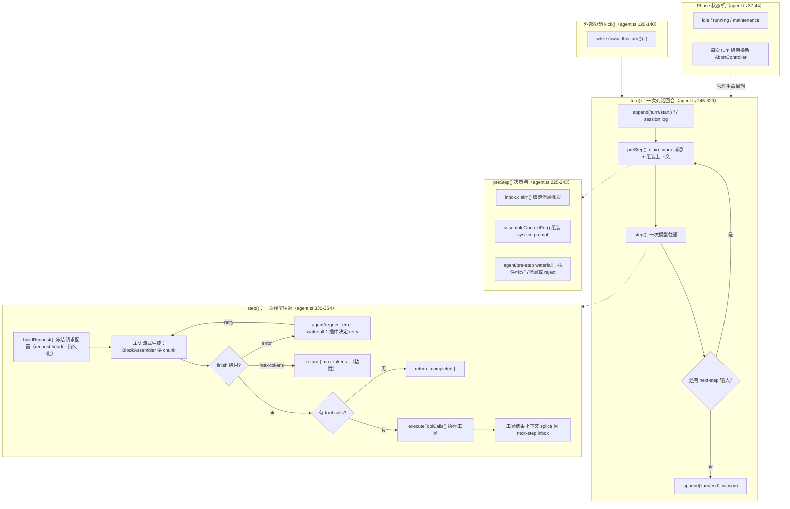

# DeepSeek Harness 源码精读（一）：Agent 主循环是怎么跑起来的？

## 开场：一个 Agent 是怎么"转"起来的？

你在聊天框里发一句"帮我查北京的天气，并算一下 1+1"，背后的 Agent 会经历：调模型 → 模型说要调两个工具 → 执行工具 → 把结果喂回模型 → 模型再生成最终回答。这个过程看起来简单，但生产级实现要考虑：怎么界定"一轮对话"和"一次模型调用"？工具结果怎么回填？用户中途插话怎么办？模型输出触顶了怎么标记？取消怎么处理？

DeepSeek Harness（v0.1.0-rc.5，2026-08-13 开源，MIT）的主循环实现是 `packages/core/agent-loop/src/agent.ts` 的 `ReactLoopAgent` 类（核心源码约 861 行：agent.ts 496 + tool-calls.ts 289 + constants.ts 76）。这篇从源码出发，把它的核心拆开讲清楚，并在我们自己的代码仓库（ai-agent-code-lab）里写一个简化版复现验证理解。

## 先看一张全景图：整个主 agent 长什么样

先把主循环的完整结构铺开，后面每个机制都能在这张图上找到位置。这张图基于源码 `agent.ts` 的 `ReactLoopAgent` 实际结构绘制：

这张图分五层：**kick**（外部驱动）→ **turn**（回合循环）→ **preStep**（决策点）→ **step**（模型往返）→ **Phase 状态机**（生命周期管理）。下面逐个拆。

## 先看一个真实 Agent 循环长什么样

在啃源码之前，先跑一遍简化版复现（真实 LLM），建立直觉。代码在 `ai-agent-code-lab/articles/dsh-agent-loop/`：

注意这里已经出现了两个层级：**Turn 1** 是一次完整的用户请求（对应全景图里的 turn 层）；**Step 1.1 / Step 1.2** 是两次模型调用（对应 step 层）。Step 1.1 模型返回 2 个工具调用 → 执行工具 → 结果回填 → Step 1.2 模型直接出最终答案。这就是 turn/step 双层循环。

## 主循环的两层结构：turn 和 step

用大白话理解：**turn 是一次"对话回合"**（从用户说话到 Agent 给出最终答复），**step 是回合里的一次"模型往返"**（模型说一句 → 可能需要调工具 → 拿到结果再继续说）。一个回合里可以有很多次模型往返——比如模型第一次说要查天气，第二次说要算数，第三次才给最终答案。

对应源码 `agent.ts:245-329` 的 `turn()`，骨架很精简：

这段代码只说明两件事：**① turn 内的 while 循环反复推进 step；② 所有 turn/start、step/start、turn/end 都写进 session log（durable 事实）**——这是整个系统可回放、可恢复的基础。至于 `turnEnds` 为什么有个"已结束原因还要等 next-step 清空才关 turn"，是因为模型在 turn 收尾前可能还会被塞入新的下一步输入（比如工具结果），必须把这些都消化完才算真正结束。

## step 的内部流程：一次模型往返 + 工具回路

单个 step 是主循环的心脏。它做的事情用一句话说：**把当前所有消息发给模型，看模型是想说话还是要调工具；要调工具就执行、把结果拿回来，再让模型继续说。**

源码 `agent.ts:330-354` 的 `step()`：

注意两个容易混淆的点：

- **step 内层的 while 是 retry loop**：只有请求错误（网络失败、限流等）会走 `agent/request-error` waterfall 决定是否重试；**max-tokens 不是重试条件，是直接结束原因**
- **工具结果回填**：`executeToolCalls` 的最后一个参数是回调，把工具结果 context 塞回 next-step inbox（对应全景图里的 S6）——下一个 step 的 `preStep()` 会 claim 它，模型就能"看到"工具结果

## 三种消息注入：followup / steer / inject

用户（或插件）可以在不同时机给 Agent 塞消息，源码 `agent.ts:95-118` 用 `(target × wakeup)` 两个维度统一了它：

- **followup**：常规的下一轮输入（比如用户发新问题），开一个新的 turn
- **steer**：在当前 turn 的下一步插话（打断正在进行的模型调用回路），不新开 turn
- **inject**：只预埋上下文，不触发模型调用（比如工具结果回填、后台注入系统状态）

设计决策笔记 `2026-07-22-unified-send-and-coalesced-user-messages` 说明：这三种注入不是三套队列，而是同一个消息原语在"放进哪个边界 × 是否唤醒"上的组合，避免引入多余概念层。

## 插播：pre-step 不是注入，是当前步的决策入口

很多人第一次读源码会误以为 `agent/pre-step` 是第四种注入方式——不是。它是**每个 step 正式开始前的决策点**（对应全景图里的 preStep 层）：插件在这个 waterfall 里可以改写"这一步到底要处理哪些消息"（甚至直接 reject 掉这一步）。

源码 `agent.ts:225-243` 的 `preStep()`：

三者的分界很清晰：**inject 影响的是"后续 step"，pre-step 影响的是"当前这一步正在结算的请求"**。想改当下这一步，必须走 pre-step；只想预埋后面，用 inject。这是时序语义，不是 API 风格差异。

## max-tokens 粘性：为什么触顶后不能降级

源码 `agent.ts:285-290` 有一段反直觉的设计：**max-tokens 是 sticky（粘性）的**——一旦某个 step 触顶，后续即使正常完成，turn 的结束原因也不能降级回 completed。

为什么？因为 turn 级结束原因要真实反映"整个 turn 经历过的最坏约束"。如果 Step 1 触顶（可能输出被截断、答案不完整），Step 2 正常完成就把原因改成 completed，那么 UI、恢复逻辑、策略插件看到的终止原因就是失真的——它们会以为这个 turn 完全正常，而实际上中间发生过一次输出截断。sticky 保证这个信号不会被后续步骤抹掉。

这是一个很微妙但重要的生产级细节：**聚合指标要保留最坏情况，而不是被最新情况覆盖**。

turn 结束状态机（`TurnEndReason`）完整枚举：completed（正常）/ max-tokens（粘性）/ aborted（AbortSignal reason）/ error（LlmError 保结构，其他错误 flatten errorChain + UNKNOWN code）/ blocked（pre-step reject）。

## 工具并发执行：厨房可以并行炒菜，上菜按点单顺序

模型一次可能返回多个 tool-calls（比如上面的天气 + 计算）。如果串行执行，一个慢工具会卡住所有后面的调用。Harness 的调度器（`tool-calls.ts:41-49, 145-159, 198-245`）允许**并行执行**，但有一个关键不变量：

- **执行阶段**：可以并发（有界滚动池，`maxParallelToolCalls` 默认 10，设 1 退回串行）
- **提交阶段**：结果必须**按模型给出的顺序**落盘（`commitReady()` 只在前一个模型顺序槽位就绪后才 append tool/result）

打个比方：**厨房可以同时炒好几道菜（并行执行），但上菜顺序必须按客人点单的顺序（模型顺序提交）**。这样做的收益：慢工具不会阻塞已准备好的并行调用（省时间），但日志、回放、工具结果、后续上下文都像串行一样可解释（保正确性）。中止时，未启动的调用会补上合成失败结果，保证 replay 合法。

## Phase 状态机：idle / running / maintenance

Agent 实例不是无状态跑模型的，它有一个显式状态机（`agent.ts:37-44`，对应全景图 PHASE 层）：

- **idle**：空闲，可接收新 turn
- **running**：正在跑一个 driver（含 turn/step 计数 + AbortController）
- **maintenance**：后台任务（如持久化），此时新唤醒会被 latch，任务结束再补跑

每次 turn 结束会换新的 AbortController，旧 controller 上的 latch（wakeRequested）会失效，由活着的 driver 自己 claim 队列——这是避免"唤醒信号发给已死任务"的经典并发陷阱。

## 自己实现一遍：SimplifiedReactLoop

为了验证上面的理解，我们在 ai-agent-code-lab 里写了一个 `SimplifiedReactLoop`（约 490 行，真实 LLM + 真实工具）：

简化版忠实还原了四个关键点：turn 内 while 循环跑多 step、claim 消息、工具结果回填 inbox、无工具调用即收尾。但它和真实源码的差异必须交代清楚，否则会误导：

所以简化版验证的是**流程骨架**（turn/step 双层、工具回路、收尾条件），没有验证的是**生产级细节**（并发、恢复、取消、插件介入）。想深入的同学建议直接读源码 + 跑官方测试（`agent-loop/tests/` 下有 cancel / tool-order / scope-lifecycle 等 spec）。

## 回头看：这个主循环的设计哲学

把源码和设计笔记合起来看，主循环的核心不是"跑模型"，而是把四件事拼成一条**可回放、可取消、可恢复的流水线**：

- **durable 边界**：turn/step 生命周期全部写 session log（事件溯源），模型可见内容必须能从日志重建（`reconstructable-requests` 笔记）
- **可重建请求**：每个请求的 header + 消息都持久化，崩溃后能从日志恢复
- **可控注入**：inbox 的 (target × wakeup) 组合 + pre-step waterfall，插件有明确的介入点
- **顺序保真的并发**：工具执行可并行，但结果提交严格按模型顺序

这也是为什么 Harness 敢说"一切皆插件"——主循环的每个环节（pre-step 决策、request 配置、错误重试）都暴露了 waterfall/serial 事件，插件可以在不修改主循环代码的前提下改变它的行为。

## 总结

DeepSeek Harness 的 Agent 主循环是一个 **turn/step 双层循环**：turn 管用户请求边界（durable、可恢复），step 管模型调用边界（模型 → 工具 → 模型回路）。核心机制：三种消息注入（followup/steer/inject）+ pre-step 决策入口、max-tokens 粘性（聚合指标保留最坏情况）、工具并发执行但结果按模型顺序提交、Phase 状态机（idle/running/maintenance）管理生命周期。我们用简化版复现验证了这套理解——真实 LLM 跑通"查天气 + 计算"双工具场景。

## 面试考点

- Agent 主循环为什么需要 turn/step 双层而不是单层？——turn 承担 durable 边界和恢复，step 承担一次模型调用的工具回路；双层让"一轮对话多次工具往返"不需要开新会话
- max-tokens sticky 是什么意思？为什么？——某个 step 触顶后 turn 结束原因不能被后续正常 step 降级；聚合指标要保留最坏情况，避免 UI/恢复逻辑误判
- 工具并发执行如何保证 transcript 正确？——执行阶段可并发（滚动池），提交阶段严格按模型顺序；中止时未启动调用补合成失败结果保 replay 合法
- steer 和 inject 的区别？——都是 next-step 目标，steer 唤醒 driver，inject 只排队不唤醒；追问：那"正在结算的这一次请求"怎么改？——只能走 pre-step waterfall，inject 只影响后续 step
- 怎么让插件介入主循环？——agent/pre-step（改写进入决策）、agent/request（改请求配置）、agent/request-error（决定是否重试），都是 waterfall 事件

## 参考来源

- DeepSeek Harness 源码：`packages/core/agent-loop/src/agent.ts`（ReactLoopAgent）+ `tool-calls.ts`（并发调度）
- 设计决策笔记（`source/.agents/notes/`）：2026-07-31 claimed-pre-step-inbox-lifecycle / 2026-07-22 unified-send-and-coalesced-user-messages / 2026-07-05 reconstructable-requests / 2026-06-30 event-domain-semantics / 2026-07-10 parallel-tool-call-execution
- 复现代码：`~/workspace/ai-agent-code-lab/articles/dsh-agent-loop/`（SimplifiedReactLoop，真实运行输出见 engineer-output-dsh-loop.md）
- [DeepSeek Harness 仓库（GitHub）](https://github.com/deepseek-ai/dsh)
