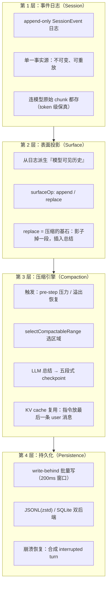
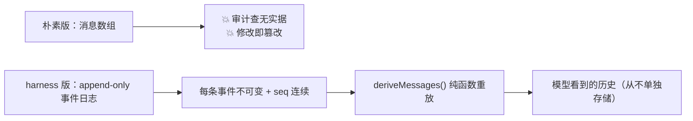
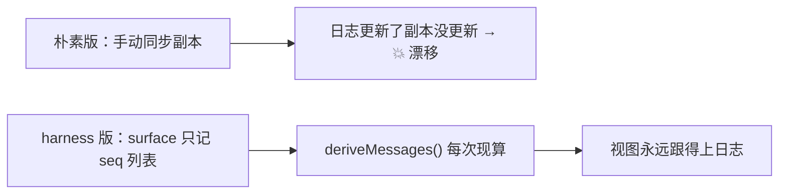
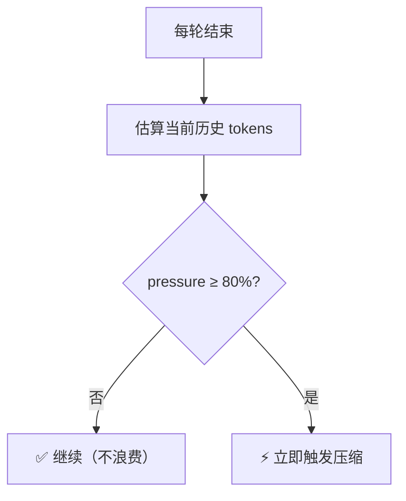
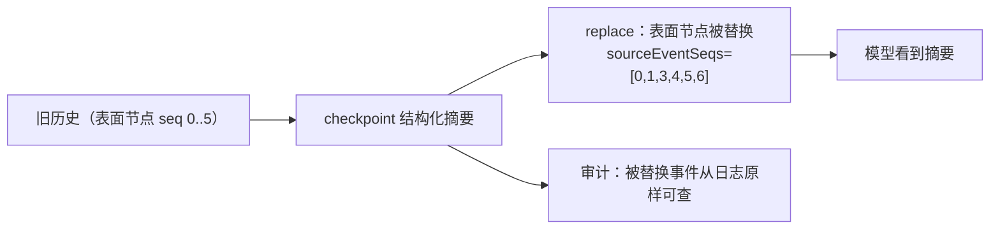
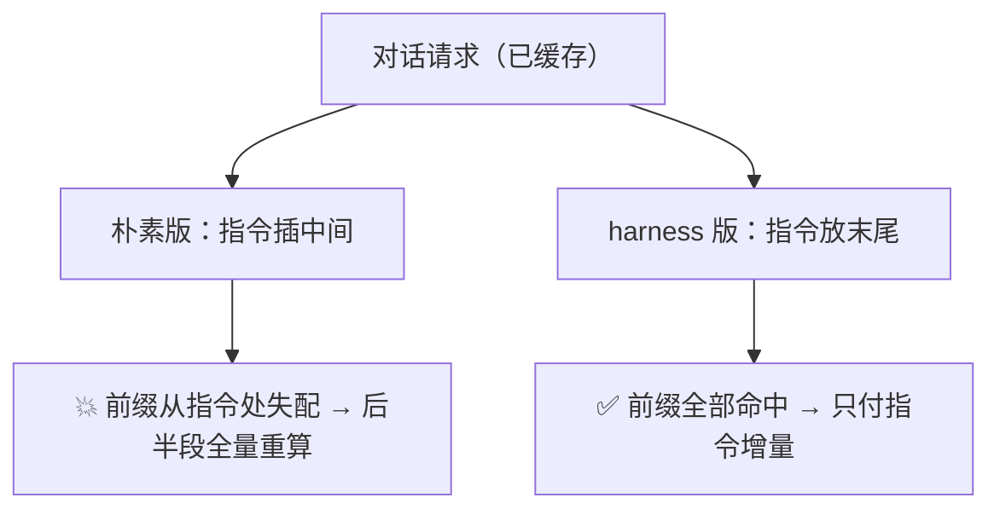
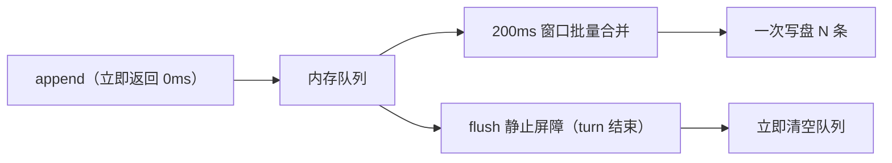

# DeepSeek Harness 源码精读（三）：对话无限长，记忆怎么扛？——记忆压缩与持久化

## 开场：一个 Agent 聊 8 小时之后，模型还记得开头吗？

上一篇我们看了工具调用管线：模型说"调工具"，六段管线把关。但有个更基础的问题一直被我们跳过了——**模型有上下文窗口上限（比如 128K tokens），而一场 Agent 对话可以无限长**。聊到第 500 轮，第 1 轮的内容早被窗口挤出去了。怎么办？

常见的粗暴答案有几种：

- **截断**：只保留最近 N 轮。实现简单，但模型"失忆"——用户开头说的需求、改过的代码、踩过的坑全忘了。
- **塞进向量库检索**（RAG）：把历史切片存起来，需要时按相似度查。灵活，但要引入 embedding 模型 + 向量数据库，还解决不了"模型需要连续上下文"的问题。
- **压缩**（compaction）：把早期历史喂给模型总结成一份"checkpoint"，用总结替换原文。既保住了要点，又不占窗口。

DeepSeek Harness 选择了**第三种，而且把它做到了极致**——它把"压缩"和"会话存储"做成了一套精密的机制：事件溯源日志 + 表面投影（surface）+ 结构化 checkpoint + KV cache 复用 + write-behind 持久化。这套设计值得任何想写长上下文 Agent 的人精读。

这篇从源码出发（`packages/core/session/` + `packages/compaction/` + `packages/session/` + `packages/llm/token-meter/`），把"记忆从产生到压缩到落盘"的完整旅程拆开。

## 先看全景图：记忆的四个层次

DeepSeek Harness 的记忆系统分四层，每层解决一个问题：



- **第 1 层**是真相：所有交互都是追加进日志的事件，谁也不许改历史。
- **第 2 层**是视图：模型看到的历史不是日志本身，而是日志的"投影"——投影支持替换操作，这是压缩的物理基础。
- **第 3 层**是决策：什么时候压、压哪段、怎么总结，全在这里。
- **第 4 层**是落地：日志要落盘，但不能每次事件都写一次文件（太慢），所以有批量写和双后端。

下面逐层拆。

---

## 第 1 层：会话 = append-only 事件日志（Session）

### 1.1 为什么是事件溯源，而不是"一个消息数组"？

2026-06-11 的 `event-sourced-sessions` 设计笔记讲得很直白：MVP 要求"严格基于事件的 trace + 完全可回放的 session"。备选方案是"可变消息数组 + 事件通知"，被否掉的理由是——**状态和日志可能分叉**；而事件溯源里"日志本身就是状态"，分叉在结构上不可能发生。

于是 `Session` 就是一份**只追加（append-only）的 `SessionEvent[]` 日志**，是 Agent 全部交互历史的唯一事实源（`packages/core/session/src/types.ts`）。注意：**LLM 消息历史是"派生"出来的，从不单独存储**；重放 = 从同一份事件重新派生。

### 1.2 事件词汇表：`SessionEventMap`

日志里跑的是类型化事件，核心词汇表长这样（`packages/core/session/src/types.ts`）：

| 事件                      | 载荷要点                          | 角色                       |
| ------------------------- | --------------------------------- | -------------------------- |
| `turn/start` / `turn/end` | turn 编号 + 结束原因              | 一轮用户请求的边界         |
| `step/start` / `step/end` | turn + step 编号                  | 一次模型调用的边界         |
| `user/message`            | 用户消息（含注入上下文）          | 表面事件                   |
| `assistant/chunk`         | 原始流式 chunk                    | **token 级重放保真**       |
| `assistant/message`       | 组装好的助手消息 + usage          | 表面事件（派生历史用这个） |
| `tool/call`               | 工具名 + 原始参数 JSON（不解析）  | 与 tool/result 配对        |
| `tool/result`             | 工具结果消息 + meta               | 表面事件                   |
| `todo/write`              | 整个待办列表快照                  | 日志专用（UI 状态）        |
| `request/header`          | 请求信封（config+system+tools）   | 日志专用（请求可重建）     |
| `request/context`         | 路由元数据（provider/model/容量） | 日志专用                   |
| `session/end-seed`        | 空载荷                            | 构造种子边界（后文详述）   |

关键设计点：

1. **`assistant/chunk` 也存**——模型吐出的每个原始 chunk 都进日志，所以重放能精确到 token 级。而派生历史用组装好的 `assistant/message`（chunk 只是重放/UI 数据）。这俩分工：chunk 保真，message 权威。
2. **`tool/call` 存原始参数 JSON 字符串（`arguments` 未解析）**——模型原样吐的啥就存啥，不加工。
3. **`todo/write` 是整表快照**——最新一次写入覆盖，重放时 last-write-wins。条目不需要稳定 id（见 2026-06-29 todo-write 笔记）。
4. **`request/header` 把请求信封也存进日志**——所以"任何一次请求"都能从日志纯函数重建（reconstructability）。`foldRequestHeader(events)` 取最新快照即可。
5. **词汇表是 merge-extensible 的**：插件可以用 declaration merging 追加事件类型。compaction 就追加了 `compaction/start` / `compaction/summary` / `compaction/end` 三个。核心对这些未知事件的态度是：**带 `ignorable: true` 标记的可以跳过，没标记的必须拒绝重建**——一个无法识别的必需事件可能改变整个日志的解释方式。

### 1.3 `Session.append()`：热路径永不阻塞 I/O

`Session.append()` 是同步的：校验 → 深冻结 → 推进日志 → 同步通知观察者。持久化插件是异步缓冲的（write-behind，第 4 层讲）。一旦事件进入日志，append 就提交了——观察者失败只记日志，不影响返回值和后续监听者。

**校验有多严？** append 会用一次递归遍历验证数据可无损 JSON 序列化（BigInt、函数、symbol、undefined、负零、非有限数、循环引用、稀疏数组、Map/Set/Date/class 实例全部拒绝），同时校验 surface 元数据契约（后面讲）。坏事件在 append 处就失败，绝不拖到后端 flush 时才爆——因为**日志是持久真相，坏事件必须在源头拦下**。

### 1.4 为什么顺序号必须连续？

`seq = log.length`——每个事件的顺序号就是它入日志时的长度。**序列号连续性是持久化契约**：chunk 不能被过滤掉（否则 seq 断档），持久化后端可以换自己的存储编码，但 load 必须返回完全相同的追加事件。

---

## 第 2 层：表面投影（Surface）——压缩的物理基础

### 2.1 问题：历史"替换"没有持久共享机制

日志是权威的，但如果插件要"把一段历史换成总结"，没有一个持久的共享机制。之前是各插件在 `agent/request` 监听器里按顺序改写请求——监听器顺序脆弱、没有记录改了哪些事件、每加一种历史操作都要改核心 `deriveMessages()`。

2026-06-18 的 `session-surface` 笔记定下方案：加一个**表面（surface）**——日志上派生的、缓存的事件顺序投影，由日志里的 `surfaceOp` 标记维护。

### 2.2 SurfaceOp：两个操作

```ts
type SurfaceOp =
  | 'append' // 正常尾部追加
  | { op: 'replace'; start: number; end: number } // 影子掉 [start, end]（含两端）
```

- **append**：新事件追加到表面尾部。所有正常消息（user/assistant/tool-result）走这个。
- **replace**：把 `start` 到 `end`（含）的表面条目移除，在它们的位置插入新事件。**两个端点必须在当前表面存在**；`start === end` 就是替换单条。

只有三类事件能上表面（`SurfaceEventType`）：

```ts
type SurfaceEventType = 'user/message' | 'assistant/message' | 'tool/result'
```

这三类事件**必须**携带 `surfaceOp`（编译器强制），其他事件（chunk、turn 边界、日志专用记录）**禁止**携带。

### 2.3 sourceEventSeqs：替换必须"报出全部来源"

replace 事件还要带 `sourceEventSeqs`——**被影子掉的每个表面节点的 seq**，外加产生它的书签事件。为什么？因为重放必须能验证"一个 replace 范围操作点名了它移除的每个事件"。缺一个就拒绝。这就是压缩的可审计性：**你压掉了什么，日志里永远有据可查**。

`assistant/message` 的 `sourceEventSeqs` 则引用组装它的 chunk seqs（空数组合法 = 已知的空流）。

### 2.4 SurfaceManager：增量维护，不是全量重建

`Session` 持有一个 `SurfaceManager`（`packages/core/session/src/surface.ts`）：

- 维护一个有序的 `number[]`（表面事件 seq 列表）
- **增量处理**：只处理上次同步以来的新事件，O(new events)，不重扫全日志
- 候选事件在提交前先校验（`validateNext`），提交后应用（`applySurfacePlan`）
- replace 用数组位置定位端点，splice 插入替换 seq——**不需要第二个管理器、链表对象或 seq 映射表**

`Session.surface` 暴露只读的 `SessionSurface`：`{ nodes: readonly number[], replaceGeneration: number }`。`replaceGeneration` 是单调递增的替换计数——**这是"表面被重写过"的证据**，后文压缩的溢出恢复靠它判断是否真的发生了改动。

### 2.5 deriveMessages()：模型看到的历史 = 表面投影

`Session.deriveMessages()` 沿着表面顺序把每个节点投影成 `Message[]`：

- `user/message` → 用户消息，content 原样
- `assistant/message` → 助手消息（**空 content 的跳过**——那是 max-tokens 截断留下的"仅承载 usage"的占位，不能进模型 transcript）
- `tool/result` → 带 tool-result 块的用户消息
- 其他一切（chunk、边界、日志记录）→ 不投影

投影是**缓存的**：每个表面节点只投影一次（首次见到时）；表面重写（replace）才重建。返回的数组每次都是新快照（后续 append 不会增长你已持有的数组），消息对象是共享的深冻结对象。

**重要推论：表面故意影子掉被替换的范围**。所以人类看到的对话记录（transcript）不能从表面读——表面会"抹掉"用户已经看过的旧对话。transcript 应该读 append 起源事件（`isAppendSurfaceEvent`）。

---

## 第 3 层：压缩引擎（Compaction）——何时压、压哪段、怎么总结

### 3.1 架构：能力缝（capability seam）四件套

压缩被设计成一个**能力缝**（2026-06-18 `compaction-capability-seam` 笔记），拆成四个包：

1. **`@deepseek-ai/dsh-compaction`**（接口）：抽象 `CompactionEngine`，持有 `ctx.compaction` 键、`CompactionResult` 词汇、`compaction/*` 事件、手动失败分类、checkpoint 消息来源。三个操作**全是 abstract**——契约只说"做什么"，不说"怎么做"。
2. **`@deepseek-ai/dsh-compaction-basic`**（实现）：`BasicCompactionEngine`，消费 `ctx.tokenMeter`，拥有尾→头保留遍历、LLM 总结、表面替换、锁、pre-step 压力、溢出恢复。`summarize()` 是它唯一的子类钩子。
3. **`@deepseek-ai/dsh-compaction-tool-result-pruner`**（无模型伴侣）：确定性裁剪超大的工具结果节点，在选总结区域前执行。不是第二个压缩实现。
4. **`@deepseek-ai/dsh-command-compact`**（人类入口）：注册 `/compact` 命令，调用后端无关的 `compactNow()`。这是直接的人为控制，不是模型工具。

### 3.2 三个抽象操作

```ts
abstract class CompactionEngine {
  // 自动：压力/溢出触发
  abstract compactIfNeeded(
    agent,
    trigger: 'pressure' | 'context-overflow',
    signal,
  ): Promise<CompactionResult | null>
  // 手动：空闲会话强制压缩一次（低于压力阈值也行）
  abstract compactNow(agent, signal, sourceCommandId?): Promise<CompactionResult | null>
  // 显式：压缩指定表面范围
  abstract compactRegion(start, end, agent, signal?): Promise<CompactionResult>
}
```

### 3.3 触发时机一：压力压缩（agent/pre-step）

自动压缩挂两个事件点：

- **成功路径**：`agent/pre-step`（waterfall 瀑布）。在**下一次请求派生之前**检查压力。此时上一次的助手输出、工具结果、缓冲上下文、steering 都**已经持久化**了，所以压力策略看到的是完整的成功调用状态。
- **失败路径**：`agent/request-error`（waterfall）。provider 返回"超出上下文窗口"（`CONTEXT_WINDOW_EXCEEDED`）后，失败的 step 关闭，在这里做强制压缩，返回 `{ kind: 'retry' }` 让循环从替换后的表面重建请求重试。

**为什么压在 pre-step 而不是请求时？** 因为 `agent/request` 时请求还没定型（路由可能变、工具 schema 未冻结），压力视图是临时的。pre-step 时上次调用的一切都已 durable，最准确。

### 3.4 压力怎么算？——阈值与保留策略

配置默认值（`config.ts`）：

- `thresholdRatio: 0.8`——模型上下文窗口的 80% 触发压缩
- `retainRatio: 0.16`——保留最近 16% 窗口的**逐字**历史（不压）
- `maxTokens: 8192`——总结输出上限
- `compactionRetries: 1`——压缩后仍超阈值最多重试几次
- `maxOverflowRetries: 1`——溢出恢复最多重试几次
- `auto: true`

压力计算流程（`BasicCompactionEngine.compactIfNeeded`）：

1. 从 durable 日志取**最近一次路由请求**的 provider/model（`routedTarget`），没有路由过就不干活（返回 null）。
2. 用 `resolveTargetPolicy` 合并精确模型覆盖策略，`resolveCompactSpec` 把比例换算成具体 token 预算（thresholdTokens = contextWindow × 0.8，retainTokens = contextWindow × 0.16）。
3. `ctx.tokenMeter.measure(session)` 测当前压力。低于阈值 → 返回 null（不干活）。
4. **一旦超阈值**：先跑可选的 `toolResultPruner.pruneSession()`（无模型裁剪，见 3.8），重新测量；如果裁剪后回到安全区 → 跳过总结直接收工。
5. 仍然超阈值：`selectCompactableRange()` 选区域 → `compactRegion()` 总结替换 → 重新测量。未收敛且没到 retries 上限 → 再来一轮。

### 3.5 区域选择：头锚定 + 尾保留 + 工具配对平衡

`selectCompactableRange(session, measurement, retainTokens)`（`region.ts`）的逻辑：

1. 从表面**尾部往前**累积 token，直到达到 retainTokens 预算——这部分**逐字保留**。
2. 从保留起点**往前回溯**，直到找到一个"工具配对平衡"的边界——不能把 `tool/call` 和它的 `tool/result` 拆开（用 `toolPairingBalancedBefore` 检查）。
3. 返回 `{ start: 表面头, end: 保留区前一个 }`。

**为什么头锚定（head-anchored）？** 自动压缩总是从表面头部开始，把旧的 checkpoint 和新压的历史合并——这样**永远只有一个自动 checkpoint 在头部**。`shadowedRange` 因此是"位置跨度"而非"数值区间"：新的总结 seq 可能占据旧的表面位置，所以 `shadowedSeqs` 才是权威的影子节点集合（按表面顺序）。

**为什么"整 turn 不保留"？** 压缩不是按 turn 切，而是按"闭合的 step"切——一个超大 turn 里早期已闭合的 step 可以先被压掉，不影响它后面还在跑的部分。这保证了**失控 turn 也能自救**：工具密集的 ReAct turn 每步追加 assistant/message + tool/result，下一步的 pre-step 就能把早期闭合的工具对压掉。唯一压不动的情况：只剩一个"不可分割的开放尾 step"（工具调用还没结果），此时返回 null，等 step 闭合再试。

### 3.6 总结：五段式（实际八段）结构化 checkpoint

总结指令（`summarizer.ts` 的 `COMPACTION_INSTRUCTION`）要求模型输出固定的 Markdown 结构——注意现在实际是**八段**：

```
## Primary Request and Intent     ← 用户原始/演进目标（关键措辞逐字引用）
## Key Technical Concepts         ← 技术/框架/模式
## Files and Code                 ← 精确路径：为什么重要、关键改动
## Errors and Fixes               ← 错误：如何解决 + 相关用户反馈
## Pending Jobs                   ← 明确要求但未完成的工作
## Current Work                   ← 此刻正在进行什么
## Next Step                      ← 下一步单个动作（或 "(none)"）
## Critical Context               ← 决策及理由、约束、用户偏好、开放问题
```

规则很细：

- 保留精确文件路径、命令、错误串、标识符、数值、函数签名、语法片段
- 忠实记录用户反馈和纠正
- **禁止提"这是总结请求"或"上下文被压缩了"**
- **如果已有旧 checkpoint（`<compacted-summary>` 块），不要逐字复制**：保留仍真的事实、丢弃过期的、合并新信息成一份

checkpoint 的落地格式（`frameSummary`）：

```
This is an automatically generated checkpoint condensing an earlier span
of the conversation to free up context. Treat the captured context as
established background and build on it without restating it...

<compacted-summary>
[模型的总结块]
</compacted-summary>
```

这个 preamble 告诉后续模型：这是既有背景，直接接着干，不用重新陈述。

### 3.7 最妙的优化：KV cache 复用

2026-07-21 的 `compaction-summary-prefix-cache-reuse` 笔记记录了一个关键 bug fix：**总结调用曾经是独立的辅助请求**——自己的 system prompt + 把旧历史压成一段字符串。问题是 provider 按请求**开头的 token 序列**做 KV cache：第一 token 不同（不同 system prompt）→ 整个缓存前缀失效 → 每次压缩都双倍付费（对话请求付一次、总结请求再付一次），恰好在对话最大时最烧钱。

**修复**：把总结指令从"请求头部（独立 system prompt）"移到"对话尾部（最后一条 user 消息）"。辅助调用现在**逐字复现最近一次路由请求的前缀**（同一个 system、同一份 tools、同一段派生历史），只在末尾追加指令——于是它是 warm 请求的**前缀扩展**，provider 直接复用缓存 token。

```ts
const messages: Message[] = [
  ...input.messages, // 重放区域（与路由请求逐字一致）
  createUserMessage({
    content: [{ type: 'text', text: COMPACTION_INSTRUCTION }],
    source: { kind: 'plugin', plugin: 'dsh-compaction-basic' },
  }), // 指令作为最后一条 user 消息
]
```

几个魔鬼细节：

- **tools 也要带上**，即使总结器从不调工具——去掉 tools 会让 token 序列变短，破坏与缓存请求的对齐。
- **system 必须是对话自己的 system prompt**——system 槽是 provider 缓存的第一个 token 区域，换了就全废。
- 头部锚定保证影子区域是路由请求的头部 → 重放前缀完全匹配 → 必中缓存。手动压缩中间区域依然正确，但放弃缓存复用（这是部署的明确权衡）。
- 深层原理：DeepSeek adapter 还会在传输元数据里打 `x-deepseek-harness-compact: 1` 标记，让辅助调用可识别。

### 3.8 无模型裁剪：tool-result-pruner

不是所有超预算都要花钱总结。`ToolResultPruner`（`compaction-tool-result-pruner/src/index.ts`）做**确定性**的 head/middle/tail 裁剪：

- `thresholdChars`（默认配置）以上才动手
- 保留头部 `headChars` + 尾部 `tailChars` 字符，中间替换为裁剪标记（`PRUNE_MARKER`）
- **按 Unicode code point 切**（不是 UTF-16 code unit），避免切断代理对
- 每个替换的 `tool/result` 事件**只改 content，保留其余全部字段**（surface 层强制校验：`assertToolResultRewrite` 只允许改 content）
- 替换前追加一个 `compaction/prune` 日志事件记录"影子价格"（被裁节点的 token 估算），纯消费者可以无状态地减去它

**为什么先裁剪再总结？** 工具结果往往占大头（尤其 bash 输出、文件读取）。先把可预测的冗余裁掉，可能直接就回到安全区，省掉一次 LLM 总结调用；就算还要总结，总结输入也小得多。

### 3.9 锁：日志即锁（compaction/start … compaction/end）

压缩期间日志里留下三个**日志专用**事件（不进表面）：

```
compaction/start    → 日志专用。获得锁（turn 编号 或 null=手动独立）。
[LLM 总结进行中...]
compaction/summary  → 日志专用。记录原始总结、调用标记、范围、影子 seq、token 数、provider/model。
user/message        → 表面事件！source=compactCheckpointSource + surfaceOp replace。
                      唯一的表面变更（framed summary）。deriveMessages 渲染为 user 角色消息。
compaction/end      → 日志专用。释放锁（失败时带 error 字段）。
```

**为什么总结要骑在 `user/message` 上？** 因为 `SurfaceEventType` 是闭合的，`compaction/*` 永远不能上表面。而"总结本质上是用户角色的上下文"——复用 `user/message` 是诚实的，不是 workaround。识别 checkpoint 靠 `compactCheckpointSource`（`{ kind: 'plugin', plugin: 'compact', compactionId }`）和 `isCompactCheckpointSource()` 谓词——**跨后端实现可识别**，不依赖具体包。

**锁的两个作用**：

1. **崩溃可检测孤儿**（主作用）：总结是慢模型调用，`compaction/start` 先落盘。崩溃在总结中途 → 留下无配对的 `compaction/start` → 可检测的孤儿，而不是静默损坏。
2. **防止并发压缩**：所有入口（自动/手动/显式范围）都拒绝"活跃的无配对 start"。这个 bracket 就是唯一锁，没有进程内互斥量。

**`session/end-seed` 的配合**：日志里一个无配对的 `compaction/start`，"上个 writer 死在压缩中途"和"现在正在压缩"字节上无法区分。`session/end-seed` 事件（构造种子后追加的第一个活写入）提供了边界：**end-seed 之前的无配对 start 属于已结束的生命周期，忽略**；之后的才是活跃锁。所以 `session/end-seed` 是 `firstLiveSeq` 的持久化投影（2026-07-30 笔记）。

**锁是时间点，不是独占容器**：手动压缩期间，一个无关的 `inject()` 上下文可以出现在 start/end 之间——手动路径只重新验证选定的位置跨度，注入的上下文在替换后依然可见。

### 3.10 手动压缩：/compact 命令与排队

2026-07-30 的 `queued-manual-compaction` 笔记：用户发 `/compact` 不应作为 prompt 文本（会花一次模型 turn，还让对话模型重新解释一个控制动作），而是通过 `ctx.commands` 注册的命令，调用 `compactNow()`。

关键机制 `Agent.runMaintenance(task)`：**同步**声明空闲阶段——从 idle 阶段启动，在调用 task 前就占有该阶段。之后到达的唤醒输入保持 FIFO 排队，直到 maintenance 结束才启动。这解决了竞态："状态检查后、压缩开始前"另一个调用者唤醒了驱动——有了同步声明，谁先声明谁拥有边界。

手动失败有完整分类（`ManualCompactionErrorCode`）：`busy` / `cancelled` / `changed` / `summary` / `commit` / `persistence`。`changed`（总结期间表面变了）和 `summary`（总结不比原文小）不改变表面但把失败尝试记入日志；`commit` 可能跟随部分变更；`persistence` 是内存 bracket 关了但 flush 失败。

### 3.11 溢出恢复：如何证明"真的发生了改变"才重试

`agent/request-error` 恢复路径的严谨之处（2026-07-10 笔记 + `index.ts`）：

- provider 确认溢出（`CONTEXT_WINDOW_EXCEEDED`）后，先快照 `session.surface.replaceGeneration`。
- 压缩后**只有 replaceGeneration 增加了**才返回 `{ kind: 'retry' }`——这防止自定义后端"声称成功但没改任何模型可见状态"。
- 即使总结阶段抛错，只要**先落地的裁剪**推进了 generation，依然授权重试（从裁剪后的表面重试）。
- 取消（cancellation）优先于一切。

### 3.12 收敛不变量

每个已提交的总结**必须比它影子掉的内容小**（`framedSummaryTokenCount < shadowedTokenCount`，否则报错"summary is not smaller"）。超阈值后最多重试 `compactionRetries` 次；仍超阈值就抛错（不能无限压）。

---

## 第 4 层：持久化——write-behind 批量写 + 双后端

### 4.1 问题：流式输出每秒几十个 chunk，不能每个都写盘

流式响应会产生大量 `assistant/chunk` 事件（fixture 里 2098 个事件中 96.1% 是 chunk）。之前是"队列空闲就来一个事件就写一次"——JSONL 每次 append 要创建并 fsync 一个 zstd frame，SQLite 每次要开一个事务。写放大严重。

2026-08-08 的 `bounded-session-persistence-write-batching` 笔记定下方案：**固定窗口的批量合并（bounded coalescing），不是 debounce**。

### 4.2 SessionWriteBehind：200ms 固定窗口

```ts
class SessionWriteBehind {
  // 队列从空变非空 → 启动一个固定窗口（maxDelayMs，默认 200ms）
  // 后续事件加入该批，不重置截止时间（coalescing，不是 debounce）
  // 截止到 → 把完整 pending 前缀交给后端 appendBatch
  // 同一时刻每个 Session 最多一个 active write
  // 写期间新到的事件 → 新 pending 前缀，自己的固定窗口
  // session/flush → 取消等待，drain 到静止（quiescence barrier）
}
```

关键语义：

- **失败保留**：后台写失败 → 完整批次恢复到队列头部（保持顺序），报告一次失败，**暂停自动重试**（避免定时器驱动的失败循环）；下一个新事件重新开窗口；显式 flush 立即重试并向上报错。
- **`session/flush` 是共享的静止屏障**：取消剩余等待，drain 活动写 + 屏障期间到达的所有事件，然后才 resolve。turn 边界、模型请求前、生命周期 teardown 都走这个屏障。
- **flush 不等待定时器**：teardown 不依赖 batching timer。

### 4.3 双后端：JSONL(zstd) 和 SQLite

**JSONL 后端**（`session-persistence-jsonl`）：

- 每会话一个文件：`<root>/<项目目录>/<编码后的sessionId>/session.jsonl[.zstd]`
- **第一行是 header**（`type: 'session'` 标记，存 version/id/createdAt/cwd/lineage），后续每行一个事件
- **zstd 压缩**（2026-07-19 笔记）默认开启；`packChunks` 把连续的 delta chunk 运行打包成 storage rows（fixture 里 2098 事件 → 182 存储行，文件从 379KB 降到 89KB）
- SessionId 是未验证的 branded string，**必须路径编码**（`encodeSegment`：安全字符保留、其他转 `~XXXX`，防路径穿越）；项目目录用 `projectKey` 可读化
- 崩溃容忍：`SessionLogScanner` 只处理完整 JSONL 记录，末尾不完整的记录 = torn tail，容忍并给出安全截断点

**SQLite 后端**（`session-persistence-sqlite`）：

- 三张表：`persistence_state`（store id）、`sessions`（元数据 header，**行存在 = 物化信号**，首次 append 才写行）、`events`（每个事件一行：seq/type/time/data/source_event_seqs/surface_op/ignorable）
- `SCHEMA_VERSION = 15`，`application_id = 0x44534850`——**版本不符直接拒绝打开，不迁移**（pre-release 无兼容承诺）
- WAL 模式默认（durability 模型）；网络文件系统可回退 rollback-journal 模式
- 崩溃恢复同 JSONL：`scanRows` 找到最后一个 `turn/end` 之前的完整前缀，之后的 torn tail 容忍并删除

### 4.4 崩溃恢复：合成 interrupted turn

后端 reload 一个中途崩溃的日志时，发现打开的 `turn/start` 没有 `turn/end`。**不截断**——单个 turn 在长任务里可能巨大（很多 step、大工具输出），这些事件崩溃前已持久化。修复方式是合成一个 `turn/end { reason: { kind: 'interrupted' } }` 关闭孤儿 turn（`repair.ts`）。`interrupted` 是唯一一个循环自己永远不会发出的结束原因——它只由崩溃恢复合成（persistence.md）。

### 4.5 SessionPreparation：历史读取与恢复共享一次冷读

2026-08-05 笔记：历史检查和 Agent 恢复之前各自物化同一份日志——大压缩日志每次都要完整读、解压、解析、校验、冻结、构造。现在 `SessionPreparation` 拥有一个精确的未发布 Session，LRU 缓存（默认 5 个），`inspect()` 借用、`prepare()` 独占保留。**同一份冷读被多次历史翻页和后续恢复复用**，revision 变化才重新物化。

---

## 🧪 自己动手：7 步渐进式理解记忆系统（代码 + 真实输出）

> 2026-08-22 重构：每步只解决一个哲学点，配**术语先行**（先懂几个词）和 **AB 对比**（朴素版崩点 → harness 版解决）。代码在 `articles/dsh-memory/src/steps/`（ai-agent-code-lab 仓库，纯 Node 实现，不需要 API key）。
>
> 跑法二选一：
>
> - 根目录：`pnpm run memory:step:01` ~ `memory:step:07`；完整版 `pnpm run run:dsh-memory`
> - 或在 `articles/dsh-memory/` 目录内：`pnpm run step:01` ~ `step:07`

### Step 01：事件日志——为什么"历史"是派生的，从不单独存储？

**先懂几个词**：**事件日志** = 按时间顺序追加的流水账，每条不可变；**派生** = 模型看到的历史不是存出来的，是从日志算出来的。

**这一步解决什么问题**：如果直接维护一个"消息数组"当历史，聊一句 push 一句——要审计"当时工具传了什么参数"时，数组里只有结果；发现回答有误想改，直接把数组改掉 = 历史被篡改。**日志和"模型看到的历史"之间没有隔离**。

**为什么这么设计**：日志是唯一事实源（append-only，不可变，seq 连续），模型看到的历史是 `deriveMessages()` 纯函数重放的结果——从不单独存储。分叉在结构上不可能。

**收益**：审计有据可查（原始参数还在日志里）、修正靠追加新事件（旧事件原封不动）、断号能被检测（日志不可信就拒绝重放）。

**流程图**：



**核心代码**（`step-01-session-log.ts`）：

```ts
/** 会话 = append-only 事件日志。没有 update / delete——只提供 append */
class Session {
  private log: StoredEvent[] = []

  append(event: SessionEvent): StoredEvent {
    const stored: StoredEvent = {
      seq: this.log.length, // seq = 入日志时的长度（连续性契约）
      time: Date.now(),
      event: deepFreeze(event), // 深冻结：任何路径都改不动历史
    }
    this.log.push(stored)
    return stored
  }

  /** 派生消息历史：纯函数重放，从不单独存储 */
  deriveMessages(): string[] {
    return this.log
      .filter(s => /* 只挑三类"模型可见"事件 */)
      .map(s => `user/assistant/tool: ${s.event.content}`)
  }
}

/** 校验 seq 连续：断号 = 日志不可信，拒绝重放 */
function assertContiguousSeq(log: readonly StoredEvent[]): void {
  log.forEach((stored, i) => {
    if (stored.seq !== i) {
      throw new Error(`seq 断档！期望 ${i}，实际 ${stored.seq}——日志不可信，拒绝重放`)
    }
  })
}
```

**实测输出**：

```text
① 朴素版：消息数组当历史
   数组内容：user → assistant → tool → assistant
   💥 崩点 1：要审计"当时工具传了什么参数"→ 数组里只有结果，参数查无实据
   💥 崩点 2：发现 assistant 回答有误，直接改数组 → 原始回答被覆盖，历史被篡改

② harness 版：append-only 事件日志（唯一事实源）
   日志（每一条都留着，包括工具调用细节）：
     seq=0  user/message         帮我写一个 debounce 工具函数
     seq=1  assistant/message    好，我调工具检查一下现有代码
     seq=2  tool/call            {"file":"debounce.ts"}
     seq=3  tool/result          lint 通过，0 错误
     seq=4  assistant/message    完成。
   ✅ 审计：找到 tool/call，原始参数 = {"file":"debounce.ts"}
   ✅ 修正需求：追加新事件（seq=5），旧事件原封不动
   ✅ 不可变：篡改 seq=1 被拒（Object.isFrozen=true）
   ✅ seq 连续：0..5 ✓
   ✅ 断号检测：seq 断档！期望 1，实际 2——日志不可信，拒绝重放

🎯 一句话：日志是真相，消息是派生——分叉在结构上不可能。
```

**看什么**：朴素版的两个崩点正好对应 harness 版的两个能力——**审计**（tool/call 参数在日志里原样可查）和**不可变**（只能追加、不能修改）。"派生"不是优化，是让"历史被篡改"在结构上不可能。

### Step 02：表面投影——为什么模型看到的是"投影"，不是日志本身？

**先懂几个词**：**投影 / surface** = 从日志里挑出"模型该看的事件"组成一份视图——类比：仓库货架（日志，全部）vs 橱窗陈列（surface，精选）。**只挑不复制，每次现算**。**视图 / view** = 模型实际看到的对话历史，是投影的结果。**日志专用事件** = 只进日志、不进视图的事件（如 tool/call 内部细节）。

**这一步解决什么问题**：日志里有工具调用、推理、内部事件，模型不该全看。若为模型单独存一份"干净历史"副本，日志更新了副本没更新 → 两处漂移，模型看到的是过期的。

**为什么这么设计**：surface 只维护"该展示哪些 seq 的列表"，`deriveMessages()` 每次从日志现算——日志是唯一事实源，视图永远可重算。投影坏了重新投影即可，不需要修数据。

**收益**：视图自动跟上日志（追加新消息自动出现在视图里），不需要手动同步副本；tool/call 等内部细节天然被过滤。

**流程图**：



**核心代码**（`step-02-surface.ts`）：

```ts
/** 表面管理器：增量维护"能上表面的事件的 seq 列表" */
class SurfaceManager {
  nodes: number[] = []

  /** 新事件入日志后调用：是表面事件就记下它的 seq */
  apply(stored: StoredEvent): void {
    if (isSurfaceEvent(stored.event)) this.nodes.push(stored.seq)
  }
}

class Session {
  private log: StoredEvent[] = []
  private surface = new SurfaceManager()

  append(event: SessionEvent): StoredEvent {
    const stored: StoredEvent = { seq: this.log.length, time: Date.now(), event: deepFreeze(event) }
    this.log.push(stored)
    this.surface.apply(stored) // 表面同步更新——这就是"自动"
    return stored
  }

  /** 沿表面投影模型可见历史：只有表面节点能投影 */
  deriveMessages(): string[] {
    return this.surface.nodes.map(seq => {
      const ev = this.log[seq].event as SurfaceEvent
      // user/assistant/tool 三类，tool/call 不在表面里
    })
  }
}
```

**实测输出**：

```text
① 朴素版：单独维护一份"干净历史"副本，手动同步
   日志：user/message → assistant/message → tool/call → assistant/message
   副本：user/message → assistant/message
   💥 崩点：日志里有 4 条，副本只有 3 条——模型看到的是过期的历史，漂移了

② harness 版：surface 只记 seq 列表，视图每次现算
   日志共 5 条，表面节点 seq = [0, 1, 3, 4]
   tool/call 是日志专用事件 → 不上表面（模型不需要看内部调用）
   模型看到的视图（deriveMessages 现算）：
     user: 帮我写一个 debounce 函数
     assistant: 我先调工具检查现有代码
     tool: lint 通过，0 错误
     assistant: 完成，已给实现

③ 日志追加新消息 → 视图自动包含（不用手动同步副本）
   追加后表面节点 seq = [0, 1, 3, 4, 5, 6]（自动加了 seq 5、6）

🎯 一句话：投影只挑不复制、每次现算——视图永远跟得上日志，漂移不可能。
```

**看什么**：朴素版的"副本"是**第二份真相**——任何同步遗漏都是漂移。surface 不存内容只存 seq 列表，视图是"现算"的，所以**结构上就没有第二份真相**。tool/call 不上表面 = 模型不被内部细节干扰。

### Step 03：压力驱动压缩——为什么"该压缩"由 token 压力决定，而不是定时触发？

**先懂几个词**：**token 压力** = 当前历史折算成 token 数占模型上下文预算的比例；**压缩** = 把旧历史折叠成摘要（本步只讲"什么时候该压缩"，"怎么压缩"是 step-04）。

**这一步解决什么问题**：固定 N 轮压缩 → 简单对话（聊两句就完）白白压缩浪费；复杂对话（代码+工具往返）还没到 N 轮就爆上下文。定时炸弹式压缩没有依据。

**为什么这么设计**：每轮估算模型可见历史的 token 数，超过阈值（如预算 80%）才触发压缩。短对话不触发（不浪费），长对话超阈值立即触发（不迟到）。

**收益**：压缩时机由真实需求驱动，而不是拍脑袋。

**流程图**：



**核心代码**（`step-03-pressure.ts`）：

```ts
class PressurePolicy {
  constructor(
    readonly contextWindow: number,
    readonly thresholdRatio = 0.8,
  ) {}

  get thresholdTokens(): number {
    return Math.floor(this.contextWindow * this.thresholdRatio)
  }

  /** tokenMeter.measure：测当前压力（0~1+，1 表示窗口满了） */
  measure(history: readonly Msg[]): { tokens: number; pressure: number } {
    const tokens = history.reduce((sum, m) => sum + estimateTokens(m.content), 0)
    return { tokens, pressure: tokens / this.contextWindow }
  }

  isOverThreshold(m: { pressure: number }): boolean {
    return m.pressure >= this.thresholdRatio
  }
}
```

**实测输出**：

```text
   上下文窗口 = 2000，阈值 = 1600 tokens（80%）

① 朴素版：每 5 轮固定压缩一次
   短对话（6 轮简单问答）：压力 = 0.156
   💥 崩点：第 5 轮定时器到了 → 强制压缩——可压力才 0.13，白白总结花钱！
   长对话（15 轮复杂问答）：压力实际在轮 12 就超过 0.8
   朴素版压缩点：5、10、15 轮——轮 15 才压（晚了 3 轮，此时压力已到 1.03，窗口已爆）
   💥 崩点：超阈值后还要干等定时器——窗口可能已经爆了

② harness 版：每轮测压力，超过 80% 立即触发
   短对话：压力 0.156 < 0.8 → ✅ 不触发（不浪费）
   长对话：压力 0.820 ≥ 0.8 → ✅ 立即触发压缩

   逐轮压力（harness 版在超阈值那一轮就触发）：
     轮  2  tokens= 286  pressure=0.143  ████░░░░░░░░░░░░░░░░░░░░░░
     轮 12  tokens=1639  pressure=0.820  ████████████████████████████  ⚠️ 超阈值
     轮 15  tokens=2051  pressure=1.026  █████████████████████████████  ⚠️ 超阈值

🎯 一句话：pressure ≥ 80% 才动手——短对话不浪费、长对话不迟到。
```

**看什么**：朴素版在**两个方向**都错——短对话白花钱（0.13 压力也压），长对话迟到（超阈值 3 轮后才压，窗口已爆）。压力驱动同时解决这两个问题。

### Step 04：结构化 checkpoint——为什么压缩是"结构化保留"，不是"丢进垃圾桶"？

**先懂几个词**：**checkpoint** = 压缩产生的"存档点"，把旧历史折叠成结构化摘要；**replace** = 用新事件（摘要）在视图里**替换**一段旧事件的操作；**sourceEventSeqs** = replace 必须声明"我替换掉了哪几条事件"——可审计性：每次压缩都有据可查。

**这一步解决什么问题**：粗暴截断丢信息——问"用户最初要什么"查无此内容；直接让 LLM"随便总结一下"→ 摘要质量不可控、后续模型不知道去哪找细节；替换无记录 → 审计查无实据。

**为什么这么设计**：checkpoint = 折叠旧消息 + 固定结构摘要（Primary Request / Current Work / Next Step…）+ replace 必须带 sourceEventSeqs 点名被替换的事件（端点越界/少报都拒绝）。总结必须比原文小（收敛约束）。

**收益**：压缩后仍可回溯，模型"知道去哪里找"；每次替换有据可查。

**流程图**：



**核心代码**（`step-04-checkpoint.ts`）：

```ts
/** append 时校验 replace 契约：端点必须在表面内；sourceEventSeqs 必须点名全部被影子节点 */
if (typeof event.surfaceOp === 'object') {
  const { start, end } = event.surfaceOp
  if (start < 0 || end >= this.surfaceNodes.length || start > end) {
    throw new Error(
      `replace 端点 [${start}, ${end}] 不在当前表面（共 ${this.surfaceNodes.length} 个节点）`,
    )
  }
  const shadowed = this.surfaceNodes.slice(start, end + 1)
  if (
    event.sourceEventSeqs.length !== shadowed.length ||
    event.sourceEventSeqs.some((seq, i) => seq !== shadowed[i])
  ) {
    throw new Error(
      `replace 必须点名全部被影子节点：期望 [${shadowed.join(', ')}]，实际 [${event.sourceEventSeqs.join(', ')}]`,
    )
  }
  this.surfaceNodes.splice(start, end - start + 1, stored.seq)
  this.generation++
}
```

**实测输出**：

```text
① 朴素版：超预算就 slice 截断（丢进垃圾桶）
   截断后模型看到：assistant → user → assistant
   💥 崩点 1：问"用户最初要什么？"→ 需求已被截断，查无此内容
   💥 崩点 2：审计"截断了什么？"→ 没有记录，查无实据

② harness 版：checkpoint 结构化保留 + replace 可审计
   原始事件（8 条，将整个影子掉）：
     seq=0  user/message         帮我开发一个 todo CLI 工具，用 Node.js + TypeScript…
     seq=1  assistant/message    好的，技术方案：用 fs 模块做持久化…
     seq=2  tool/call            {"file":"src/cli.ts"}
     …

   → 总结为 3 段 checkpoint：
     ## Primary Request and Intent：帮我开发一个 todo CLI 工具…
     ## Current Work：很好。还差单元测试和 --json 输出的文档。
     ## Next Step：收到，我先补单元测试覆盖增删改查…
   ✅ 收敛约束：总结 146 tokens < 影子 152 tokens ✓
   ✅ replace：表面 [0, 5] 被替换为 checkpoint（sourceEventSeqs=[0,1,3,4,5,6]）

   ✅ 信息可检索（这就是"结构化保留"的意义）：
     Q: 用户最初要什么？ → 帮我开发一个 todo CLI 工具，用 Node.js + TypeScript…
     Q: 下一步做什么？   → 收到，我先补单元测试覆盖增删改查…

   ✅ 契约校验：坏 replace 在源头被拒
     端点越界被拒：replace 端点 [1, 9] 不在当前表面
     sourceEventSeqs 少报被拒：replace 必须点名全部被影子节点

🎯 一句话：总结比原文小 + 结构固定 + 替换可审计——不是丢进垃圾桶。
```

**看什么**：三个关键词对应三个能力——**结构化**（固定段位，模型知道去哪找"用户最初要什么"）、**收敛**（总结必须比原文小，不然压缩没意义）、**可审计**（sourceEventSeqs 点名，坏 replace 在源头被拒）。压缩不是"丢"，是"存档"。

### Step 05：KV cache 复用——为什么压缩指令必须放在"最后一条 user 消息"？

**先懂几个词**：**KV cache** = LLM 服务商按请求**开头**的 token 序列缓存计算结果，前缀相同就复用；**前缀命中** = 两次请求开头一样，第二次不用重新算。

**这一步解决什么问题**：provider 按请求开头的 token 序列做 KV cache。总结指令若放中间/开头，前缀变了缓存失效，每轮全量重算——压缩省下的 token 又烧回去。

**为什么这么设计**：总结指令作为**最后一条 user 消息**——历史前缀保持不变 → KV cache 复用，只付指令增量的钱。

**收益**：压缩后的长对话继续省钱，不是压缩完就白烧。

**流程图**：



**核心代码**（`step-05-kv-cache.ts`）：

```ts
/** 模拟 provider 的 prefix KV cache：取最长公共前缀，第一个不同 token 之后全部失效 */
class MockProvider {
  private seen: Message[][] = []

  call(request: readonly Message[]): { total: number; cached: number; billed: number } {
    const total = request.reduce((sum, m) => sum + estimateTokens(m.content), 0)
    let cached = 0
    for (const prev of this.seen) {
      let hit = 0
      for (let i = 0; i < Math.min(prev.length, request.length); i++) {
        if (prev[i].content !== request[i].content) break // 第一个失配点 = 缓存终点
        hit += estimateTokens(request[i].content)
      }
      if (hit > cached) cached = hit
    }
    this.seen.push([...request])
    return { total, cached, billed: total - cached }
  }
}
```

**实测输出**：

```text
   对话请求（缓存基准）：195 tokens 全量计费
   历史 = system + 8 条消息

① 朴素版：总结指令拼在历史中间
   总结请求结构：system + 3条历史 + 💥指令 + 5条历史
   cached=85 tokens（只命中 system + 前 3 条），billed=170
   💥 崩点：指令插进历史中间 → 前缀从指令处失配 → 后半段全部重算

② harness 版：指令作为最后一条 user 消息
   总结请求结构：system + 8条历史 + ✅指令（末尾）
   cached=195 tokens（前缀全部命中），billed=60（只付指令增量）

对比：朴素版付费 170 vs harness 版付费 60
   每次压缩多付 110 tokens（64.7%）——对话越长，损失越大

🎯 一句话：指令放末尾 = 前缀扩展（只付增量）；放中间 = 前缀断裂（全量重算）。
```

**看什么**：同样是"总结一次"，170 vs 60 tokens——**放对位置省 64.7%**。这是纯工程细节，但对话越长、压缩次数越多，差距越大。前缀缓存是"钱"，指令放末尾是"省钱的姿势"。

### Step 06：write-behind 持久化——为什么 append 不阻塞 I/O？

**先懂几个词**：**write-behind** = 先写内存立即返回，后台批量落盘；**落盘** = 写进磁盘持久化。

**这一步解决什么问题**：流式输出每秒产生几十个事件，每个都同步写盘 → 性能灾难（主循环卡死）；但也不能完全不落盘 → 崩溃全丢（日志是唯一事实源）。

**为什么这么设计**：append 先入内存队列立即返回 → 固定窗口（200ms）批量合并写盘 → flush 静止屏障（turn 结束立即清空）→ 崩溃时从磁盘恢复。

**收益**：不阻塞主循环 + 不丢事件。

**流程图**：



**核心代码**（`step-06-write-behind.ts`）：

```ts
/** write-behind 核心：200ms 固定窗口 coalescing + 失败保留 + flush 静止屏障 */
class SessionWriteBehind {
  private queue: StoredEvent[] = []
  private timer: ReturnType<typeof setTimeout> | null = null
  private writing: Promise<void> | null = null
  stats = { appended: 0, writes: 0, failedWrites: 0 }

  enqueue(event: StoredEvent): void {
    this.queue.push(event)
    this.stats.appended++
    if (!this.timer) {
      this.timer = setTimeout(() => {
        this.timer = null
        void this.drain()
      }, this.windowMs) // 队列空→非空时启动固定窗口
    }
  }

  /** 静止屏障：取消等待，等活动写 + 屏障期间到达的事件 */
  async flush(): Promise<void> {
    if (this.timer) {
      clearTimeout(this.timer)
      this.timer = null
    }
    // …等活动写完成，再清空队列
  }
}
```

**实测输出**：

```text
① 朴素版 A：每次 append 都同步写磁盘（模拟 15ms fsync）
   6 个事件写完耗时 95ms（每个都等磁盘 I/O）
   💥 崩点：流式输出每秒几十个事件 → 每个都等 fsync → 主循环卡死

② 朴素版 B：只存内存、从不写盘
   崩溃前内存 6 条 → 崩溃后恢复 0 条
   💥 崩点：日志是唯一事实源——内存一没，历史全没了

③ harness 版：append 立即返回，200ms 窗口合并落盘
   enqueue 6 个事件总耗时 0ms（同步返回，0 阻塞）
   窗口截止：1 次写盘，6 个事件合并成 1 次 ✓

④ flush 静止屏障：turn 结束立即清空队列
   flush 后：2 次写盘，落盘 9 条

⑤ 崩溃恢复：进程没了，磁盘还在
   崩溃后从磁盘恢复 9 条（0 丢失 ✓）

🎯 一句话：先记内存立即放行（不阻塞），窗口批量落盘（不浪费），flush 做边界（不丢失）。
```

**看什么**：朴素版 A（同步写）和朴素版 B（不写盘）是**两个极端**——一个卡死，一个丢数据。harness 版在中间：**立即返回（不卡）+ 批量落盘（不浪费）+ flush 屏障（不丢）**。三个需求一次满足。

### Step 07：全链路——一场对话的"记忆一生"

**先懂几个词**：回顾前六步——事件日志（唯一事实源）/ surface 投影（视图现算）/ token 压力（超阈值触发）/ checkpoint（结构化保留 + replace 审计）/ KV cache（指令放末尾）/ write-behind（批量落盘）。

**这一步解决什么问题**：前六步单独看都能懂，但真实会话里它们**接力**：日志 append → surface 投影 → 压力超阈值 → checkpoint 压缩（含 KV cache 放置 + replace 审计）→ write-behind 持久化。

**为什么这么设计**：四层各司其职——L1 记录真相（日志）、L2 决定看到什么（表面）、L3 决定何时折叠怎么折叠（压缩）、L4 决定何时落盘（持久化）。每层只解决一个问题，坏了一层不影响其他层。

**收益**：读者从"每层单独看"升级到"看整体协作"——记忆系统的全貌。

**核心代码**（`step-07-full-chain.ts`，四层接力主循环）：

```ts
// 每轮：L1 append 进日志（立即返回）→ L2 表面自动更新 → L3 测压力
for (const round of conversation) {
  session.append(round) // L1: 日志 + 表面 + write-behind 队列
  const { pressure } = policy.measure(session.deriveMessages()) // L3: 测压力
  if (policy.isOverThreshold({ pressure })) {
    const cp = summarize(session.surfaceNodesList) // 生成 checkpoint
    session.append(checkpointEvent(cp)) // replace + sourceEventSeqs 审计
  }
}
await session.flush() // L4: turn 结束 flush 落盘
```

**实测输出**（节选，15 轮对话）：

```text
① 朴素版"记忆"：一个消息数组，超预算就截断丢开头
   💥 截断 #1：丢 8 条（含 "第 1 轮：帮我设计一个 markd…"）
   💥 截断 #2：丢 8 条（含 "第 5 轮：帮我设计一个 markd…"）
   对话结束：14 条消息（852 tokens），共截断 2 次
   💥 崩点：最初的需求 + 中间的修正全丢了，工具调用从未记录，审计查无实据

② harness 版：四层接力（L1 append → L2 surface → L3 压缩 → L4 落盘）
--- 轮 7 ---
   ⚡ L3 压缩 #1：压力 0.862 ≥ 0.8
     区域：表面 [0, 12]（13 节点，678 tokens）
     KV cache：压缩付费 59 tokens，命中缓存 870
     收敛：checkpoint 248 tokens < 影子 678
     压缩后压力 0.432 < 0.8 ✓
--- 轮 10 ---
   ⚡ L3 压缩 #2：压力 0.805 ≥ 0.8
     …

📊 结尾对比：朴素版 vs harness 版各剩什么
   朴素版：14 条原始消息（最早需求已丢）｜无工具记录｜无审计
   harness：L1 日志 43 条全在（含工具调用）｜L2 表面 7 节点（含 3 个 checkpoint）｜L4 落盘 43 条 0 丢失
   L3 账单：对话 2578 + 压缩 177（命中 2594）

🎯 一句话：日志是真相 → 表面是视图 → 压力驱动压缩 → checkpoint 结构化保留 → write-behind 落盘。
```

**看什么**：结尾对比是最有力的证据——**朴素版 14 条消息（最早需求已丢）vs harness 版日志 43 条全在 + 3 个 checkpoint + 0 丢失**。同样的对话，一个"失忆"，一个"存档"。四层接力让记忆系统同时做到：真相不丢（L1）、视图干净（L2）、省 token（L3）、崩溃不慌（L4）。

**7 步跑通的收获**：纸上读源码和亲手跑一遍是两种理解。Step 01 的断号检测、Step 02 的视图自动更新、Step 03 的压力条、Step 04 的 replace 契约校验、Step 05 的 170 vs 60 tokens、Step 06 的 0ms vs 95ms、Step 07 的结尾对比——这些真实输出把"事件溯源""投影""压力驱动""可审计压缩""前缀缓存""write-behind"从抽象概念变成了可触摸的事实。

## 设计模式总结

1. **日志即真相，视图即派生**：状态和日志分叉在结构上不可能；模型看到什么由 surface 投影决定，压缩只是换投影。
2. **一切变更都可审计**：replace 必须报出全部 `sourceEventSeqs`，影子掉的节点永远在日志里。
3. **KV cache 是金钱**：辅助调用复现 warm 请求前缀，指令放最后——"前缀扩展"而非"独立请求"。
4. **锁即日志**：`compaction/start` 落盘才是锁；崩溃留下可检测孤儿；end-seed 区分生死生命周期。
5. **无模型优先**：先裁剪工具结果（免费）再考虑 LLM 总结（花钱）。
6. **收敛有硬约束**：总结必须比原文小、不能拆工具对、溢出重试必须证明 generation 前进。
7. **持久化批量但不丢序**：固定窗口合并、失败保留、flush 屏障、双后端同契约。

## 对照参考：这套设计和常见做法差在哪

| 维度     | 常见做法            | DeepSeek Harness                                 |
| -------- | ------------------- | ------------------------------------------------ |
| 历史存储 | 消息数组            | append-only 事件日志（含 chunk）                 |
| 压缩     | 截断 / 简单总结     | 结构化八段 checkpoint + 头部锚定 + KV cache 复用 |
| 触发     | 定时 / 手动         | pre-step 压力 + 溢出自动恢复                     |
| 替换审计 | 无                  | sourceEventSeqs 全引用                           |
| 落盘     | 每消息写 / 定时全量 | write-behind 200ms 固定窗口 + flush 屏障         |
| 崩溃     | 丢尾巴 / 截断       | 合成 interrupted turn，不丢已提交事件            |
| 可扩展   | 单体                | 能力缝四件套（接口/实现/裁剪/命令）+ 双后端      |

## 生产启示（对我们项目的借鉴）

1. **会话存储优先事件溯源**：哪怕不压缩，也先保证"日志可重放、消息是派生"——调试、回放、审计全免费。
2. **压缩指令放最后一条 user 消息**：任何"总结历史"的辅助调用，都要复用原请求前缀，省一半 prompt 成本。
3. **总结结构要固定**：八段式 checkpoint 让后续模型"知道去哪里找什么"，比自由文本总结可恢复性强得多。
4. **裁剪先于总结**：工具输出裁头尾留中段（或反过来按场景），很多压力不用花钱就能缓解。
5. **重试要证明**：失败恢复只有在"表面真的变了"（generation 前进）才重试，防止假成功死循环。
6. **批量写 + 显式屏障**：高频事件合并写，关键边界（请求前/关闭前）显式 flush。

---

_来源：`packages/core/session/`、`packages/compaction/*`、`packages/session/*`、`packages/llm/token-meter/`；规范 docs/subsystems/{session,compaction,persistence}.md；设计笔记 `.agents/notes/`（event-sourced-sessions、session-surface、compaction-capability-seam、after-call-compaction-pressure-and-overflow-recovery、compaction-summary-prefix-cache-reuse、routed-model-context-and-compaction-policy、queued-manual-compaction、bounded-session-persistence-write-batching、session-end-seed-log-boundary、session-preparation）。_
