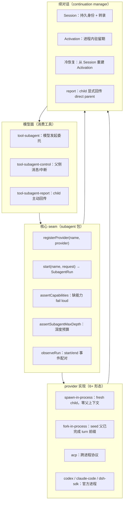
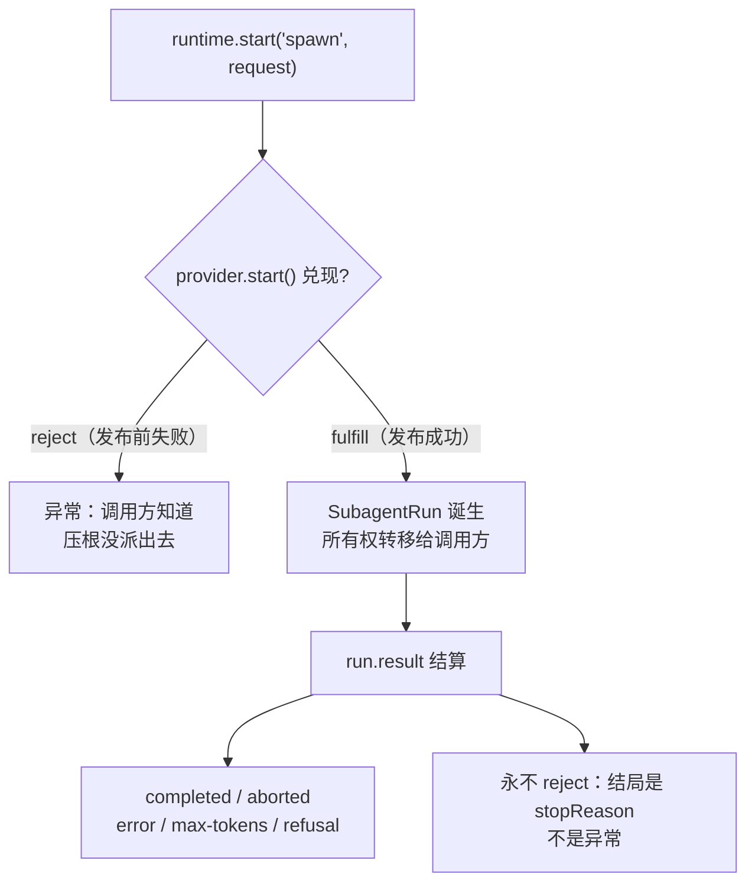
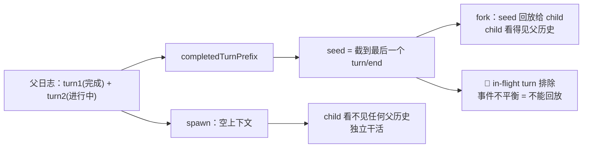
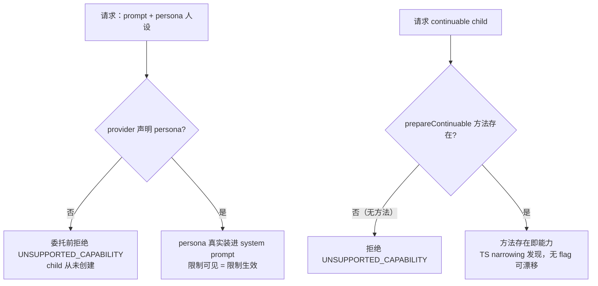
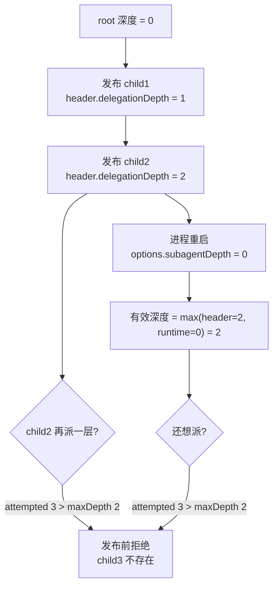
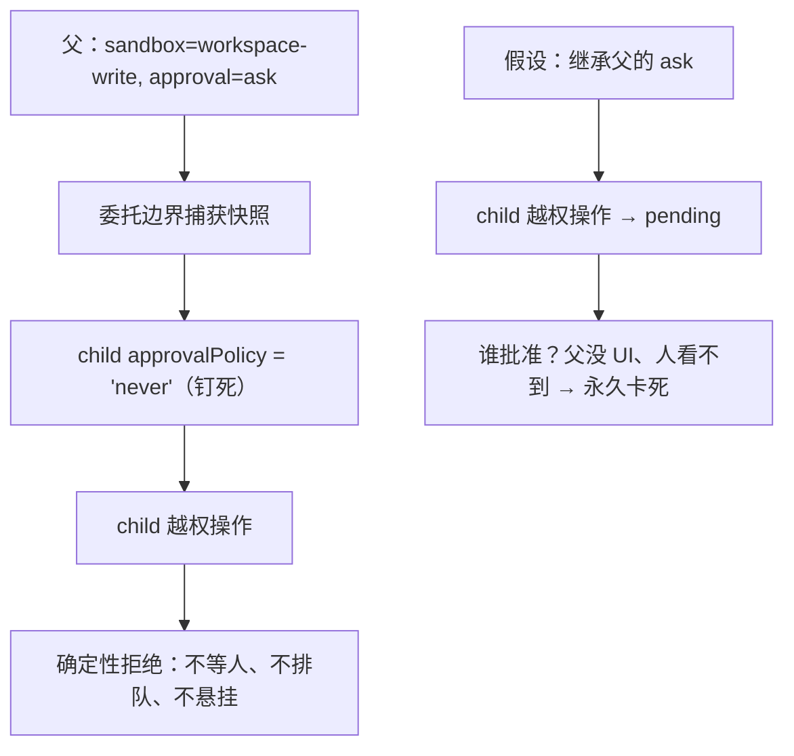
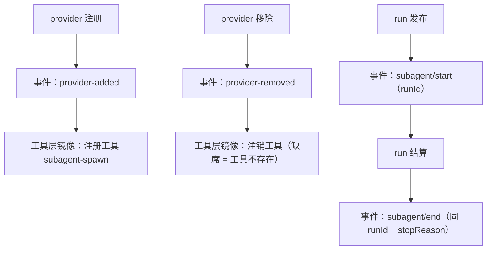
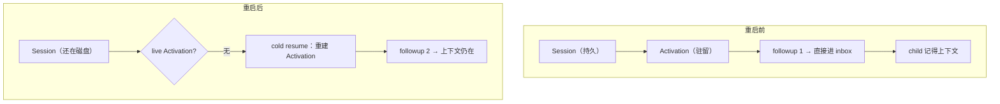
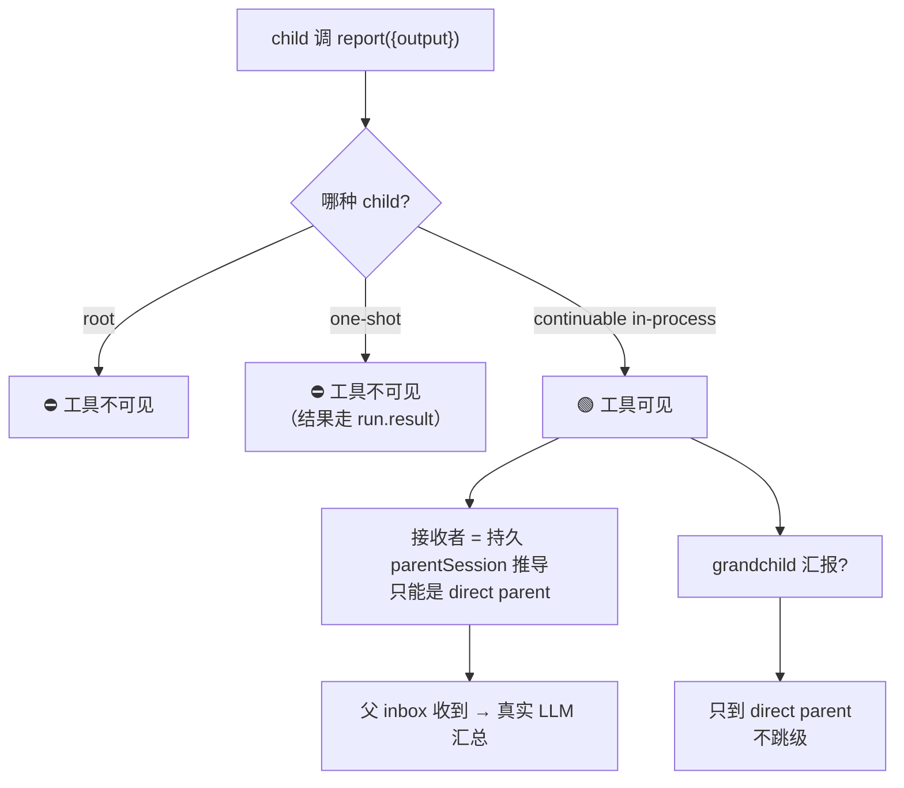

# DeepSeek Harness 源码精读（六）：Agent 怎么"派小弟"干活？——子代理编排

## 开场：模型说"我要派一个子代理"，然后呢？

上一章我们看了工具调用：模型说"调工具"，调度器把一次调用送过六道关，结果回填给模型。
那子代理更麻烦：模型说"派一个小 Agent 去干活"——它不是"一次调用"，而是一个**活的、会思考的、跑完要回来的东西**。接下来要回答的不是"能不能跑"，而是一串更尖锐的问题：

- 这个小 Agent **到底怎么跑**？同进程？外部进程？还是官方产品？
- 它拿到的是**什么上下文**？跟父对话有关系吗？有关系的话，关系到哪一行？
- 它能做的事**边界在哪**？父能审批的操作，后台 child 能审批吗？
- 它跑挂了、被取消了、跑到一半进程重启了——**谁知道**？
- 它干完了，**怎么把结果交回来**？父怎么知道"这就是结论"？
- 父一次派 3 个小弟，**会不会打架**？

如果"派子代理"只是在主循环里 `new ChildAgent()`，上面每一问都会变成主循环里的 `if (mode === ...)`，而且每加一种运输方式（本地进程、ACP 协议、Codex、Claude Code），核心代码就要改一次。

DeepSeek Harness 把整个子代理域做成了一个 11 个子包的 **subagent seam**：核心一个注册表 + 抽象契约，实现一堆 provider，消费端几个模型面工具。这篇从源码出发，把"模型说派小弟 → 子代理跑完 → 结果交回父"这条链路上的每一个设计决策拆开。

## 先看全景图：一次子代理委托的完整旅程



- **注册表 seam**（`subagent` 包）：所有运输方式都按名字注册，调用方按名字点单。委托前把能力、深度、权限、事件一次做完。
- **provider 实现**（`subagent-*` 各包）：spawn / fork / ACP / 官方产品进程，各管各的上下文哲学。
- **续对话**（`continuation.ts`，1483 行）：Session 管身份，Activation 管运行，跨重启不丢上下文；report 是 child 唯一显式回传通道。

下面从源头拆起。

## 起点：SubagentProvider——一个子代理必须声明什么？

先看核心契约。子代理不是"一个更小的 Agent"，而是一个**可插拔的 provider**。它最少要回答四件事（`subagent/src/types.ts:285`）：

```ts
export interface SubagentProvider {
  /** 注册表里的唯一名字（如 spawn / fork / acp） */
  readonly name: string
  /** start 时支持的特性：outputSchema / depthLimit / toolFilter / persona */
  readonly capabilities: SubagentCapabilities
  /**
   * child 是否继承父的已完成 turn 前缀。这是**描述性**的，不是服务校验的
   * start 能力：模型面工具从它派生诚实的文案（fork 说"继承对话"，
   * spawn/ACP 说"独立上下文"）。
   */
  readonly inheritsParentContext: boolean
  /** 建立一次性 child，发布后返回 run */
  start(request: ResolvedSubagentStartRequest): Promise<SubagentRun>
  /**
   * 可选：continuable 创建能力。**方法存在即能力**——不用 flag，
   * 用 TS narrowing 发现，flag 不会与实现漂移。
   */
  prepareContinuable?(request: ContinuableCreateRequest): Promise<ContinuableCreateSpec>
}
```

配套的 `SubagentRun`（`types.ts:249`）是"已发布 child"的句柄，它有三个关键契约：

```ts
export interface SubagentRun {
  readonly id: SessionId // 本地 run 必须等于已发布的 child session id
  readonly localAgent: Agent | undefined // 远程 run 为 undefined
  readonly result: Promise<SubagentResult> // 见下：**不 reject 的结算**
  dispose(): Promise<void> // 幂等：取消剩余工作、到达 quiescence
}
```

而 `SubagentResult`（`types.ts:219`）回答"跑完是什么"：

```ts
export interface SubagentResult {
  readonly output: ContentBlock[] // child 最后一条非空 assistant 消息
  readonly structured?: unknown // 请求了 outputSchema 且满足时的结构化结果
  readonly stopReason: SubagentStopReason // 见下
}
```

`stopReason` 是一张 merge-extensible 词汇表（`types.ts:200`）：`completed / aborted / error / max-tokens / refusal`。**任何非 completed 的 stopReason 都意味着 output 可能不完整**——消费方不能假设"拿到 result 就拿到了完整答案"。

### 为什么一个"派小弟"要做成注册表？

因为"派子代理"不是一个动作，而是几种**运输方式**：同进程 fresh（spawn）、同进程 seed（fork）、跨进程协议（ACP）、官方产品进程（Codex / Claude Code / dsh SDK）。今天加一种，明天加一种。把它们焊死在主循环里，主循环很快就变成一坨 `if (mode === ...)`。

Harness 的答案是**注册表 + 名字点单**（`subagent/src/index.ts:369`）：

```ts
registerProvider(provider: SubagentProvider): () => void {
  // 同名重复注册直接报错；返回的 disposer 供 HMR 卸载
}
```

调用方永远只做一件事：`runtime.start('spawn', request)`。provider 怎么跑、child 什么形态，调用方不关心——**provider 选择是配置，不是模型可见的**。模型只知道有个 `subagent` 工具，不知道背后是 spawn 还是 acp 还是 Codex。

### start 的发布边界：为什么 reject 和 result 要分开？

这是整个 seam 最精妙的一个语义（`index.ts:414` + `types.ts` SubagentRun 注释）：

```ts
async start(name: string, request: SubagentStartRequest): Promise<SubagentRun> {
  const provider = this.expectProvider(name) // 没这个名字 → NO_PROVIDER，fail loud
  this.assertCapabilities(provider, request) // 缺能力 → UNSUPPORTED_CAPABILITY
  assertSubagentMaxDepth(request.maxDepth)
  if (request.outputSchema !== undefined) assertObjectJsonSchema(request.outputSchema)
  const descriptor = snapshotSubagentDescriptor({ mode: 'one-shot', provider: name, ... })
  const resolved: ResolvedSubagentStartRequest = { ...request, descriptor }
  return observeRun(..., await provider.start(resolved)) // 发布边界在这
}
```

关键在 **`provider.start()` 的 promise 兑现（fulfill）那一刻 = child 正式"发布"，所有权转移给调用方**：

- **发布前失败**（promise reject）：child 从未存在。没有 run、没有需要 dispose 的东西、不发生命周期事件。调用方从异常里知道"压根没派出去"。
- **发布后失败**（child 跑挂了/被取消/超 token）：不 reject，而是通过 `run.result` **结算**成一个 stopReason。`result` 的注释写得很直白：_"Does NOT reject on a child-level failure — a model/transport failure resolves with stopReason: 'error' so the consumer maps it to an isError tool result."_

为什么要分开？因为两种失败对调用方是**不同的问题**：发布前失败 = "这次委托不存在"，一个 try/catch 就能处理；发布后失败 = "委托存在，但结局是 X"，调用方必须始终能拿到并 settle 这个 run——如果混在一起，调用方要额外区分"没派出去"和"派出去后干坏了"。

## spawn 和 fork：委托的两种上下文哲学

同样是派子代理，`spawn` 和 `fork` 解决的是不同任务：

- **spawn**（`subagent-spawn-in-process`）：fresh child，**零父上下文**。适合独立任务："帮我查竞品数据"——带父上下文反而是污染。
- **fork**（`subagent-fork-in-process`）：seed child，**继承父已完成 turn 前缀**。适合追问型任务："基于刚才的对话继续分析"。

### fork 的 seed 为什么截到最后一个 turn/end？

`fork` 的核心逻辑就一个函数（`subagent-fork-in-process/src/index.ts:48`）：

```ts
function completedTurnPrefix(parent: Agent): SessionEvent[] {
  const events = parent.session.events
  const lastEnd = events.findLast(e => e.type === 'turn/end')
  if (lastEnd === undefined) return []
  // seq === 数组下标（append 契约），slice 到最后一个 turn/end（含）
  return events.slice(0, lastEnd.seq + 1)
}
```

**in-flight turn 被排除**：正在进行的 turn 里，可能已经发出 subagent 调用但结果还没回来——事件是不平衡的（有 `tool/call` 没有对应 `tool/result`）。如果把这份"半本账"复制给 child，child 恢复时读到的是一个损坏的账本：它解释不了"调用已发出、结果不存在"的鬼状态。

另外注意**父日志的记账纪律**：父日志只记录 `tool/call` + `tool/result`（child 的最终输出），child 内部的 step/tool 调用**永不进父日志**。父只要结论，不关心过程——这也让 fork 的 seed 天然干净。

### 一个追问，两种结果

step-02 里用真实 LLM 演示了这个对比：fork child 因为继承了"前端 React + Vite，后端 NestJS，AI 用 LangChain"的父对话，能答出追问；spawn child 上下文为空，只会照实说"我看不到父对话"。同一个追问，两种哲学两种结果——**追问必须 fork，独立任务必须 spawn**。

## 委托边界一：能力校验——fail loud，不接受后忽略

模型可以请求四件事：结构化输出（outputSchema）、深度上限（maxDepth）、工具过滤（toolFilter）、专属人设（persona）。每个请求字段都对应 provider 声明的一个能力 flag（`subagent/src/index.ts:481`）：

```ts
private assertCapabilities(provider: SubagentProvider, request: SubagentStartRequest): void {
  const needs: { when: boolean; cap: keyof SubagentCapabilities }[] = [
    { when: request.outputSchema !== undefined, cap: 'outputSchema' },
    { when: request.maxDepth !== undefined, cap: 'depthLimit' },
    { when: request.toolFilter !== undefined, cap: 'toolFilter' },
    { when: request.persona !== undefined, cap: 'persona' },
  ]
  for (const { when, cap } of needs) {
    if (when && !provider.capabilities[cap]) {
      throw new SubagentError(
        `subagent provider "${provider.name}" does not support the "${cap}" capability`,
        'UNSUPPORTED_CAPABILITY',
      )
    }
  }
}
```

**为什么 fail loud？** 因为"先接受、后面默默忽略"是最贵的沉默：父 agent 以为海盗人设生效了、以为深度限制生效了、以为工具被过滤了——实际上 provider 根本做不到。模型会基于一个**不存在的限制**做决策。拒绝发生在 `provider.start()` **之前**：child 从未被创建，没有需要清理的东西。

对照设计是 **continuable 能力不设 flag**：`prepareContinuable` 方法存在即能力（TS narrowing 直接发现）。flag 会说 true 但实现被删（声明与实现漂移），方法在不在永远不可能撒谎。

## 委托边界二：深度预算——递归是配置出来的，不是运气防住的

委托深度不是装饰字段，是**防递归爆炸的预算**。顶层 agent 深度 = 0，child = 父深度 + 1，超过 maxDepth 直接拒绝，child 根本不发布（`depth.ts`，全文 51 行）：

```ts
export function delegationDepthOf(agent: Agent): number {
  const runtime = agent.options.subagentDepth
  if (
    runtime !== undefined &&
    (!Number.isSafeInteger(runtime) || runtime < 0 || Object.is(runtime, -0))
  ) {
    throw new TypeError('agent subagentDepth must be a non-negative safe integer')
  }
  // header 是权威且单调的：运行时 options 可以加深，永远不能降低已烙下的深度
  return Math.max(agent.session.header.delegationDepth ?? 0, runtime ?? 0)
}
```

两个关键点：

- **header 是 monotone floor**：进程重启后 agent 带着全新的 options 起来，如果从 0 算，一个曾经是第 2 层的 child 会假装自己是顶层继续往下派——重启不能降低递归计数。`Math.max(header, runtime)` 保证有效深度永不低于已烙下的烙印。
- **层数必须是安全整数**：负数、小数、`-0`、Infinity、NaN 都不是"层数"。为什么连 `-0` 都拒？`-0` 与 `0` 在 `===` 下相等却在 `Object.is` 下不等，混进深度比较会制造"看起来合法、实际不可信"的值。

## 委托边界三：权限快照——后台 child 的审批钉死 never

后台 child 的审批升级是最恶心的状态：父不在 UI 前，child 的审批弹出来**永远没人看**——任务永久卡死 + 一条无人认领的 pending 记录。

Harness 的答案不是给后台补"审批可见性"机制，而是**让这个状态根本不可能出现**（`subagent/src/child-agent.ts:199`）：

```ts
export function captureDelegatedPolicyOverrides(parent: Agent): DelegatedPolicyOverrides {
  return {
    // 只捕获父 session 的显式 sandbox override——绝不捕获部署默认值或一次性授权
    sandboxMode: parent.ctx.get('sandboxPolicy')?.overrideOf(parent.session),
    // 只要 approval 能力组装了就钉死 'never'：不读父的 'ask'
    approvalPolicy: parent.ctx.get('approval') === undefined ? undefined : 'never',
  }
}
```

配套三件事把"钉死"落到实处：

1. **写成持久事件**（`appendDelegatedPolicyOverrides`）：快照以 `source: 'delegation'` 落到 child 自己的 log 上——cold resume 回放它，fork seed 里可能携带的陈旧父策略输给它（新策略赢）。
2. **child 被告知而非被坑**（`SUBAGENT_DELEGATION_CONTEXT`，`child-agent.ts:135`）：每个 in-process child 的 system prompt 里都有一条 delegation 声明，order 120 排在 sandbox/approval 策略句之后：

```ts
export const SUBAGENT_DELEGATION_CONTEXT =
  'You are a delegated subagent: your permission scope was fixed when you were started and cannot be ' +
  'widened from inside this session — operations that require approval are rejected automatically. ' +
  'When the task needs access beyond that scope, do not retry the denied operation; state the ' +
  'limitation in your reply so the delegating agent can handle it.'
```

3. **child 的权限故事收敛到一维**：sandbox scope（danger-full-access / read-only / workspace-write）。加宽永远是父侧决定——child 想要更宽权限，就说明限制让父处理，**别重试**。

step-05 的真实输出演示了对比：钉死 never 的 child 越权操作被**确定性拒绝**（不等人、不排队）；而"假设没钉死、继承了父的 ask"的对照组，操作进入 pending——**没人会批准它**。

## 生命周期可观测：一对事件讲完一个 run 的一生

子代理不是"跑了就算"，而是要能被看见。`observeRun`（`lifecycle.ts:133`）把一次 run 的一生压成**一对同 runId 的事件**：

```ts
export function observeRun(emit, provider, parent, run): SubagentRun {
  const identity = { runId: randomUUID(), provider, id: run.id, local: run.localAgent !== undefined }
  // 先挂终态 observer，再发 start——保证 start → end 顺序
  void run.result.then(
    (result) => emit('subagent/end', { ...identity, stopReason: result.stopReason, ... }, parent),
    () => emit('subagent/end', { ...identity, stopReason: 'error' }, parent),
  )
  emit('subagent/start', identity, parent)
  return run
}
```

没有这层配对，监控、日志、消费工具都只能轮询内部状态——run 的边界就没了。观察者隔离也在这里保证：`createLifecycleEmitter`（`lifecycle.ts:100`）对每个 listener 单独 try/catch，**一个坏 observer 抛异常只打日志，不影响其他 listener**——观察者是旁观者，旁观者摔一跤，比赛照常进行。

provider 生命周期同样广播：`provider-added / provider-removed` 事件让消费方（tool-subagent）**镜像** provider 的来去，而不是赌加载顺序。起因很实际：工具的 description 依赖 provider 的 `inheritsParentContext`（fork 文案要说"继承对话"），但 Cordis Loader 并发启动 sibling，无顺序保证。所以 tool-subagent 的做法是：provider 在 → 注册工具（那一刻派生文案）；provider 走 → 注销工具；provider 缺席时**工具不存在**——诚实状态，不能向模型撒谎。

## 续对话：Session 在磁盘，Activation 在内存

一次性 run 干完就 dispose，但**可持续对话**的 child 是另一个物种：它要活着跨越多轮 followup、跨过进程重启、让父随时能找到它。Harness 的答案是**两层分离**（`continuation.ts`，1483 行）：

```text
persisted Session          ← 持久身份：转录、lineage、delegationDepth
  └── optional live Activation   ← 进程内驻留期：重建的 child Agent + inbox
        └── one AgentHandle
        └── Agent inbox = 唯一 turn FIFO
        └── zero or more owned child Activations
```

- **Session**：持久身份，存对话转录、lineage、delegationDepth。进程重启、provider 注销都不影响它。
- **Activation**：一次重建 child Agent 的驻留 epoch，可执行多个 FIFO turn，等待 descendant 时保持驻留。它不是 request/result/cancellation/Task 边界。
- **Agent inbox 是唯一 turn FIFO**：不能再有第二个"Jobs 队列"跟它抢排序权——两个队列就没有单一权威了。

provider 只参与初始创建：可选的 `prepareContinuable` 返回**纯数据**（如 parent-history seed），不含 Agent/handle/prompt/result/disposal。之后全部生命周期归 **continuation manager**：`startContinuable()` 创建完 childId 和 Activation 就返回 `{ childId, messageId }`，不等 turn 跑完。后续 followup 分三种情况：

1. live Activation 在 → 消息直接进 inbox（单一 FIFO）
2. live Activation 不在 → **cold resume**：从持久 Session 重建 Activation，不经过 provider——descriptor 保留 provider 名但不依赖 provider 注册（provider 注销后 child 仍可恢复）
3. 冷恢复有授权门槛：**只有 exact live parent Agent 能继续**（授权依据是持久 Session 里的 parentSession lineage，不是"谁知道 childId"）

step-07 用真实 LLM 演示了完整链路：startContinuable → followup（记得上文）→ 模拟进程重启（清空 Activation 表）→ 再 followup（cold resume 成功，上下文仍在）→ 别的 agent 想接管 → `UNAUTHORIZED`。

## report：child 怎么把结果交回父？

长命 child 干完一轮，怎么让父知道？**不是**"最后一条消息自动算结果"——那是隐式协议，父要猜。Harness 给每个 continuable in-process child 装一个普通模型面工具 `report`（`tool-subagent-report` 包），child 被指导结束前主动调一次（report obligation），`reportFrom`（`continuation.ts:583`）：

```ts
async reportFrom(child: Agent, content: ContentBlock[], options): Promise<MessageId> {
  options.signal.throwIfAborted()
  this.assertAdmitting(child)
  const activation = this.authorizeReporter(child) // exact live child Agent = 发送凭证
  const parent = this.resolveReportParent(child) // 从持久 parentSession 推导唯一接收者
  return this.deliverReport(activation, parent, content, options.delivery)
}

private authorizeReporter(child: Agent): Activation {
  const activation = this.activations.get(child.id)
  if (activation === undefined || activation.handle.agent !== child) {
    throw new SubagentError(`agent "${child.id}" is not a live continuable subagent...`, 'UNAUTHORIZED')
  }
  ...
}

private resolveReportParent(child: Agent): Agent {
  const parentId = child.session.header.parentSession // durable lineage
  ...
}
```

几个边界是精心设计的：

- **API 上没有 recipient 参数**：`{ output }` 进，`{ messageId }` 出。接收者只能从持久 `parentSession` 推导——child 选不了"发给谁"。
- **只跨一条边**：grandchild 只能报给 direct parent，不能跳级。若 grandchild 要影响 root：先报 childA，由 childA 决定要不要再报——**每个环节有权过滤**。
- **scope-local 注册**：report 只在 continuable in-process child 里可见。roots（没有父）、one-shot child（结果走 run.result）、远程 child（没有父的 inbox 可投递）都看不到它——**可见性与权威一致**，模型不会看到"能调却调不了"的工具。
- **report 是协作控制，不是结果包装**：report 成功**不**结束 turn、**不**结算 Activation、**不**阻止后续 followup；结束 turn 也从不自动 report。child 报完还能继续干活。
- **调度是部署配置**：`reportDelivery: 'quiet' | 'wakeup'`（默认 wakeup）。quiet = `parent.inject()`（加模型可见上下文但不唤醒）；wakeup = `parent.followup()`（一个普通 FIFO parent turn）。
- 回执语义克制：`messageId` 不是 read receipt / log ack / turn-completion / 持久化 flush。

## 设计哲学：子代理域反复出现的五个原则

1. **委托前做所有校验**：能力、深度、权限快照全部在 start 之前完成，委托边界的 yes/no 清晰。缺能力 fail loud，不接受后忽略；深度超限 child 根本不发布；权限钉死在边界，会话内无法加宽。
2. **让坏状态不可能出现，而不是给它造可见性**：后台审批升级 = 没人看的阻塞——与其做"后台审批可见性"机制，不如把 approval 钉死 never，让挂起状态在类型上不存在。
3. **身份与运行分离**：Session 持身份（持久），Activation 管运行（进程内）。重启丢驻留、不丢对话；turn 排序只信 Agent inbox 一个队列。
4. **跨进程能力诚实**：做不到就别广告。out-of-process provider 广告 `NO_START_CAPABILITIES`（零 start 特性），service 在 start 前就拒绝需要它们的请求；run handle 契约（result 不 reject、dispose 幂等）让消费方不需要区分本地/远程。
5. **优化有前提条件，在组合层收窄**：fork 的唯一价值是前缀复用，而 report 活在请求头部、会破坏前缀逐字节一致——所以 shipped 组合把 fork 绑到 one-shot，而不是在代码层禁止（代码层断言不了它观察不到的包）。

## 🧪 自己动手：8 步渐进式理解子代理编排（代码 + 真实输出）

> 2026-09-03 重构：从"机制叠加"改为**每步只解决一个哲学点**。代码在 `articles/dsh-subagent/src/steps/`（ai-agent-code-lab 仓库），机制自实现 + child 干活走真实 LLM。
>
> 跑法二选一：
>
> - 仓库根：`pnpm run subagent:step:01` ~ `subagent:step:08`
> - 或在 `articles/dsh-subagent/` 内：`pnpm run step:01` ~ `step:08`

每步文件顶部都是四段式 JSDoc（痛苦场景 → 为什么这么设计 → 收益 → 对应源码）。下面按步拆解，配核心代码和**真实运行输出**。

### Step 01：provider 注册表——派子代理 = 按名字点单

**这一步解决什么问题**：新手实现"派子代理"，就是在主循环里直接 new 一个子 Agent 类写死。等想换一种跑法（本地进程 → 远程沙箱），主循环里到处是 if/else；加一个第三方子代理实现，还得改核心代码。派生的"动作"和派生的"方式"焊死在一起了。

**为什么这么设计**：注册表 + 可插拔 provider（对应源码 `SubagentRuntime`）：provider 按名字注册进 Map，父 agent 按名字 start。多个 provider 并存（不像 bash 只能有一个执行器），加运输方式 = 注册新 provider，不改核心。另一个关键设计是**发布边界**：`provider.start()` 兑现那一刻 = child 正式发布、所有权转移；发布前失败 → start() reject（调用方拿不到 run、无需清理）；发布后失败 → 通过 `run.result` 结算成 stopReason，result 本身不 reject。

**收益**：运输方式可插拔；调用方对"派出去没"和"结局是什么"有确定答案。

**流程图**（一次委托的两条失败路径）：



**核心代码**（`step-01-provider-registry.ts`，SubagentRuntime + 发布边界语义）：

```ts
class SubagentRuntime {
  private providers = new Map<string, SubagentProvider>()

  /** 同名重复注册 → 报错（对应源码 registerProvider L369） */
  registerProvider(provider: SubagentProvider): void {
    if (this.providers.has(provider.name)) {
      throw new SubagentError(
        `a subagent provider named "${provider.name}" is already registered`,
        'DUPLICATE_PROVIDER',
      )
    }
    this.providers.set(provider.name, provider)
  }

  /** 按名字派一次委托（对应源码 start L414） */
  async start(name: string, request: SubagentStartRequest): Promise<SubagentRun> {
    const provider = this.providers.get(name)
    if (provider === undefined) {
      throw new SubagentError(`no subagent provider registered for "${name}"`, 'NO_PROVIDER')
    }
    // 发布边界：provider.start() reject = 这次委托从未发布，没有 run 需要 dispose
    return provider.start(request)
  }
}
```

**实测输出**：

```text
🧭 Step 01 – 子代理注册表：派子代理 = 按名字点单，不关心运输方式
==============================================================

① 注册 provider（多种运输方式并存）
   ✅ 已注册：spawn、acp

② 重复注册同名 provider
   ✅ 拒绝：a subagent provider named "spawn" is already registered（code=DUPLICATE_PROVIDER）

③ start 一个不存在的 provider
   ✅ 拒绝：no subagent provider registered for "ghost"（code=NO_PROVIDER）

④ spawn 派一个 child（真实 LLM 干活）
   🔍 run.id = 70a962ae-df36-4116-959b-154b3d97fd8d
   📨 child 真实回答：闭包是一个函数连同其外部作用域的变量捆绑在一起的组合…
   🏁 stopReason = completed（发布后正常完成 → 通过 result 结算）

⑤ acp 派一个 child（进程边界之外，干活仍是真实 LLM）
   🔍 run.id = 3f569fd7-95be-4229-ab6b-ff429d5aefd5
   📨 child 真实回答：事件循环是JavaScript等异步编程中用于管理任务队列…的核心机制。
   🏁 stopReason = completed

⑥ 发布边界 · 发布前失败：start() reject，调用方拿不到 run、无需清理
   ✅ start() reject：subagent request was aborted before child publication
   → 没有任何 run 诞生，调用方没有需要 dispose 的对象（未发布 = 不存在）

⑦ 发布边界 · 发布后失败：run.result 结算 stopReason，不 reject
   🔍 run.id = 0062a8af-e760-4bdd-8dc4-df208ef8a619（已发布）
   ⚡ 父 agent 立刻 dispose（模拟"不需要结果了"）
   ✅ result 结算：stopReason = aborted
   → 发布前是"异常"（reject），发布后是"结局"（stopReason）——调用方永远有确定答案

🎯 一句话：注册表解耦"派什么活"和"怎么派"，发布边界解耦"没派出去"和"结局如何"。
```

**看什么**：⑥⑦ 是核心——同一把取消信号，落在发布前是 reject（没有 run），落在发布后是 `aborted` 结局（有 run 要 settle）。消费方永远不需要问"这 run 到底存不存在"。

### Step 02：spawn vs fork——独立任务要干净的脑子，追问要一本抄好的笔记

**这一步解决什么问题**：都是"派子代理"，但 spawn（fresh）和 fork（seed）解决的不是一类任务。混用就会出两种事故：把父对话全部塞给独立调研的 child（上下文污染，模型被无关历史带偏）；或让追问型 child 从零开始（它根本不知道你们刚才聊了什么）。

**为什么这么设计**：fork 的 seed 由 `completedTurnPrefix` 计算——**截到父日志最后一个 turn/end（含）**。in-flight turn 被排除：它里面可能有已发出但没结果的 subagent 调用，事件不平衡，不能作为合法回放历史——把"调用已发出、结果不存在"的半本账复制给 child，child 读到的是损坏的账本。父日志也只记 child 的 `tool/call` + `tool/result`（最终输出），child 内部过程永不进父日志。

**收益**：追问型任务自带上下文、独立任务不受污染；seed 永远是一份平衡的账本。

**流程图**（同一份父日志，两条派法）：



**核心代码**（`step-02-spawn-vs-fork.ts`，completedTurnPrefix + fork/spawn 双执行器）：

```ts
/** fork 的 seed 计算：已完成 turn 前缀（对应源码 completedTurnPrefix L48-54） */
function completedTurnPrefix(session: Session): SessionEvent[] {
  const events = session.events
  let lastEnd = -1
  for (let i = events.length - 1; i >= 0; i--) {
    if (events[i].type === 'turn/end') {
      lastEnd = i
      break
    }
  }
  if (lastEnd === -1) return [] // 没有任何已完成 turn → fresh，等价 spawn
  return events.slice(0, lastEnd + 1) // seq === 数组下标，slice 到最后一个 turn/end（含）
}

/** spawn：fresh child，零父上下文（对应源码 subagent-spawn-in-process） */
async function spawnChild(task: string): Promise<string> {
  const system = '你是一个被派来干独立任务的子代理。你**看不到**父 agent 的任何对话历史…'
  return childAnswer(system, '', task)
}

/** fork：seed child，先"回放"父的已完成 turn 前缀再回答 */
async function forkChild(seed: readonly SessionEvent[], task: string): Promise<string> {
  const system = '你是一个继承了父对话上下文的子代理。下面给你父 agent 已完成的历史（回放）…'
  const history = seedAsText(seed).length > 0 ? `【父对话历史】\n${seedAsText(seed)}\n\n` : ''
  return childAnswer(system, history, task)
}
```

**实测输出**：

```text
🍴 Step 02 – spawn vs fork：独立调研派 spawn，追问派 fork
==============================================================

① 父会话日志（1 个已完成 turn + 1 个正在进行的 turn）
   完整父日志：
     turn/start
     user/message         我们这个 AI 课程项目用什么技术栈？
     assistant/message    前端用 React + Vite，后端用 NestJS，AI 部分用 LangChain…
     turn/end
     turn/start
     user/message         帮我把登录接口的安全性检查一遍。
     assistant/message    好的，我派一个子代理去审计登录接口。
     tool/call            subagent({"description":"审计登录接口","promp…)

② fork 的 seed = completedTurnPrefix（截到最后一个 turn/end）
   🔍 seed 含 4 条事件（父日志共 8 条）
   🚫 被排除的 in-flight turn：subagent（调用已发出但结果没回来）
   → 为什么排除：turn 没收尾 = 事件不平衡。把"调用已发出、结果不存在"的
     半本账复制给 child，child 会读到一个它无法解释的鬼状态。

③ fork 一个 child，追问父对话内容（真实 LLM 回答）
   📨 fork child 回答：LangChain
   ✅ fork child 答出了继承的上下文（它有 seed，看得见父历史）

④ spawn 一个 child，问同一个追问（真实 LLM 回答）
   📨 spawn child 回答：我无法看到父 agent 的对话历史，所以不知道父 agent
      刚才说的 AI 部分具体是什么技术。请提供更多上下文。
   ✅ spawn child 答不出（它上下文是空的，只会照实说不知道）
   → 同一个追问，两种哲学两种结果：追问必须 fork，独立任务必须 spawn。

⑤ 父日志只记录子代理的"调用 + 最终输出"，child 内部过程不进父日志
   child 内部 6 条事件（read_file 调用等）→ 父日志只追加 2 条：
     └─ tool/result（子代理最终输出）
     └─ turn/end（收尾）
   父日志现在 10 条；child 内部 step 永远不会出现在父日志里

🎯 一句话：spawn 给独立任务一个干净的脑子，fork 给追问任务一本抄好的笔记——边界是最后一个 turn/end。
```

**看什么**：③④ 是最有说服力的证据——同一个追问，fork child 秒答"LangChain"，spawn child 只会说"我看不到"。上下文不是越多越好，**该给谁就给谁**；而 ② 的 in-flight 排除是账本纪律：宁可少给，不给半本账。

### Step 03：能力声明——fail loud，不接受后忽略

**这一步解决什么问题**：父 agent 请求"给 child 装一个海盗人设"，如果 provider 不支持还默默收下，模型会**以为限制生效了**——实际上 child 收到的是普通 system prompt。等 child 干出不符合人设的事，父才发现"哦原来它没收到"。**接受后忽略是最贵的沉默**：错误发生在信任建立之后。

**为什么这么设计**：委托前逐一校验（对应源码 `assertCapabilities` L481-496）：请求里用到的每个字段，provider 都必须声明支持，缺哪个直接抛 `UNSUPPORTED_CAPABILITY`。拒绝发生在 `provider.start()` **之前**——child 从未被创建，父的意图不会静默丢失。continuable 能力则用"方法存在即能力"（`prepareContinuable` 可选方法 + TS narrowing），flag 可能漂移，方法在不在撒不了谎。

**收益**：能力要么被明确拒绝，要么真实生效——没有中间地带。

**流程图**（缺能力的两种命运）：



**核心代码**（`step-03-capabilities.ts`，assertCapabilities 逐项校验）：

```ts
class SubagentRuntime {
  /**
   * 委托前逐一校验：请求用到的每个字段，provider 都必须声明支持
   * （对应源码 assertCapabilities L481-496）。拒绝发生在"委托之前"。
   */
  async start(name: string, request: SubagentStartRequest): Promise<SubagentRun> {
    const provider = this.providers.get(name)
    if (provider === undefined)
      throw new SubagentError(`no subagent provider registered for "${name}"`, 'NO_PROVIDER')
    this.assertCapabilities(provider, request)
    return provider.start(request)
  }

  private assertCapabilities(provider: SubagentProvider, request: SubagentStartRequest): void {
    const needs: { when: boolean; cap: keyof SubagentCapabilities }[] = [
      { when: request.outputSchema !== undefined, cap: 'outputSchema' },
      { when: request.maxDepth !== undefined, cap: 'depthLimit' },
      { when: request.toolFilter !== undefined, cap: 'toolFilter' },
      { when: request.persona !== undefined, cap: 'persona' },
    ]
    for (const { when, cap } of needs) {
      if (when && !provider.capabilities[cap]) {
        throw new SubagentError(
          `subagent provider "${provider.name}" does not support the "${cap}" capability`,
          'UNSUPPORTED_CAPABILITY',
        )
      }
    }
  }
}
```

**实测输出**：

```text
🚦 Step 03 – 能力声明 + fail loud：不支持的请求在委托前就被拒绝
==============================================================

① 注册两个 provider：minimal（4 个能力全 false）+ full（全 true）

② 向 minimal 请求 persona（它没声明这个能力）
   ✅ 委托前拒绝：subagent provider "minimal" does not support the "persona" capability
     code = UNSUPPORTED_CAPABILITY
   → 关键：拒绝发生在 provider.start() **之前**，子代理从未被创建。
     如果"接受后忽略"，父 agent 会以为海盗人设已生效——模型以为限制在，其实不在。

③ 同一个请求给 full（声明了 persona 能力）→ 通过且真实生效
   📨 child 回答：嘞个是海盗爷们儿，最凶残的干活儿仔，能帮你搞定任何海域的宝藏和麻烦…
   ✅ 人设真的装进了 child 的 system prompt（限制可见 = 限制生效）

④ 逐项校验：每个请求字段 → 一个能力 flag
   ✅ maxDepth 请求 → minimal 抛 UNSUPPORTED_CAPABILITY
   ✅ toolFilter 请求 → minimal 抛 UNSUPPORTED_CAPABILITY
   ✅ outputSchema 请求 → minimal 抛 UNSUPPORTED_CAPABILITY

⑤ 对比设计：continuable 能力 = 可选方法 prepareContinuable 是否存在（注释演示）
   full.prepareContinuable 存在 → continuable 能力 = true
   minimal.prepareContinuable 不存在 → continuable 能力 = false
   → 为什么不设 flag：flag 说 true、方法却被删了 → 声明与实现漂移。
     方法在不在由 TS narrowing 直接发现，两者不可能不一致。

🎯 一句话：能力要么被明确拒绝，要么真实生效——"接受后忽略"是最贵的沉默。
```

**看什么**：③ 是整个 step 的爽点——同样的 persona 请求给 full provider，child 真的开口就是海盗腔。**限制可见 = 限制生效**，fail loud 的另一半是"说了支持就必须做到"。

### Step 04：委托深度预算——"派一层烙一层"，重启改不了

**这一步解决什么问题**：child 还能派 grandchild，grandchild 还能派曾孙——没有上限的委托树迟早递归爆炸。更隐蔽的漏洞是**重启作弊**：进程重启后 agent 带着全新的 options 起来，如果深度从 0 算，一个曾经是第 2 层的 child 会假装自己是顶层继续往下派，预算形同虚设。

**为什么这么设计**：深度是持久烙印，不是运行时装饰。`delegationDepthOf` 取 `max(持久化 header, 运行时 options)`——**header 是 monotone floor**，运行时只能加深、永远不能降低。超限的委托在发布前就抛 `SubagentDepthError`：第 3 层 child 根本不存在，没有需要清理的东西。maxDepth 和 subagentDepth 都必须是**非负安全整数**：负数、小数、`-0`、Infinity、NaN 在类型上拒绝（`-0` 与 0 在 `Object.is` 下不等，会制造"看起来合法、实际不可信"的值）。

**收益**：委托深度可配置、可持久、跨重启不可作弊；递归失控在"发布前"被拦下。

**流程图**（header 是下限，运行时只能加深）：



**核心代码**（`step-04-max-depth.ts`，delegationDepthOf + assertSubagentMaxDepth + resolveChildDepth）：

```ts
function delegationDepthOf(agent: AgentLike): number {
  const runtime = agent.options.subagentDepth
  if (
    runtime !== undefined &&
    (!Number.isSafeInteger(runtime) || runtime < 0 || Object.is(runtime, -0))
  ) {
    throw new TypeError('agent subagentDepth must be a non-negative safe integer')
  }
  // 取 max：header 是下限（monotone floor），运行时只能加深不能减轻
  return Math.max(agent.header.delegationDepth ?? 0, runtime ?? 0)
}

function assertSubagentMaxDepth(maxDepth: unknown): void {
  if (
    maxDepth !== undefined &&
    (typeof maxDepth !== 'number' ||
      !Number.isSafeInteger(maxDepth) ||
      maxDepth < 0 ||
      Object.is(maxDepth, -0))
  ) {
    throw new TypeError('subagent maxDepth must be a non-negative safe integer')
  }
}

function resolveChildDepth(parent: AgentLike, maxDepth: number | undefined): number {
  const childDepth = delegationDepthOf(parent) + 1
  if (!Number.isSafeInteger(childDepth))
    throw new RangeError('child depth exceeds safe-integer range')
  if (maxDepth !== undefined && childDepth > maxDepth) {
    throw new SubagentDepthError(childDepth, maxDepth) // 发布前拒绝
  }
  return childDepth
}
```

**实测输出**：

```text
🧮 Step 04 – 委托深度预算：递归是配置出来的，不是运气防住的
==============================================================

① 合法委托链（maxDepth=2）
   root 深度 = 0（顶层 agent 缺省）
   ✅ 发布 child（delegationDepth 烙进 header = 1）
   ✅ 发布 child（delegationDepth 烙进 header = 2）

② child2 想再派一层（递归失控的瞬间）
   ✅ 拒绝：subagent depth 3 exceeds maxDepth 2
     attemptedDepth=3 > maxDepth=2
   → 拒绝发生在发布之前：第 3 层 child 根本不存在，没有需要清理的东西。

③ 持久化 header 防作弊（monotone floor）
   header.delegationDepth=2，重启后 options.subagentDepth=0
   → 有效深度 = max(2, 0) = 2（header 说了算，重启不算"回零"）
   ✅ 它想再派一层 → 实际 attemptedDepth=3，被拒
   → 如果有效深度用新 options 从 0 算，这个"第 2 层"重启后会假装顶层，
     递归预算就失效了——所以 header 是单调下限，只能加深不能减轻。

④ 非法参数全部 reject（TypeError）
   ✅ maxDepth=负数 -1 → TypeError
   ✅ maxDepth=小数 1.5 → TypeError
   ✅ maxDepth=负零 -0 → TypeError
   ✅ maxDepth=Infinity → TypeError
   ✅ maxDepth=NaN → TypeError
   ✅ options.subagentDepth=2.5 → TypeError

🎯 一句话：深度是"派一层烙一层"的持久烙印，重启改不了，超限就拒绝。
```

**看什么**：③ 是精髓——重启后 options 归零，但 header 记得你是第 2 层。**递归预算的防作弊不靠自觉，靠持久化烙印**；④ 的 `-0` 拒绝是"类型即契约"的极端例子。

### Step 05：委托即权限快照——后台 child 的审批钉死 never

**这一步解决什么问题**：父 agent 在 UI 前，审批策略是 ask（弹窗问人）。但它派出的后台 child 不在任何 UI 里——如果 child 继承 ask，它一申请升级权限，审批弹窗**永远不会有人看**：任务永久卡死 + 一条无人认领的 pending 记录。比拒绝糟糕得多。

**为什么这么设计**：与其给后台造"审批可见性"机制，不如让"挂起"状态**不可能出现**。委托边界同步捕获权限快照：sandbox override 继承父的显式设置，approval 一律钉死 `'never'`。快照写成 child 自己 log 上的持久事件（`source: 'delegation'`），cold resume 回放它、fork seed 的陈旧父策略输给它。child 还**被告知**（system prompt 里有一条 delegation 声明）：权限已固定、要审批的操作自动拒绝、需要更宽权限就说明限制让父处理、别重试。

**收益**：后台 child 要么在权限内干活，要么被确定性拒绝——没有第三种（挂起）状态。

**流程图**（钉死 vs 继承，两种命运）：



**核心代码**（`step-05-delegated-permission.ts`，captureDelegatedPolicyOverrides + decide）：

```ts
function captureDelegatedPolicyOverrides(parent: ParentAgent): DelegatedPolicyOverrides {
  return {
    sandboxMode: parent.explicitSandboxOverride, // 只捕获显式 override
    approvalPolicy: 'never', // 钉死：不读父的 approval 策略
  }
}

function appendDelegatedPolicyOverrides(
  childSession: ChildSession,
  overrides: DelegatedPolicyOverrides,
): void {
  if (overrides.sandboxMode !== undefined) {
    childSession.append('sandbox/mode', { mode: overrides.sandboxMode, source: 'delegation' })
  }
  if (overrides.approvalPolicy !== undefined) {
    childSession.append('approval/policy', {
      policy: overrides.approvalPolicy,
      source: 'delegation',
    })
  }
}

/** 极简审批裁决：never → 确定性拒绝；ask → 挂起（后台没人看！） */
function decide(policy: ApprovalPolicy, operation: string): ApprovalDecision {
  if (policy === 'never') {
    return {
      kind: 'denied',
      reason: `审批策略='never'：操作「${operation}」被自动拒绝（要审批的操作在此会话不可用）`,
    }
  }
  return { kind: 'pending', reason: `审批策略='ask'：操作「${operation}」已提交，等待人类批准……` }
}
```

**实测输出**：

```text
🔒 Step 05 – 委托即权限快照：后台 child 的审批钉死 never
==============================================================

① 父 agent 的状态：显式 sandbox override = workspace-write，审批策略 = ask（人在 UI 前）

② 委托发生：同步捕获权限快照（captureDelegatedPolicyOverrides）
   🔍 sandboxMode    = workspace-write（继承父的显式 override）
   🔍 approvalPolicy = never（不读父的 'ask'，钉死 'never'）
   → 为什么钉死：child 在后台跑，审批升级 = 没人看的阻塞。
     与其造"后台审批可见性"机制，不如让"挂起"这个状态不可能出现。

③ 快照写成 child 自己 log 上的持久事件（cold resume 回放它）
   📜 sandbox/mode → {"mode":"workspace-write","source":"delegation"}
   📜 approval/policy → {"policy":"never","source":"delegation"}

④ child 执行权限内任务（真实 LLM，system 带 delegation 声明）
   📨 child 回答：我的权限状态固定且不可扩展，超出范围的操作会被自动拒绝；权限内操作成功。

⑤ child 尝试越权操作（改 sandbox 模式 = 需要审批）
   ❌ 审批策略='never'：操作「把 sandbox 模式改为 danger-full-access」被自动拒绝
   → 拒绝是**确定性的**：不等人、不排队、不悬挂。child 立刻知道边界在哪。

⑥ 对比：假设没钉死 never，child 继承了父的 ask
   ⏳ 审批策略='ask'：操作「把 sandbox 模式改为 danger-full-access」已提交，等待人类批准……
   → 这个 pending 会被谁批准？父 agent 没有审批 UI，人类用户看不到后台 child 的弹窗。
     结果：任务永久卡死 + 一条无人认领的待审批记录——比拒绝糟糕得多。

⑦ delegation 声明生效：让 child 真实 LLM 回答"需要更宽权限怎么办"
   📨 child 回答：我无法访问该机密文件，因为我的权限范围在启动时已固定，无法从会话内部
      自行扩大。请委托您的父 agent 处理此操作。
   ✅ child 说明限制而非重试（声明生效）

🎯 一句话：委托即快照——权限固化在边界上，后台 child 要么在权限内，要么被确定性拒绝，没有第三种状态。
```

**看什么**：⑥ 是全文最重要的反例——"ask 继承"在后台场景不是更宽松，而是**死锁**。钉死 never 不是限制 child，是保护任务：child 立刻知道边界，而不是永远等一个不会来的批准。

### Step 06：生命周期可观测——一对事件讲完一个 run 的一生

**这一步解决什么问题**：子代理跑了，但监控、日志、UI 都看不见它——只能轮询内部状态猜"它到哪一步了"。消费工具想镜像 provider 的来去，还得赌插件加载顺序（Cordis Loader 并发启动 sibling，没有顺序保证）。

**为什么这么设计**：`observeRun` 把一次 run 的一生压成**一对同 runId 的事件**：`subagent/start`（runId + provider + childId）+ `subagent/end`（同 runId + stopReason + 最终输出）。终态 observer 在 start 之前就挂好，保证 start → end 顺序。provider 生命周期也用事件广播（`provider-added / provider-removed`），消费方**镜像**而不是赌顺序：provider 在就注册工具、走就注销、缺席时工具不存在（诚实状态，不向模型撒谎）。观察者隔离：一个 listener 抛异常只打日志，不影响其他人。

**收益**：run 的边界可观测、可审计；消费方与 provider 解耦（事件镜像，无 load-order 依赖）；坏观察者不传染。

**流程图**（事件配对 + 消费方镜像）：



**核心代码**（`step-06-lifecycle-events.ts`，EventBus + observeRun 配对 + listener 隔离）：

```ts
class EventBus {
  private listeners = new Map<EventName, Set<Listener>>()

  on(name: EventName, fn: Listener): () => void {
    if (!this.listeners.has(name)) this.listeners.set(name, new Set())
    this.listeners.get(name)!.add(fn)
    return () => this.listeners.get(name)!.delete(fn) // 返回 disposer
  }

  emit(name: EventName, payload: unknown): void {
    const set = this.listeners.get(name)
    if (!set) return
    for (const fn of [...set]) {
      try {
        fn(payload)
      } catch (error) {
        // listener 隔离：坏 observer 只警告，不影响其他 listener
        console.log(
          `   ⚠️ listener 隔离：${name} 的一个 listener 抛了 ${(error as Error).message}，其他 listener 不受影响`,
        )
      }
    }
  }
}

/** 配对一次 run 的 start/end（对应源码 observeRun L133-162） */
function observeRun(emit, provider: string, run: SubagentRun): void {
  const identity = { runId: run.id, provider }
  emit('subagent/start', identity) // 先发 start
  void run.result.then(result => {
    emit('subagent/end', {
      ...identity,
      stopReason: result.stopReason,
      lastAssistantMessage: result.output,
    })
  }) // 结算时发 end（同一 runId）
}
```

**实测输出**：

```text
📡 Step 06 – 生命周期可观测：一对事件讲清一个 run 的一生
==============================================================

① 注册 provider（观察工具层如何镜像生命周期）
   🛠️ 工具层镜像：provider "spawn" 出现 → 注册工具 subagent-spawn
   → 当前挂载的工具：subagent-spawn

② 移除 provider
   🧹 工具层镜像：provider "spawn" 离开 → 注销工具 subagent-spawn
   → 当前挂载的工具：（无）
   → 异步状态不是同步状态：工具不赌"加载顺序"，provider 在就注册、走就注销。
   🛠️ 工具层镜像：provider "spawn" 出现 → 注册工具 subagent-spawn

③ 订阅 subagent/start + subagent/end，跑一次真实委托
   🟢 start：runId=d4045fba… provider=spawn childId=04121b95…
   🔴 end：  runId=d4045fba… stopReason=completed
       lastAssistantMessage=事件驱动是一种编程范式，程序的执行流程由外部事件…
   ✅ start/end 同 runId 配对成功（d4045fba…）

④ listener 隔离：故意 throw 的 observer 不影响其他 listener
   🟢 start：runId=d96ff77c… provider=spawn childId=bc3ca6ba…
   ⚠️ listener 隔离：subagent/start 的一个 listener 抛了 我是坏 observer，我炸了，其他 listener 不受影响
   ✅ 好 observer 仍然收到事件
   🔴 end：  runId=d96ff77c… stopReason=completed
   ✅ 隔离生效：坏 observer 的异常被吞掉并警告，不影响其他人
   → 观察者是旁观者：旁观者摔一跤，比赛照常进行。

🎯 一句话：run 的一生 = 一对同 runId 的 start/end 事件；工具随 provider 进退；坏观察者不传染。
```

**看什么**：③ 的"同 runId 配对"是审计的基石——任何监控都能回答"这个 run 从哪来到哪去"；② 的镜像语义回答"工具为什么有时在有时不在"——不是 bug，是 provider 没注册时工具就该不存在。

### Step 07：可持续对话——Session 在磁盘，Activation 在内存

**这一步解决什么问题**：一次性 run 干完就没了，但有些 child 需要**持续对话**：父随时能追加一轮、child 记得所有上下文、进程重启也不丢。如果拿"一次性 run"硬做，进程一重启对话就断了；如果给每个 turn 都建新 child，上下文就丢了。

**为什么这么设计**：两层分离——**Session**（持久身份：转录、lineage、delegationDepth，跨重启不丢）+ **Activation**（进程内驻留期：重建的 child Agent + 一个 inbox）。`startContinuable` 创建完 childId 和 Activation 就返回 `{ childId, messageId }`，不等 turn 跑完。后续 followup 分三种：live Activation 在 → 直接进 inbox；不在 → **cold resume**（从持久 Session 重建 Activation，不经过 provider）；冷恢复有授权（只有 exact live parent 能继续，依据是持久 lineage 不是"谁知道 childId"）。

**收益**：对话身份与运行实例解耦——重启丢驻留、不丢对话；turn 排序只信 inbox 一个 FIFO；provider 只交"创建差异"。

**流程图**（重启前 vs 重启后）：



**核心代码**（`step-07-continuable.ts`，SessionStore + AgentHandle + ContinuationManager 简化）：

```ts
/** 持久 Session：转录存在"磁盘"上，跨"进程重启"不丢 */
interface DurableSession {
  readonly id: string
  readonly parentSession: string | undefined
  transcript: string[]
}

class SessionStore {
  private sessions = new Map<string, DurableSession>()
  save(s: DurableSession): void {
    this.sessions.set(s.id, s)
  }
  load(id: string): DurableSession | undefined {
    return this.sessions.get(id)
  }
}

class ContinuationManager {
  private activations = new Map<string, Activation>() // 进程内驻留表
  constructor(private sessions: SessionStore) {}

  /** startContinuable：建 Session + Activation，不等 turn 跑完就返回 */
  startContinuable(parent: ParentAgent, prompt: string): { childId: string } {
    const childId = randomUUID()
    this.sessions.save({ id: childId, parentSession: parent.id, transcript: [] })
    this.activate(childId, prompt) // 驻留 + 投递首轮
    return { childId }
  }

  /** followup：live 在 → 直接投递；不在 → cold resume 重建 */
  followup(parent: ParentAgent, childId: string, content: string): void {
    if (parent.id !== this.sessions.load(childId)?.parentSession) {
      throw new SubagentError(
        `agent "${parent.id}" is not the direct parent of subagent "${childId}"`,
        'UNAUTHORIZED',
      )
    }
    let activation = this.activations.get(childId)
    if (activation === undefined) {
      activation = this.activate(childId, '') // cold resume：从 Session 重建
      console.log('   → live Activation 不在：cold resume（从持久 Session 重建 Activation）')
    }
    activation.inbox.push(content) // 单一 FIFO
  }

  /** 模拟进程重启：清空驻留表，Session 存储保留 */
  simulateRestart(): void {
    console.log('   → 重启后 live Activation 表为空，但持久 Session 还在"磁盘"上')
    this.activations.clear()
  }
}
```

**实测输出**：

```text
🔁 Step 07 – 可持续对话的子代理：Session 在磁盘，Activation 在内存
==============================================================

① startContinuable：建立 durable child 并投递初始 prompt
   🔍 childId = f552b35e…，messageId = 977bb7ad…（inbox 已接受，不等 turn 开始）
   📨 首轮回答：收到。任务：为 TypeScript 泛型编写一份教学笔记。我将基于此方向与你持续对话。

② followup 追加一轮（同一 childId，live Activation 在）
   → live Activation 在（状态=waiting）：消息直接入唯一 inbox 并唤醒
   📨 第二轮回答：为 TypeScript 泛型写一份教学笔记。
   ✅ 上下文连续：child 记得首轮内容（转录在持久 Session 里）

③ 模拟进程重启：清空 Activation 表（内存没了），Session 存储保留
   → 重启后 live Activation 表为空，但持久 Session 还在"磁盘"上

④ 重启后再 followup（同一 childId）
   → live Activation 不在：cold resume（从持久 Session 重建 Activation）
   📨 冷恢复后回答：限制泛型类型必须符合某个结构，从而在泛型内安全地使用该类型的特定属性或方法。
   ✅ cold resume 成功：同一持久 Session 被重建为 live Activation，上下文仍在
   → 注意：重建的 Activation 是全新驻留期，但对话转录来自持久 Session——历史不丢。

⑤ 授权：别的 agent 想接管这个 child → UNAUTHORIZED
   → 拒绝：agent "someone-else" is not the direct parent of subagent "f552b35e…"; followup denied
     code = UNAUTHORIZED
   → 授权依据是持久 Session 里记的 parentSession（lineage），不是"谁知道 childId"。
   → live 状态下同样拒绝：code = UNAUTHORIZED（live 投递也过 authorizeLineage）

🎯 一句话：Session 是身份，Activation 是驻留，inbox 是唯一队列——重启丢驻留、不丢对话。
```

**看什么**：④ 是整个 step 的高潮——进程重启后同一个 childId 还能续上对话，因为转录在 Session、不在 Activation。**身份与运行的分离**让"重启"从灾难降级为普通事件；⑤ 证明授权跟着 lineage 走，知道 childId 不等于有权接管。

### Step 08：report 显式回传 + 并行总装——child 怎么把结果交回父？

**这一步解决什么问题**：长命 child 干完一轮，父怎么知道结果？如果靠"最后一条消息自动算结果"，父要猜、要解析、要等——隐式协议在长对话里根本不可靠。而且一次派多个 child，它们的结果怎么不打架地汇总？

**为什么这么设计**：report 是 child **主动调用**的显式回传工具（对应源码 `tool-subagent-report`）：只收 `{ output: string }`、只回 `{ messageId: string }`，**没有 recipient 参数**——接收者从持久 parentSession 推导，只能是 direct parent。它 **scope-local**：只在 continuable in-process child 里可见（roots 没有父、one-shot 结果走 run.result、远程 child 没有父的 inbox——可见性与权威一致）。report 是**协作控制不是结果包装**：成功不结束 turn、不结算 Activation、不阻止后续 followup。嵌套只跨一条边：grandchild 只能报给 direct parent，不能跳级。父汇总由真实 LLM 完成。

**收益**：回传是显式协议（何时报、报给谁、确认是什么都明确）；scope-local 保证"能看到的都能用"；并行 child 各报各的 direct parent，天然不打架。

**流程图**（scope-local + 单边投递 + 总装）：



**核心代码**（`step-08-report-and-assembly.ts`，scope-local 可见性 + report 投递）：

```ts
/** report 工具的作用域：只有 continuable in-process child 可见（对应源码 scope-local 注册） */
function reportToolVisible(scope: ChildScope): boolean {
  return scope === 'continuable'
}

class ContinuationManager {
  /** child 调 report：只接受它的 direct parent 作为接收者（对应源码 reportFrom） */
  reportFrom(child: ChildHandle, content: string): { messageId: string } {
    if (!reportToolVisible(child.scope)) {
      throw new SubagentError(
        `agent "${child.id}" is not a live continuable subagent and cannot report`,
        'UNAUTHORIZED',
      )
    }
    // 接收者从持久 lineage 推导：child 的 direct parent，API 上没有 recipient 参数
    const parent = this.activations.get(child.parentId)
    if (parent === undefined)
      throw new SubagentError('direct parent is not live', 'PARENT_UNAVAILABLE')
    const messageId = `msg-${randomUUID()}`
    parent.inbox.push({ from: child.id, content, messageId })
    return { messageId }
  }
}
```

**实测输出**：

```text
📮 Step 08 – report 显式回传 + 双 child 并行总装
==============================================================

① scope-local 安装：哪些作用域看得到 report 工具？
   ⛔ 顶层 agent（root） → report 工具不可见
   ⛔ 一次性 child（spawn） → report 工具不可见
   🟢 continuable in-process child → report 工具可见
   → 可见性与权威一致：没有 report 工具的作用域，连"试图报"的入口都不存在。

② 主 agent 并行派 2 个子代理（真实 LLM 同时干活）
   🍴 fork child 75b66775… 继承父对话上下文，任务：基于上下文写一句周报总结
   🧪 spawn child f90c59fc… 独立调研，任务：一句话说明什么是子代理
   📨 fork child 产出：本周完成了子代理编排章节，实现了父代理与子代理之间的任务分配与结果回传机制。
   📨 spawn child 产出：子代理是独立执行父代理分配的子任务、完成后必须将结果回传给父代理的半自主工作单元。

③ child 各自调 report（结束前回传自包含结果）
   🍴 fork child 的 report → 唯一接收者 = 它的 direct parent（root）✅
   🧪 spawn child 的 report → 唯一接收者 = 它的 direct parent（root）✅
   → 接收者由持久 parentSession 推导，API 上没有"发给谁"的参数——调用方选不了 recipient。

④ 父 agent 收件箱收到 2 条 report，真实 LLM 汇总
   📥 来自 75b66775…：周报总结：本周完成了子代理编排章节…
   📥 来自 f90c59fc…：调研结论：子代理是独立执行父代理分配的子任务…
   🧑‍💼 父 agent 总装汇总：本周完成了子代理编排章节，实现了父代理与子代理间的任务分配与结果回传机制…

⑤ 越级汇报：grandchild 只能报给 direct parent，捅不到 root
   🔗 委托链：root → childA(aac6acaf…) → grandchild(cae5734a…)
   🚫 grandchild 的 report 实际到达：aac6acaf…（它的 direct parent = childA，不是 root）
   ✅ 嵌套汇报只跨一条边：grandchild → 它的 direct parent（childA）
   ✅ root 的收件箱里没有 grandchild 的直接汇报
   → 若 grandchild 要影响 root：先报 childA，由 childA 决定要不要再报 root——每个环节有权过滤。

⑥ report 是协作控制，不是结果包装
   ✅ fork child report 之后仍然 live（report 不结算 Activation），可以继续报/继续干活
   → 结束 turn 也从不自动 report：child 被指导主动回传，父不猜。

🎯 一句话：report 是 child 主动投给 direct parent 的自包含结果——单边、显式、不结束任何东西。
```

**看什么**：⑤ 是安全设计的关键——**越级汇报被结构性地拦住**（API 上没有 recipient，接收者只能从 lineage 推导），grandchild 想影响 root 必须经过 direct parent 这一层过滤；① 的 scope-local 保证"工具可见性 = 工具可用性"，模型永远不会拿到一个调了也白调的工具。

## 回头看：这套设计在设计上反复出现的六个原则

1. **委托前做所有校验**：能力、深度、权限快照全部在 start 之前完成——委托边界的 yes/no 清晰，不把限制推到运行时让模型撞墙。写不出的能力不写，写了的必须实现；缺能力 fail loud，不接受后忽略。
2. **让坏状态不可能出现，而不是给它造可见性**：后台审批升级是"没人看的阻塞"——与其做可见性机制，不如把 approval 钉死 never，让挂起状态在类型上不存在。这比任何"后台审批弹窗"都干净。
3. **身份与运行分离**：Session 持身份（持久），Activation 管运行（进程内）。重启丢驻留、不丢对话；turn 排序只信一个 inbox，单一排序权威；provider 只参与创建，后续生命周期全归 manager。
4. **回传是显式协议**：report 明确"何时报、报给谁（direct parent）、安静还是唤醒（quiet/wakeup）、确认是什么（messageId 不是回执）"——不是"最后一条消息自动算结果"的隐式约定。接收者从持久 lineage 推导，模型选不了 recipient。
5. **scope-local 注册，可见性与权威一致**：report 只装在真需要它的 child 形态里；root / one-shot / 远程 child 看不到它——避免"模型以为能用、实际不能用"的幻影工具。
6. **跨进程能力诚实**：做不到就别广告（NO_START_CAPABILITIES）；run handle 契约（result 不 reject、dispose 幂等）让消费方不需要区分本地/远程。

## 总结

DeepSeek Harness 的子代理域是一套 **"注册表 seam + 可插拔 provider + 续对话管理器"** 的三层架构。注册表回答"派谁"（spawn / fork / ACP / Codex…按名字点单），委托边界在 start 前回答"能不能派"（能力 fail loud、深度预算、权限快照），续对话管理器回答"派出去之后怎么活"（Session 持身份、Activation 管运行、cold resume 跨重启、report 显式回传）。

对我们自己的 agent 项目最值得抄的四件事：**发布边界**（reject = 没派出去，result = 结局如何，永不 reject）、**权限快照 + 钉死 never**（让后台挂起状态不可能出现，而不是造可见性机制）、**身份与运行分离**（重启不丢对话）、**scope-local 工具注册**（模型看到的工具永远能用）。

## 面试考点

- **subagent seam 的三层边界是什么？**（核心契约包 subagent / provider 实现包 subagent-spawn、fork、acp… / 消费工具包 tool-subagent）
- **provider.start() 的发布边界？为什么 reject 和 result 结算要分开？**（发布前失败 = 委托不存在，reject；发布后失败 = 委托存在但结局是 stopReason，result 永不 reject——两种失败是不同的问题）
- **fork 的 seed 为什么截到最后一个 turn/end？**（in-flight turn 事件不平衡——有 tool/call 没 tool/result——不能作为合法回放历史；父日志只记 child 的调用+最终输出）
- **assertCapabilities 为什么 fail loud 而不是接受后忽略？**（父 agent 会基于不存在的限制做决策；拒绝发生在 provider.start() 之前，child 从未创建）
- **delegationDepth 为什么持久化到 Session header？**（重启后 options 归零，header 是 monotone floor，`max(header, runtime)` 保证重启不能降低递归计数）
- **后台 child 的 approval 为什么钉死 never？**（后台审批升级 = 没人看的阻塞；钉死让挂起状态不可能出现；child 被告知（delegation 声明）而非被坑）
- **Session 和 Activation 的区别？**（Session = 持久身份+转录+lineage；Activation = 进程内驻留期；冷恢复从 Session 重建 Activation，不经过 provider）
- **report 工具为什么只在 continuable in-process child 里可见？**（scope-local：可见性与权威一致；root 没有父、one-shot 结果走 run.result、远程 child 没有父的 inbox）
- **child 怎么选 report 的接收者？**（选不了——API 没有 recipient 参数，接收者从持久 parentSession 推导，只能是 direct parent；嵌套汇报只跨一条边）
- **report 是协作控制还是结果包装？**（协作控制：成功不结束 turn、不结算 Activation、不阻止后续 followup；结束 turn 也从不自动 report）

## 参考来源

- 源码：`packages/subagent/subagent/src/types.ts`（SubagentProvider L285 / SubagentRun L249 / SubagentResult L219 / SubagentStopReasonMap L200 / SubagentCapabilities L86）
- 源码：`packages/subagent/subagent/src/index.ts`（registerProvider L369 / start L414 / expectProvider L449 / assertCapabilities L481-496 / startContinuable L212）
- 源码：`packages/subagent/subagent/src/depth.ts`（delegationDepthOf L28-36 / assertSubagentMaxDepth L42-51）
- 源码：`packages/subagent/subagent/src/child-agent.ts`（captureDelegatedPolicyOverrides L199-204 / SUBAGENT_DELEGATION_CONTEXT L135-139 / applyChildComposition L177-196）
- 源码：`packages/subagent/subagent/src/lifecycle.ts`（observeRun L133-162 / createLifecycleEmitter L100-123）
- 源码：`packages/subagent/subagent/src/continuation.ts`（startContinuable L403 / followup L476 / coldResume L883 / materialize L966 / reportFrom L583 / authorizeReporter L596 / resolveReportParent L616）
- 源码：`packages/subagent/subagent-fork-in-process/src/index.ts`（completedTurnPrefix L48-54）
- 源码：`packages/subagent/tool-subagent-report/src/index.ts`（installReportTool L49）
- 设计笔记：`implemented/feature/2026-06-21-subagent-capability-seam.md`
- 设计笔记：`implemented/feature/2026-07-12-subagent-persona-tool-filter-and-depth.md`
- 设计笔记：`implemented/architecture/2026-07-05-subagent-provider-lifecycle-events.md`
- 设计笔记：`implemented/feature/2026-07-28-continuable-subagent-conversations.md`
- 设计笔记：`implemented/feature/2026-07-30-continuable-subagent-report-tool.md`
- 设计笔记：`implemented/architecture/2026-08-10-subagent-list-identity-projection.md`
- 设计笔记：`implemented/feature/2026-08-10-subagent-approval-pinned-never.md`
- 设计笔记：`implemented/architecture/2026-08-10-fork-children-stay-one-shot.md`
- 设计笔记：`implemented/feature/2026-08-09-parallel-subagent-delegations.md`
- 设计笔记：`implemented/feature/2026-08-11-background-first-continuable-delegation.md`
- 机制主线笔记：`deepseek-harness-study/notes-subagent-summary.md`（11 主题）
- 知识地图：`deepseek-harness-study/00-知识地图.md`（子代理域 ✅）
- 复现代码：`ai-agent-code-lab/articles/dsh-subagent/src/steps/`（step-01~08，2026-09-03 全部真实跑通）
