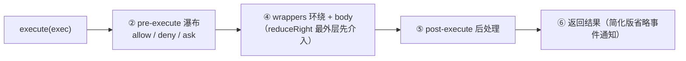
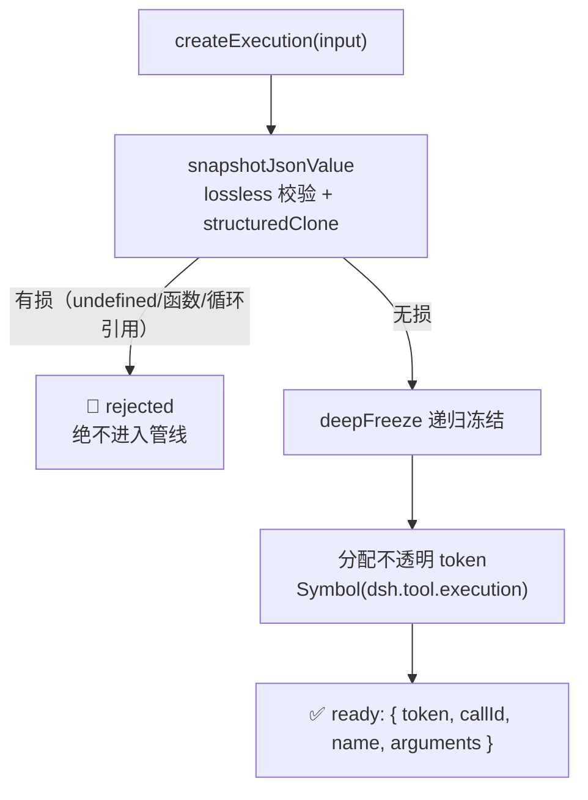
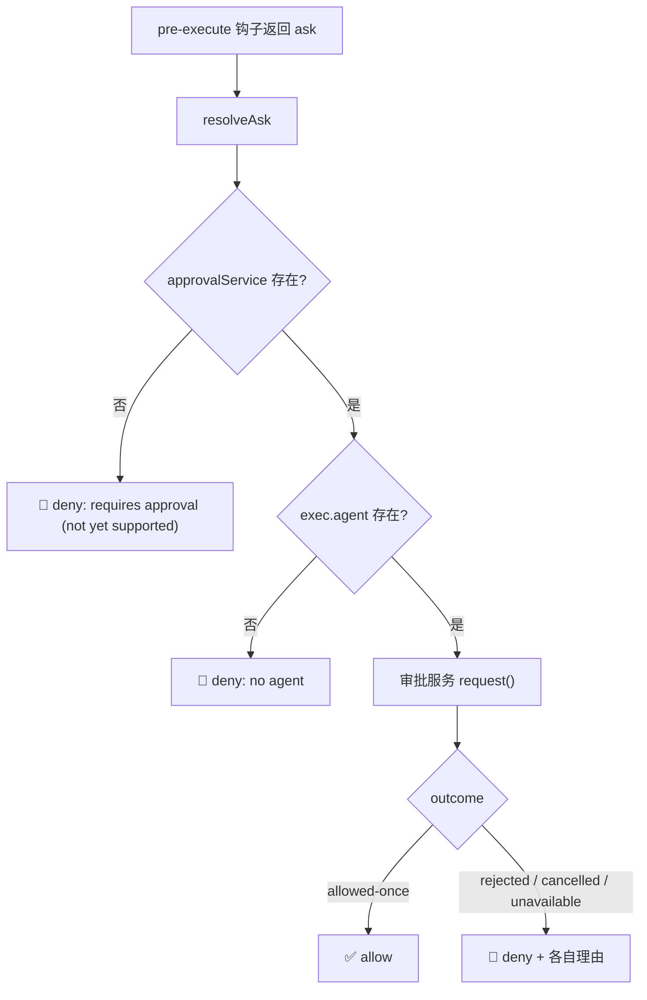
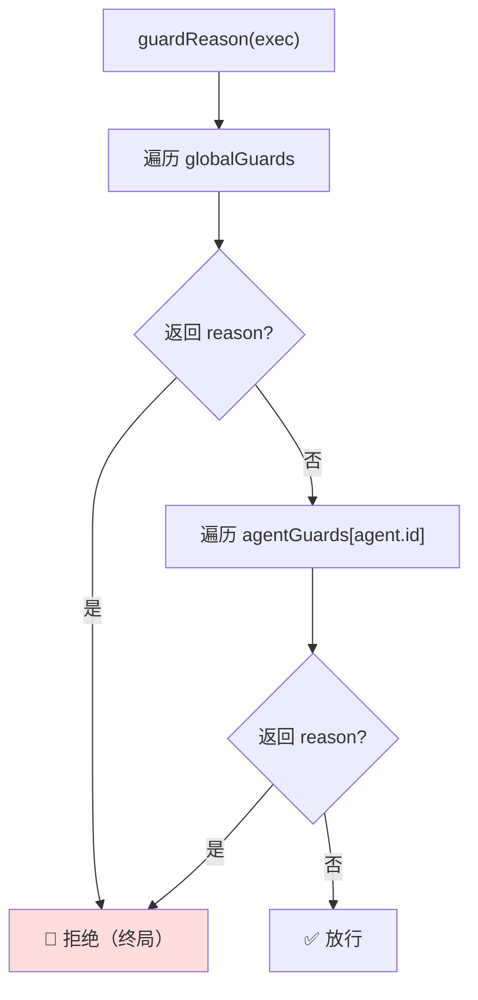
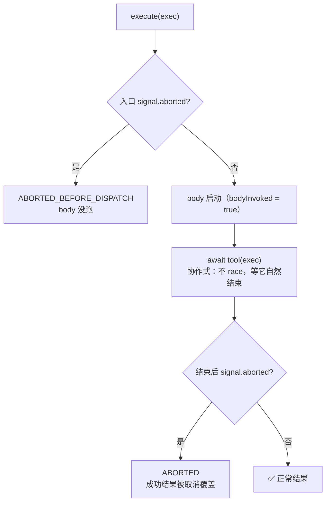
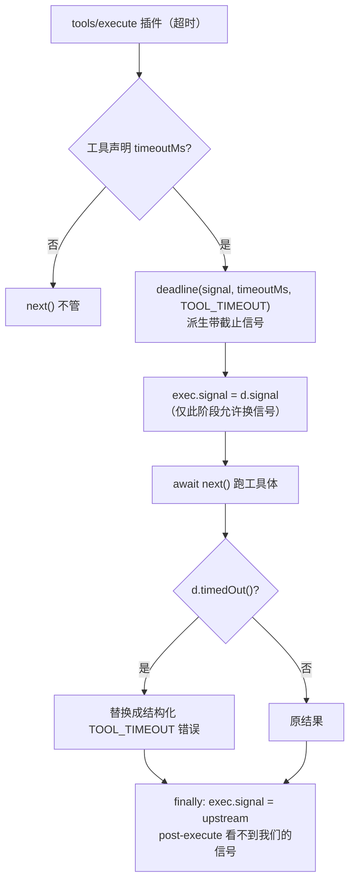
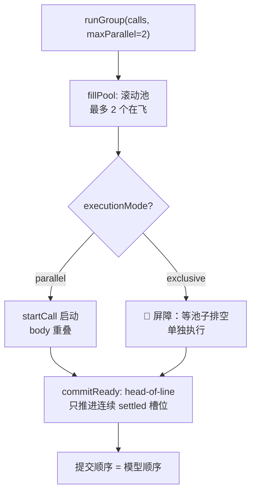

# DeepSeek Harness 源码精读（二）：一个工具调用，要过几道关？

## 开场：模型说"我要调工具"，然后呢？

上一篇我们看了 Agent 主循环：模型流式生成 → 遇到 tool-calls → `executeToolCalls()` 执行工具 → 结果回填 → 模型继续。那"执行工具"这四个字背后到底发生了什么？如果只是 `tool.execute(args)` 一行，你很快会撞上一堆生产级问题：

- 这个工具**该不该让模型调**？（权限：谁允许？要不要问用户？）
- 调用**超时了**怎么办？（bash 卡死、子代理跑飞）
- 模型一次回了 5 个工具调用，**能并行吗**？会不会有竞态？
- 用户中途**点了取消**，正在跑的工具怎么停？没跑的呢？
- 工具返回的数据**怎么变成模型能看的内容**？（结构化 value → 渲染文本）
- 这个工具**在子代理里该不该可见**？（scope 隔离）

DeepSeek Harness 把这套东西做成了一个 1946 行的 `ToolRuntime`（`packages/core/tools/src/index.ts`）+ 一个 289 行的调度器（`packages/core/agent-loop/src/tool-calls.ts`），再加一整套设计决策笔记（40+ 篇）。这篇从源码出发，把"一个工具调用从模型嘴里说出来到结果写进会话日志"的完整旅程拆开。

## 先看全景图：一个工具调用的完整旅程

源码把执行过程分成**六个阶段**，加上**调度器**在外面编排，以及一个**双模式**（native/code）决定模型怎么"够到"工具：

```mermaid
flowchart LR
    subgraph REG["注册（启动时）"]
        R1["register(ToolDefinition)"]
        R2["强制 output 声明 + schema 校验"]
    end

    subgraph SCHED["调度器（agent-loop/tool-calls.ts）"]
        S1["executionMode 分类: parallel / exclusive"]
        S2["滚动池 + 独占屏障"]
        S3["按模型顺序提交结果"]
    end

    subgraph PIPE["六段执行管线（ToolRuntime.execute）"]
        P1["① createExecution 参数物化+冻结"]
        P2["② pre-execute 瀑布: allow/deny/ask"]
        P3["③ guards 单调守卫"]
        P4["④ tools/execute 环绕 + body"]
        P5["⑤ post-execute: accept/replace/block"]
        P6["⑥ finalizeContent + tools/result"]
    end

    REG --> SCHED --> PIPE
```



六个阶段里，②④⑤ 都是 Cordis **waterfall**（可插拔瀑布），意味着超时、溢出、守卫、审计这些能力全是插件挂上去的，核心调度器不用改一行。这是整个设计的灵魂。下面逐个拆。

## 起点：ToolDefinition——一个工具必须声明什么？

先看注册的基本单元。一个工具不是"一个函数"，而是一个**完整的声明对象**（`index.ts:222`）：

```ts
interface ToolDefinition extends ToolSchema {
  // 模型可见：name / description / parameters（来自 ToolSchema）

  // ① 强制输出契约：schema + 纯函数渲染器
  readonly output: {
    schema: JsonSchemaNode // 工具返回值的 JSON Schema
    render(args, value): ContentBlock[] // 规范值 → 模型可见内容（纯函数）
    presentationMeta?(args, value): JsonValue // 可选 UI 元数据投影
  }
  // ② 执行函数：只返回规范 JSON value
  execute(args: unknown, exec: ToolRunContext): Promise<unknown>
  // ③ 最后一道内容变换（快照后恰好调用一次）
  finalizeContent?(exec, result): ContentBlock[] | undefined
  // ④ 超时预算（由 timeout-policy 插件强制执行）
  timeoutMs?: number
  // ⑤ 并发分类器：精确 true 才可并行
  isConcurrencySafe?(args): boolean
  // ⑥ UI 展示：pending 态 / 完成态
  presentCall?(args): ToolCallView | undefined
  presentResult?(args, result): ToolResultView | undefined
}
```

**为什么 output 是强制的？** 这是 2026-07-20 的 `canonical-tool-output-contract` 笔记定下的：以前工具直接返回一段文本给模型，导致"执行结果"和"展示"永远纠缠在一起——审计想要结构化数据拿不到，UI 想要卡片只能解析文本。现在每个工具必须回答两个问题：**我的返回值长什么样（schema）** + **怎么把它渲染给模型看（render）**。注册时少声明 `output` 直接 `TypeError` 拒绝。

**为什么 schemas() 要白名单？** 模型请求里只能出现 `name/description/parameters` 三个字段（`index.ts:1260` 的 `schemaOf`），`execute`、`output.render`、`finalizeContent` 这些**永远不能泄漏到模型请求里**——否则工具的实现细节就暴露在模型上下文里，白白烧 token 还可能被诱导。

第一方工具不手写 `ToolDefinition`，用 `defineTool`（`schema.ts:545`），它做三件事：把作者友好的 `ValueSchemaSpec` 编译成严格 JSON Schema 子集、从 schema **类型推断**出 `execute`/`render` 的参数和返回类型、在每次调用时硬校验参数。

## defineTool：一个 schema，三处用途

作者写的 schema 是一份 `ValueSchemaSpec`，比如：

```ts
const tool = defineTool({
  name: 'read_file',
  description: 'Read a text file.',
  parameters: {
    path: { type: 'string', required: true },
    offset: { type: 'integer' },
    limit: { type: 'integer' },
  },
  output: {
    schema: {
      type: 'object',
      additionalProperties: false,
      properties: {
        path: { type: 'string', required: true },
        totalLines: { type: 'integer', required: true },
        lines: { type: 'array', required: true, items: { type: 'string' } },
      },
    },
    render(args, value) {
      return [{ type: 'text', text: `read ${value.lines.length} lines of ${value.path}` }]
    },
  },
  async execute(args, exec) {
    // args 的类型已经被推断：{ path: string; offset?: number; limit?: number }
    return { path: args.path, totalLines: 100, lines: [] } // 必须匹配 output.schema
  },
})
```

一份 schema 编译成 JSON Schema 后有三个消费者（`defineTool` 内部）：

- **execute 路径硬校验**：参数不合法 → `ToolArgsError`（`INVALID_ARGS`）；返回值不合 output schema → `ToolOutputError`（`INVALID_TOOL_OUTPUT`）
- **presenter 路径软校验**：`presentCall/presentResult` 只在参数合法时才调用作者函数，否则回退通用卡片——因为展示会在**会话回放**时对任意历史参数运行，schema 可能已经改了，展示绝不能 throw
- **类型推断**：`InferArgs<S>` / `InferValue<S>` 精确推断 16 层容器深度，超过就放宽成 `JsonValue`——避免 TypeScript 类型栈爆炸

有个细节值得注意：`isConcurrencySafe` 也是"软校验 + 精确 true"语义（`index.ts:698` 的 `executionMode`），分类器抛异常、返回非 true 一律按**独占**处理——**fail-closed**，猜错了宁可串行不可并行。

## 第一站：参数物化——为什么参数要"冻"起来

调度器把模型请求的 tool-calls 交给 `ToolRuntime.execute()`（`index.ts:1382`），第一件事是 `createExecution`：**参数过一遍 lossless-JSON 快照 + deepFreeze**，再分配一个不透明的 `token`（Symbol）作为执行身份。

为什么要冻结参数？看 `PreToolDecision` 的注释就知道：**参数已经在历史日志里、在审计里、在 UI 里展示过了，执行时改参数 = 三个读者看到三个版本**。这就是 `proposed/feature/2026-06-30-pre-tool-input-rewrite.md`（执行前重写参数）至今没被批准的原因——改参数需要原子化更新模型历史、审计记录、UI 展示三个读者，代价巨大收益存疑。

同样的物化边界还有一道：**finalizeContent 回调在参数物化之前就快照**（`index.ts:1460`）。因为参数 getter 可能触发副作用（比如动态 schema 读取），如果在物化后快照，参数物化过程中工具定义可能已经变了。快照保证"调用开始时是什么样，最后一道变换就用什么样"。

## 第二站：pre-execute 瀑布——允许、拒绝，还是问用户？

`prepareExecution`（`index.ts:1510`）跑第一个瀑布。Cordis 的 waterfall 语义：每个监听者可以 `next()` 放行，也可以直接返回决策短路：

```ts
type PreToolDecision =
  | { kind: 'allow' }
  | { kind: 'deny'; reason: string } // 直接拒绝，产出 isError 结果
  | { kind: 'ask'; reason?: string } // 转人工审批
```

`ask` 走 approval 服务（`serviceAsk`，`index.ts:1747`）：审批返回 `allowed-once` 才放行，其余三种结局——`rejected`（用户拒绝）、`cancelled`（审批被取消）、`unavailable`（没有审批通道）——全部变成**带不同理由的 deny**。注意：**没有配置 approval 服务时 ask 直接降级为 deny**，fail-closed 而不是静默放行。agent-less 的调用也拒绝（没有会话可审计、没有 UI 可路由）。

这里还有一层精妙设计（`index.ts:1440`）：**code 模式下被折叠的工具（见后文）在进入政策管线之前就被确定性拒绝**——`pre-execute` 监听者、审批、守卫永远看不到一个注定失败的调用。否则可能出现"插件审批通过了、守卫放行了、结果还是 UNKNOWN_TOOL"的荒诞局面。

## 第三站：guards——为什么守卫只能"拒绝"不能"放行"？

瀑布之后是一道**单调守卫**（`index.ts:708`）：

```ts
type ToolGuard = (execution: Readonly<ToolExecution>) => string | undefined
// 返回 reason = 拒绝；返回 undefined = 不改变决策
```

`ToolGuard` 的返回类型**故意没有 allow 分支**。为什么？看注释：_"Because guards have no allow result, listener ordering cannot turn a denial back into permission."_ ——如果守卫能放行，那么注册顺序就能决定"谁说了算"：A 拒绝、B 放行，结果变成放行，守卫之间开始互相踩。**只允许拒绝**意味着任何一道守卫的拒绝都是终局，监听者顺序永远不会把拒绝变回许可。

守卫是分层的：全局注册的守卫对所有 agent 生效；通过 `agent.ctx` 注册的只对该 agent 生效。`guardReason` 先查全局层，再沿 scope 链从远到近查（`index.ts:1132`），任一返回 reason 即拒绝。

## 第四站：tools/execute 环绕 + 工具体——超时就是这么挂上去的

`dispatchScheduledExecution`（`index.ts:1605`）跑第二个瀑布 `tools/execute`，然后调用工具体。**这是唯一能替换 `exec.signal` 的阶段**（`ToolDispatchExecution` 是唯一可变视图）。

超时策略就是挂在这里的标准范例（`packages/guard/timeout-policy/src/index.ts`，81 行）：

```ts
ctx.on('tools/execute', async (exec, next) => {
  const timeoutMs = ctx.tools.get(exec.name, exec.agent)?.timeoutMs
  if (timeoutMs === undefined) return next() // 没声明预算就不管

  using d = deadline(exec.signal, timeoutMs, TOOL_TIMEOUT) // 派生带截止的信号
  exec.signal = d.signal // 替换信号（仅此阶段允许）
  try {
    const result = await next() // 跑工具体
    if (timeoutOf(d.signal, TOOL_TIMEOUT) !== undefined) {
      return toolTimeoutResult(timeoutMs) // 我们的计时器赢了 → 结构化 TOOL_TIMEOUT 错误
    }
    return result
  } finally {
    exec.signal = upstream // 用完恢复，post-execute 看不到我们的信号
  }
})
```

要点：**超时是协作式的**——插件只是替换信号，工具必须自己尊重 `exec.signal` 才能真的停。`timeoutMs` 声明在工具定义上而不是配置映射表里，因为"这个工具有没有超时预算"是工具自己的能力声明。错误码 `TOOL_TIMEOUT` 是插件私有的，嵌套的外层超时不会被误读成这个插件的。

工具体真正执行时（`dispatchToolBody`，`index.ts:1577`），注册表把**调用者信号和环绕包装器的信号融合**（`fuseToolSignals`）再交给工具——包装器换掉的信号不能把调用者的取消给"摘掉"。body 成功返回后进入 `createSuccessResult`：先校验 output.schema，再调 render 渲染成 `ContentBlock[]`，可选地投影 `presentationMeta`（只有顶层调用才投影，嵌套调用不投影）。**render 失败也会变成结构化错误**，而不是让整个管线崩溃。

## 第五站：post-execute——接受、替换、还是阻止？

`finalizeScheduledExecution`（`index.ts:1640`）跑第三个瀑布 `tools/post-execute`，决策有三种（`index.ts:599`）：

```ts
type PostToolDecision =
  | { kind: 'accept'; content?: ContentBlock[] } // 接受（可替换内容）
  | { kind: 'accept'; value: JsonValue } // 接受（可替换规范值）
  | { kind: 'block'; feedback: ContentBlock[] } // 阻止：变成纠正性错误
```

- **替换 content**：只改模型看到的内容，规范 value 和 meta 保留——这是**展示策略**（比如溢出策略把 10 万字的 bash 输出换成"预览 + 文件定位器"）
- **替换 value**：会重新校验 schema 并重新渲染——这是**数据策略**
- **block**：把成功结果变成 `isError`，内容换成纠正性反馈（比如"你连续 3 次调同一个工具了"）——模型会看到错误并自我纠正

两个坑：content 和 value **不能同时替换**（二选一，同时给直接 TypeError）；`additionalContexts` 可以附带，会被调度器塞进下一轮的输入。body 里 `deferContext` 挂的上下文在 accept 时保留、block 时丢弃（block 只暴露决策者显式给的上下文）。

## 第六站：finalizeContent + tools/result——最后一道门

`finishScheduledExecution`（`index.ts:1653`）做三件事：

1. **materialize**：把结果快照成 lossless JSON + deepFreeze——保证后续持久化不会因可变对象悄悄串改
2. **applyFinalContent**：调用定义里快照的 `finalizeContent`（恰好一次），返回 `undefined` 则保留原内容
3. **notifyResult**：`tools/result` emit 事件，observer 拿到**冻结的**执行对象和结果，**observer 抛异常被隔离**（只打日志，不影响结果）

这里有个细节：materialize 失败、finalizeContent 抛异常，都会降级成 `isError` 结果而不是让管线抛出去——**工具调用失败不能搞死整个 turn**。未知工具（`ToolNotFoundError` → `UNKNOWN_TOOL`）也是同样的结构化错误路径，模型看到错误可以自我纠正，而不是 turn 崩溃。

至此六段管线走完。但管线之外还有两个大机制：**取消**和**调度**。

## 取消体系：ABORTED vs ABORTED_BEFORE_DISPATCH

用户点取消，`AbortSignal` 从 agent loop 一路传进每个 `ToolExecutionInput`（必填字段）。注册表的取消语义（`index.ts:1571` + `2026-07-19-cooperative-tool-cancellation.md`）有几个关键点：

**① 不竞速、不放弃 Promise。** body 一旦开始，注册表就等它自然结束（quiescence），只是把最终结果替换成 `ABORTED`。竞速（Promise.race 赢者通吃）的问题在于：被放弃的 Promise 里的工作还在跑，可能产生你不知道的副作用。协作式取消 = "告诉它停，等它停"。

**② 两个错误码区分"停在哪了"：**

- `ABORTED_BEFORE_DISPATCH`：body 还没启动就取消了（参数物化后、政策管线前后都会重查取消）
- `ABORTED`：body 已启动，成功结果被取消覆盖

为什么要区分？**回放**需要知道真相——`tool/call` 事件已经写了，如果没区分，回放时无法判断"这个调用到底跑没跑"。

**③ 取消检查点**遍布全程：prepare 入口、pre-execute 之后、guards 之后、dispatch 之前，每次 await 回来都重查（用 `isAborted()` 函数而不是直接读 `.aborted`，避免 TS 控制流收窄误判）。

## 并行/独占调度：厨房可以并行炒菜，上菜必须按点单顺序

模型一次返回 5 个工具调用，调度器（`tool-calls.ts`）按 `executionMode()` 分类：`parallel` 的进滚动池，`exclusive` 的单独跑并形成**屏障**。设计契约（`2026-07-10-parallel-tool-call-execution.md`）：

- **只有 dispatch/body 阶段能重叠**；pre-execute、post-execute、结果提交全部按模型顺序串行——政策绝不能乱序
- **启动前重新分类**：滚动池每次补位时重读 `executionMode`，注册表中途变更可能把调用从 parallel 翻成 exclusive
- **提交保序**：`commitReady` 只推进**连续已结算**的槽位（head-of-line cursor），前面的没结算完，后面的先完成也得等——保证模型看到的工具结果顺序和它请求的顺序一致
- **容量**：`maxParallelToolCalls` 默认 10，设 1 就是纯串行；独占调用要等池子排空，且屏障持续到它的 post-execute 完成
- **取消时的合成结果**：已启动的 drain 完，未启动的**合成 `ABORTED_BEFORE_DISPATCH` 结果写进日志**（`appendSkippedToolCall`）——不然回放会看到"调用了却没结果"的洞

## Code Mode：native 之外的第二种形态——让模型写代码调工具

六段管线讲完了，但还有一个更激进的设计：**code 模式**（`2026-06-15-code-mode.md` + `code-mode.ts`）。默认 `native` 模式把全部工具的 schema 发给模型，模型直接发 tool-calls。`code` 模式下模型看到的**只有一个工具 `run_code`**：模型写一段 TypeScript/Python 程序，程序里 `await tools.read_file(...)` 这样调工具，worker 线程沙箱里跑，只把 print/return 的精选结果返回给模型。

为什么要这个模式？**省 token + 减少往返**：模型一次写程序可以循环、判断、批量调 10 个工具，而不是一轮轮发 tool-calls 等结果。代价是模型要"会编程"。

几个关键机制：

- **SDK section 动态生成**：system prompt 里按调用方的可见工具集生成 `tools` 对象的类型声明（TS 用 `jsonSchemaToTs`），程序里能绑定的工具 = prompt 里声明的工具
- **子派发走完整管线**：程序里的每次 `tools.x()` 都是注册表的一次 `execute`（带 `parent` token 标记为传输子派发），pre-execute/guards/post-execute 全都不跳过；`deferContext` 挂的上下文推迟到外层 `run_code` 结果之后
- **单驱动器通道**：子派发的有序阶段（start 事件、prepare、commit、settle 事件）全在**一个 drive 循环**里串行，只有 body 并发（上限 `maxParallelSubCalls` 默认 10）——和 native 调度器同一套语义
- **折叠规则**：code 模式下模型直接调用非 run_code 工具 → 确定性拒绝 `UNKNOWN_TOOL`（提示"请从程序里调"），且**在政策管线之前**拒绝；但 `run_code` 的子派发不受此限
- **日志分流**：每个子派发写 `tool/code-dispatch-start` / `tool/code-dispatch` 事件，`tools/code-dispatch-log` 瀑布允许替换**日志副本**（比如 spill 策略把大结果换成预览+定位器）——程序收到的 value、模型看到的结果都不受影响

## Scope 可见性：一个工具，谁能看见？

最后是可见性。注册表用 Cordis 的 scope 机制分层（`index.ts:1148` 的 `view()`）：

- **全局注册 vs agent 级注册**：`agent.ctx.tools.register()` 注册到该 agent 自己的层，**shadow** 掉全局同名工具；子代理注册自己的上报工具时，父级的 restrict 掩码**不会**剥掉它——"子代理回答问题的机制不能被父级的权限过滤误伤"
- **restrict 掩码**：`allow`（白名单）/ `deny`（黑名单）编译成集合，多个限制**求交**；只作用于继承面（全局+祖先层），不作用于自己的注册
- **run_code 保留在过滤外**：它作为"展示传输"永远可见，不能被 restrict 掉（restrict 里指名 `run_code` 直接报错）

## 自己实现一遍：一个 100 行的最小六段管线

> 📦 **可运行版**：本文配套的 7 步渐进式复现已放到 `articles/dsh-tools/`（ai-agent-code-lab 仓库），纯 Node 实现，不需要 API key。跑法二选一：
>
> - 根目录：`pnpm run tools:step:01`（最小管线）→ `tools:step:02`（参数物化）→ `tools:step:03`（权限瀑布）→ `tools:step:04`（单调守卫）→ `tools:step:05`（取消）→ `tools:step:06`（超时）→ `tools:step:07`（并行调度）；完整版 `pnpm run run:dsh-tools`
> - 或在 `articles/dsh-tools/` 目录内：`pnpm run step:01` ~ `step:07`（根目录的 `step:01` ~ `step:07` 属于 dsh-agent-loop 系列）

理解了原理，先用 100 行实现一个**最小可用**的执行管线（不带 Cordis 瀑布，用数组模拟插件），把六段结构跑一遍：

```ts
type Result = { isError: boolean; content: string; value?: unknown }
type Exec = { name: string; args: unknown; signal: AbortSignal }

// ① 注册表：强制 output 声明
const registry = new Map<string, { execute: Function; output: { schema: any; render: Function } }>()

function register(name: string, def: { output: any; execute: Function }) {
  if (!def.output?.schema || typeof def.output.render !== 'function') {
    throw new TypeError(`tool "${name}" must declare output { schema, render }`)
  }
  registry.set(name, def)
}

// ②③ pre-execute 瀑布 + 单调守卫（数组模拟插件）
const preHooks: ((exec: Exec) => 'allow' | 'deny' | 'ask')[] = []
const guards: ((exec: Exec) => string | undefined)[] = []

// ④⑤⑥ 环绕、后处理、最终化
const wrappers: ((exec: Exec, next: () => Promise<Result>) => Promise<Result>)[] = []
const postHooks: ((exec: Exec, result: Result) => Result)[] = []

async function execute(exec: Exec): Promise<Result> {
  // 取消检查点
  if (exec.signal.aborted) return { isError: true, content: 'Error: aborted before dispatch' }

  // ② pre-execute
  for (const hook of preHooks) {
    const d = hook(exec)
    if (d === 'deny') return { isError: true, content: `Error: denied` }
    if (d === 'ask') return { isError: true, content: `Error: requires approval` }
  }
  // ③ 单调守卫（只能拒绝）
  for (const guard of guards) {
    const reason = guard(exec)
    if (reason) return { isError: true, content: `Error: ${reason}` }
  }
  // ④ 环绕包装 + body
  const body = async (): Promise<Result> => {
    const tool = registry.get(exec.name)
    if (!tool) return { isError: true, content: `Error: unknown tool "${exec.name}"` }
    const value = await tool.execute(exec.args, exec)
    if (exec.signal.aborted) return { isError: true, content: 'Error: aborted' }
    return { isError: false, content: tool.output.render(exec.args, value), value }
  }
  let result = await wrappers.reduceRight((next, wrap) => () => wrap(exec, next), body)()
  // ⑤ post-execute
  result = postHooks.reduce((r, hook) => hook(exec, r), result)
  // ⑥ 最终化 + 通知（此处省略 observer）
  return result
}
```

跑通这个最小版再回头看 `ToolRuntime`，你会看到它多了什么：参数 lossless 快照 + 冻结、token 身份、信号融合、错误结构化（`error.info`）、值校验 + 重渲染、`deferContext`、`concludesTurn`、observer 隔离……**每一层都是真实的失败模式逼出来的**。

## 📺 实战验证：7 步渐进式复现（代码 + 流程图 + 真实输出）

> 2026-08-20 在公司 Windows 环境（Node + tsx）完整跑通。完整代码在 `articles/dsh-tools/src/steps/`（ai-agent-code-lab 仓库，纯 Node 实现，不需要 API key）。
>
> **公共骨架（Step 01 定义，后续步骤沿用）**：
>
> - `ToolResult = { isError: boolean; content: string; value?: unknown }` —— 工具执行结果（成功携带规范 value，失败携带错误文本）
> - `ToolExec` —— 一次工具调用的执行上下文（Step 01 只有 `name/args`，后续步骤扩展 `signal`、`token`、`agent` 等）
> - `registry: Map<string, { execute, output }>` —— 注册表，强制每个工具声明 output（schema + render）
> - `preHooks / wrappers / postHooks` —— 三个数组模拟 Cordis 的可插拔瀑布

### Step 01：最小六段管线（数组模拟瀑布）

**这一步验证什么**：文章开头那张全景图——一次工具调用要过六道关，未知工具变成 `isError` 而不是让管线崩溃。

**流程图**：



**核心代码**（自包含；`registry`/`preHooks`/`wrappers`/`postHooks` 见公共骨架）：

```ts
async function execute(exec: ToolExec): Promise<ToolResult> {
  // ② pre-execute 瀑布：任一钩子短路即终止
  for (const hook of preHooks) {
    const decision = hook(exec)
    if (decision === 'deny') {
      return { isError: true, content: `Error: tool "${exec.name}" denied by policy` }
    }
    if (decision === 'ask') {
      return { isError: true, content: `Error: tool "${exec.name}" requires approval (no channel)` }
    }
  }
  // ④ 环绕包装 + 工具体：reduceRight 让最外层 wrapper 最先执行
  const body = async (): Promise<ToolResult> => {
    const tool = registry.get(exec.name) // 未注册 → 结构化错误，不崩溃
    if (!tool) return { isError: true, content: `Error: unknown tool "${exec.name}"` }
    const value = await tool.execute(exec.args, exec)
    return { isError: false, content: tool.output.render(exec.args, value), value }
  }
  let result = await wrappers.reduceRight((next, wrap) => () => wrap(exec, next), body)()
  // ⑤ post-execute：统一后处理（替换内容 / 阻止）
  result = postHooks.reduce((r, hook) => hook(exec, r), result)
  return result // ⑥ 最终化（Step 01 简化：直接返回）
}

// 注册：强制 output 声明，少一个直接 TypeError
function register(name: string, def: { execute: Function; output: { render: Function } }): void {
  if (typeof def.output?.render !== 'function' || typeof def.execute !== 'function') {
    throw new TypeError(`tool "${name}" must declare output { schema, render } + execute`)
  }
  registry.set(name, def)
}
```

**实测输出**：

```text
🛠️ 六段管线最小版（数组模拟瀑布）
----------------------------------------
✅ add(1,2)        → isError=false content="result = 3"
🚫 add(3,4) 有拒绝钩子 → isError=true content="Error: tool \"add\" denied by policy"
❓ 未知工具         → isError=true content="Error: unknown tool \"rm -rf /\""
```

**看什么**：未知工具不是让管线抛异常，而是变成 `isError` 结果——模型看到错误可以自我纠正，而不是整个 turn 崩溃。这是文章「第六站」的核心结论。

### Step 02：参数物化（lossless 快照 + 冻结 + 执行身份）

**这一步验证什么**：文章「第一站」——为什么参数要"冻"起来。快照必须无损（不能用 `JSON.stringify`）、冻结后修改直接抛 TypeError、失真参数在源头拦下。

**流程图**：



**核心代码**（自包含）：

```ts
/** lossless 校验：undefined / function / symbol / bigint / 循环引用都拒绝 */
function isLosslessJson(value: unknown, seen = new Set<object>()): boolean {
  if (value === null) return true
  const type = typeof value
  if (type === 'string' || type === 'number' || type === 'boolean') return true
  if (type === 'undefined' || type === 'function' || type === 'symbol' || type === 'bigint')
    return false
  if (type === 'object') {
    if (seen.has(value)) return false // 循环引用
    seen.add(value)
    if (Array.isArray(value)) return value.every(v => isLosslessJson(v, seen))
    return Object.values(value).every(v => isLosslessJson(v, seen))
  }
  return false
}

/** 递归冻结：任何路径上的修改都会在严格模式下抛 TypeError */
function deepFreeze<T>(value: T): T {
  if (value !== null && typeof value === 'object') {
    Object.freeze(value)
    for (const key of Object.keys(value as object))
      deepFreeze((value as Record<string, unknown>)[key])
  }
  return value
}

/** 不透明执行 token：只用于身份比较（brand Symbol，外界无法伪造） */
const toolExecutionTokenBrand = Symbol('token-brand')
type ToolExecutionToken = symbol & { readonly [toolExecutionTokenBrand]: true }
function createExecutionToken(): ToolExecutionToken {
  return Symbol('dsh.tool.execution') as ToolExecutionToken
}

/** 物化一次调用：快照失败 → 拒绝；成功 → 冻结 + 分配 token */
function createExecution(input: { callId: string; name: string; arguments: unknown }) {
  const detached = isLosslessJson(input.arguments) ? structuredClone(input.arguments) : undefined
  if (detached === undefined) {
    return {
      kind: 'rejected',
      reason: `tool "${input.name}" arguments must be losslessly JSON-serializable`,
    }
  }
  return {
    kind: 'ready',
    exec: {
      token: createExecutionToken(),
      callId: input.callId,
      name: input.name,
      arguments: deepFreeze(detached),
    },
  }
}
```

**实测输出**：

```text
🧊 参数物化：lossless 快照 + deepFreeze + token 身份
----------------------------------------
✅ 合法参数物化成功，token = Symbol(dsh.tool.execution)
🚫 尝试修改冻结参数 → TypeError: Cannot assign to read only property 'path'...
🚫 有损参数被拒绝：tool "read_file" arguments must be losslessly JSON-serializable
🔑 相同 callId 的两次物化：token 不同（是）——token 标识的是"这一次执行"
```

**看什么**：`JSON.stringify` 会把 -0 变 0、NaN 变 null（丢失信息），所以必须 `structuredClone`；`deepFreeze` 让"执行时改参数 = 三个读者看到三个版本"的问题在运行时直接爆炸；同 callId 两次物化 token 不同——token 绑定的是"这一次执行"而不是"这个调用"。

### Step 03：pre-execute 瀑布（allow / deny / ask）

**这一步验证什么**：文章「第二站」——ask 走审批服务，且**没有审批通道时 ask 降级为 deny**（fail-closed，绝不静默放行）。

**流程图**：



**核心代码**（自包含；`preHooks` 见公共骨架）：

```ts
type ApprovalOutcome = 'allowed-once' | 'rejected' | 'cancelled' | 'unavailable'
interface ApprovalService {
  request(req: { toolName: string; reason?: string }): Promise<ApprovalOutcome>
}
let approvalService: ApprovalService | undefined // 可选的，没有就降级 deny

/** 复刻源码 serviceAsk 的 fail-closed 语义：只有 allowed-once 放行 */
async function resolveAsk(
  exec: ToolExec & { agent?: { id: string } },
  ask: { kind: 'ask'; reason?: string },
) {
  if (approvalService === undefined) {
    return {
      decision: 'deny',
      reason: ask.reason ?? `tool "${exec.name}" requires approval (not yet supported)`,
    }
  }
  if (exec.agent === undefined) {
    return {
      decision: 'deny',
      reason: `tool "${exec.name}" requires approval, but the call has no agent`,
    }
  }
  const outcome = await approvalService.request({ toolName: exec.name, reason: ask.reason })
  switch (outcome) {
    case 'allowed-once':
      return { decision: 'allow' }
    case 'rejected':
      return { decision: 'deny', reason: `the user rejected tool "${exec.name}"` }
    case 'cancelled':
      return { decision: 'deny', reason: `approval for tool "${exec.name}" was cancelled` }
    case 'unavailable':
      return {
        decision: 'deny',
        reason: `tool "${exec.name}" requires approval, but no channel is available`,
      }
  }
}
```

**实测输出**：

```text
🚦 pre-execute 瀑布：allow / deny / ask（ask 缺审批 = deny）
----------------------------------------
🚫 rm      → Error: rm is not allowed for this agent
❓ bash（无审批服务）→ Error: bash needs human approval
 👤 审批弹窗: 允许调用 "bash"? → 用户点了「允许」
✅ bash（用户批准）→ approved-once: tool "bash" executed
 👤 审批弹窗: 允许调用 bash? → 用户点了「拒绝」
🚫 bash（用户拒绝）→ Error: the user rejected tool "bash"
❓ bash（无 agent）→ Error: tool "bash" requires approval, but the call has no agent
```

**看什么**：审批四种结局（批准/拒绝/取消/无通道）全被验证；无 agent 的调用也拒绝——没有会话可审计、没有 UI 可路由。

### Step 04：单调守卫（只能拒绝，不能放行）

**这一步验证什么**：文章「第三站」——守卫没有 allow 分支，任何顺序下拒绝都是终局。

**流程图**：



**核心代码**（自包含）：

```ts
interface ToolExec {
  readonly name: string
  readonly args: unknown
  readonly agent?: { id: string }
}

/** 守卫：返回 reason = 拒绝；返回 undefined = 不改变决策。没有 allow 分支！ */
type ToolGuard = (exec: ToolExec) => string | undefined

const globalGuards: ToolGuard[] = [] // 全局层：对所有 agent 生效
const agentGuards = new Map<string, ToolGuard[]>() // agent 层：只对特定 agent 生效

/** 查守卫：先全局层，再沿作用域链从远到近。任一拒绝即终局。 */
function guardReason(exec: ToolExec): string | undefined {
  for (const guard of globalGuards) {
    const reason = guard(exec)
    if (reason !== undefined) return reason
  }
  if (exec.agent !== undefined) {
    for (const guard of agentGuards.get(exec.agent.id) ?? []) {
      const reason = guard(exec)
      if (reason !== undefined) return reason
    }
  }
  return undefined
}
```

**实测输出**：

```text
🛡️ 单调守卫：只能拒绝，顺序无关
----------------------------------------
🚫 write_file(../etc/passwd) 顺序[write, danger] → write tools are frozen for this task
🚫 write_file(../etc/passwd) 顺序[danger, write] → path escapes workspace
✅ read_file(src/index.ts)   → 放行
🔒 subagent 被 agent-1 调 → agent-1 cannot spawn subagents
🔓 subagent 被 agent-2 调 → 放行
```

**看什么**：同一个危险调用，两个守卫顺序颠倒结果都是拒绝（只是谁先拒绝不同）——如果守卫能"放行"，注册顺序就决定了谁说了算（A 拒绝、B 放行 → 结果放行），审计无法回答"为什么放行/拒绝"。只允许拒绝 = 监听者顺序永远不会把拒绝变回许可，这是"单调性"。

### Step 05：协作式取消（ABORTED vs ABORTED_BEFORE_DISPATCH）

**这一步验证什么**：文章「取消体系」——不竞速、不放弃 Promise；两个错误码区分"停在哪了"。

**流程图**：



**核心代码**（自包含）：

```ts
type ToolResult =
  | { isError: false; content: string; value?: unknown }
  | { isError: true; content: string; error: { code: string } }

interface ToolExec {
  readonly name: string
  readonly args: unknown
  readonly signal: AbortSignal
}

/** body 是否已启动：决定取消用哪个错误码（回放需要知道"到底跑没跑"） */
function cancellationResult(bodyInvoked: boolean): ToolResult {
  return bodyInvoked
    ? { isError: true, content: 'Error: tool call aborted', error: { code: 'ABORTED' } }
    : {
        isError: true,
        content: 'Error: tool call aborted before dispatch',
        error: { code: 'ABORTED_BEFORE_DISPATCH' },
      }
}

async function execute(exec: ToolExec): Promise<ToolResult> {
  if (exec.signal.aborted) return cancellationResult(false) // 检查点 ①：dispatch 前已取消
  const tool = registry.get(exec.name)
  if (!tool)
    return {
      isError: true,
      content: `Error: unknown tool "${exec.name}"`,
      error: { code: 'UNKNOWN_TOOL' },
    }
  const bodyInvoked = true
  try {
    const value = await tool(exec) // 协作式：不 race，等它结束（quiescence）
    return exec.signal.aborted
      ? cancellationResult(bodyInvoked)
      : { isError: false, content: `result = ${String(value)}` }
  } catch (error) {
    return { isError: true, content: `Error: ${String(error)}`, error: { code: 'TOOL_ERROR' } }
  }
}
```

**实测输出**：

```text
🛑 协作式取消：ABORTED / ABORTED_BEFORE_DISPATCH
----------------------------------------
① 入口已取消      → code=ABORTED_BEFORE_DISPATCH  "Error: tool call aborted before dispatch"
② 运行中取消(协作) → code=ABORTED  "Error: tool call aborted"（body 被等完了）
③ 运行中取消(无视) → code=ABORTED  "Error: tool call aborted"（不放弃 Promise）
④ 正常完成        → code=-  "result = done"
```

**看什么**：③ 是最值钱的证据——工具不尊重 signal，系统也不杀它，而是等它自然结束（quiescence）再把结果替换成 ABORTED。这就是"协作式"的字面含义；若用 `Promise.race`，被放弃的 Promise 里的工作还在跑，可能产生你不知道的副作用。

### Step 06：超时策略（tools/execute 环绕上挂插件）

**这一步验证什么**：文章「第四站」——超时是挂在 `tools/execute` 瀑布上的插件（源码只有 81 行），读工具声明的 `timeoutMs` → 派生带截止的信号 → 替换 `exec.signal`（**这是唯一允许换信号的阶段**）→ 委托执行 → 计时器赢了就替换成结构化 TOOL_TIMEOUT → finally 恢复原信号。

**流程图**：



**核心代码**（自包含）：

```ts
interface ToolExec {
  readonly name: string
  readonly args: unknown
  signal: AbortSignal
} // 唯一可变字段：signal

/** 派生带截止时间的信号：到点自动 abort，code 区分"是谁的计时器" */
function deadline(signal: AbortSignal, timeoutMs: number, code: string) {
  const controller = new AbortController()
  const timer = setTimeout(() => controller.abort(code), timeoutMs)
  const onCallerAbort = (): void => controller.abort(signal.reason)
  if (signal.aborted) controller.abort(signal.reason)
  else signal.addEventListener('abort', onCallerAbort, { once: true })
  return {
    signal: controller.signal,
    timedOut: () => controller.signal.reason === code,
    dispose: () => {
      clearTimeout(timer)
      signal.removeEventListener('abort', onCallerAbort)
    },
  }
}

// 注册超时插件（挂在 wrappers 上；wrappers 见公共骨架）
wrappers.push(async (exec, next) => {
  const timeoutMs = registry.get(exec.name)?.timeoutMs
  if (timeoutMs === undefined) return next() // 没声明预算就不管
  const d = deadline(exec.signal, timeoutMs, 'TOOL_TIMEOUT')
  const upstream = exec.signal
  exec.signal = d.signal // 换信号（仅此阶段允许）
  try {
    const result = await next() // 跑工具体（工具应尊重新信号）
    return d.timedOut()
      ? {
          isError: true,
          content: `Error: tool call timed out after ${timeoutMs}ms`,
          error: { code: 'TOOL_TIMEOUT' },
        }
      : result
  } finally {
    d.dispose()
    exec.signal = upstream // 用完恢复：post-execute 看不到我们的信号
  }
})
```

**实测输出**：

```text
⏱️ 超时环绕包装：tools/execute 插件（复刻 timeout-policy）
----------------------------------------
① slow_api（30ms < 100ms 预算）→ code=-  "result = api responded"
② very_slow_api（300ms > 100ms）→ code=TOOL_TIMEOUT  "Error: tool call timed out after 100ms"
③ fast（无预算）→ code=-  "result = instant"
```

**看什么**：② 超时后工具依然在跑（尊重信号的工具会在 abort 时立刻 settle）——`finally` 里恢复上游信号，保证 post-execute 阶段看不到超时插件的信号，不会误判归因；上游取消（早于超时）走 ABORTED 而不是误报 TOOL_TIMEOUT。

### Step 07：并行/独占调度（滚动池 + 独占屏障 + 提交保序）

**这一步验证什么**：文章「并行/独占调度」三条铁律——只有 body 能重叠；启动前重新分类；head-of-line 保序提交。

**流程图**：



**核心代码**（自包含）：

```ts
interface PlannedCall {
  id: string
  name: string
  args: unknown
}
interface ToolDef {
  execute: (args: unknown, signal: AbortSignal) => Promise<unknown>
  isConcurrencySafe?: (args: unknown) => boolean
}

/** 分类：fail-closed，只有精确 true 是 parallel（抛异常/非 true = 独占） */
function executionMode(name: string, args: unknown): 'parallel' | 'exclusive' {
  const tool = registry.get(name)
  if (!tool?.isConcurrencySafe) return 'exclusive'
  try {
    return tool.isConcurrencySafe(args) === true ? 'parallel' : 'exclusive'
  } catch {
    return 'exclusive'
  }
}

async function runGroup(calls: PlannedCall[], maxParallel: number): Promise<void> {
  const slots: ({ exec: PlannedCall; result: ToolResult; settled: boolean } | undefined)[] =
    calls.map(() => undefined)
  const inFlight = new Map<number, Promise<void>>()
  let nextToStart = 0
  let committed = 0

  const commitReady = async (): Promise<void> => {
    // 铁律 3：head-of-line
    while (committed < calls.length) {
      const slot = slots[committed]
      if (slot === undefined || !slot.settled) break // 前面没结算就等
      committed++
    }
  }
  const startCall = async (index: number): Promise<void> => {
    const call = calls[index]!
    const promise = (async () => {
      // 只有 body 阶段与兄弟重叠
      const value = await registry.get(call.name)!.execute(call.args, new AbortController().signal)
      slots[index] = {
        exec: call,
        result: { isError: false, content: `${String(value)}` },
        settled: true,
      }
    })()
    inFlight.set(index, promise)
    await promise.finally(() => inFlight.delete(index))
  }
  const fillPool = async (): Promise<void> => {
    // 铁律 2：启动前重新分类
    while (nextToStart < calls.length && inFlight.size < maxParallel) {
      if (executionMode(calls[nextToStart]!.name, calls[nextToStart]!.args) === 'exclusive') break // 独占 = 屏障
      await startCall(nextToStart)
      nextToStart++
    }
  }
  // 主循环：fillPool → 等任意一个完成 → commitReady → 处理独占屏障
  await fillPool()
  while (nextToStart < calls.length || inFlight.size > 0) {
    if (inFlight.size > 0) {
      await Promise.race(inFlight.values())
      await commitReady()
      continue
    }
    const call = calls[nextToStart]! // 池子空了：独占调用单独跑
    await startCall(nextToStart)
    nextToStart++
    await commitReady()
  }
  await commitReady()
}
```

**实测输出**（真实时间线）：

```text
🧵 并行/独占调度：滚动池(max=2) + 独占屏障 + 保序提交
----------------------------------------
模型顺序: call_1(read) call_2(search) call_3(write=独占) call_4(bash=独占) call_5(grep)

 🏊 [1ms] 并行 call_1 (read) 进入滚动池
 🏊 [1ms] 并行 call_2 (search) 进入滚动池
 ✅ [311ms] 结算 call_2 (search): found TODO
 🏊 [311ms] 并行 call_5 (grep) 进入滚动池
 ✅ [517ms] 结算 call_5 (grep): grep FIXME: 3 matches
 ✅ [816ms] 结算 call_1 (read): read a.ts
 📦 [817ms] 提交 call_1 → call_2 → call_5（head-of-line：call_1 先结算才能提交）
 🚧 [817ms] 屏障：call_3 (write) 单独执行（等池子排空）
 ✅ [1321ms] 结算 call_3 (write): wrote b.ts
 🚧 [1321ms] 屏障：call_4 (bash) 单独执行
 ✅ [1731ms] 结算 call_4 (bash): bash output

⏱️ 总耗时 1732ms（若全串行约 2200ms，并行省下约 500ms）

🧪 fail-closed 分类：isConcurrencySafe 抛异常 → 按独占处理（绝不冒险并行）
   flaky 的分类结果: exclusive ✅

🛑 取消演示：250ms 时取消，池里已有 2 个在飞，第 3 个（独占）未启动
 🏊 并行 k1 (read) / k2 (read_fast) 进入滚动池
 ✅ k1/k2 结算: Error: tool call aborted（已启动 → drain 完 → ABORTED）
 ⏭️ k3 未启动 → 合成 ABORTED_BEFORE_DISPATCH 写进日志（回放不留"调用了却没结果"的洞）
```

**看什么**（三条最容易忽略的证据）：

- call_2/call_5 比 call_1 先结算，但提交必须等 call_1 先提交（head-of-line 保序）——模型看到的结果顺序永远等于它请求的顺序
- 独占 call_3/call_4 要等池子**全部排空**才启动，形成屏障
- 取消时已启动的 drain 完变 ABORTED，未启动的合成 ABORTED_BEFORE_DISPATCH 写进日志（源码 `appendSkippedToolCall`）——回放不会看到"调用了却没结果"的洞

**7 步跑通的收获**：纸上读源码和亲手跑一遍是两种理解。Step 05③ 的 quiescence 等待、Step 06② 的 TOOL_TIMEOUT、Step 07 的提交顺序——这些真实输出把"协作式取消""不竞速""保序"从抽象原则变成了可触摸的事实。跑代码时遇到任何一个"意外"输出，都值得回去翻对应源码：那不是 bug，是某个设计决策的边界。

## 回头看：这套管线在设计上反复出现的六个原则

1. **一切皆插件**：超时、溢出、守卫、审计全是瀑布上的插件，核心 1946 行从不因新策略改动——Cordis 的"效果可逆卸载"让插件装上卸下都是干净的
2. **fail-closed 是默认姿势**：分类器抛异常 → 独占；审批缺失 → 拒绝；渲染失败 → isError。猜错方向永远偏向"保守"
3. **协作式取消**：不竞速、不放弃 Promise，靠 AbortSignal 全链路传递——"告诉它停，等它停"
4. **规范值 vs 展示分离**：工具返回结构化 JSON，render 成模型内容，presentationMeta 给 UI——三个读者各取所需，互不污染
5. **模型顺序不可破坏**：并行只发生在 body 阶段，政策、结果、上下文全部保序提交
6. **执行身份不可变**：token、callId、参数全程冻结，wrapper 只能换信号不能改身份——审计和回放永远看到同一个执行

## 总结

一个工具调用在 DeepSeek Harness 里要过六道关：**参数物化**（lossless + 冻结）→ **pre-execute 瀑布**（允许/拒绝/询问）→ **单调守卫**（只能拒绝不能放行）→ **execute 环绕 + body**（超时等策略挂这里）→ **post-execute**（接受/替换/阻止）→ **finalizeContent + tools/result**（最后一道变换 + 不可变通知）。外面是**调度器**（parallel 滚动池 + exclusive 屏障，提交保序），上面是**双模式**（native 直接调 vs code 写程序调），下面是 **scope 可见性**（shadowing + restrict 求交）。取消体系用两个错误码（ABORTED / ABORTED_BEFORE_DISPATCH）精确表达"停在哪了"，协作式地贯穿全程。

对我们自己的 agent 项目（比如 agent-coze-workflow 的工具调用）最值得抄的三件事：**强制输出契约**（schema + render 分离）、**可插拔执行瀑布**（权限/超时/后处理不写死在核心）、**fail-closed 的并发分类**（不确定就串行）。

## 面试考点

- **工具执行管线的六阶段分别是什么？各自负责什么？**（物化/pre-execute/guard/execute/post-execute/finalize+result）
- **为什么 guard 只能拒绝不能放行？**（保证监听者顺序无法把拒绝翻回许可——单调性）
- **为什么工具参数要冻结？**（历史日志、审计、UI、执行必须看到同一份参数；改写参数需要原子化更新三个读者）
- **ABORTED 和 ABORTED_BEFORE_DISPATCH 的区别？**（body 是否已启动；回放需要知道调用到底跑没跑）
- **协作式取消和竞速式取消的区别？为什么选协作式？**（Promise.race 放弃的 Promise 副作用不可控；协作式 = 告诉它停、等它停）
- **并行调度的保序机制？**（只有 body 重叠；pre/post 和结果提交按模型顺序；head-of-line cursor）
- **Code Mode 的折叠规则？**（code 模式下模型只能直接调 run_code；子派发不受限；折叠拒绝发生在政策管线之前）
- **restrict 掩码为什么不影响 scope 自己的注册？**（子代理回答问题的机制不能被父级过滤误伤）
- **什么是 fail-closed？举三个例子**（并发分类器异常→独占；审批缺失→拒绝；渲染失败→isError）

## 参考来源

- 源码：`packages/core/tools/src/index.ts`（1946 行）+ `schema.ts`（617 行）+ `code-mode.ts`（673 行）+ `presentation.ts`（389 行）
- 调度器：`packages/core/agent-loop/src/tool-calls.ts`（289 行）
- 超时插件：`packages/guard/timeout-policy/src/index.ts`（81 行）
- 官方规范：`docs/subsystems/tools.md`
- 设计决策笔记（`.agents/notes/implemented/`）：parallel-tool-call-execution（07-10）、tool-call-timeout-policy（07-07）、cooperative-tool-cancellation（07-19）、canonical-tool-output-contract（07-20）、code-mode（06-15）、code-mode-typed-tool-returns（07-20）、code-mode-live-parallel-dispatch（07-26）、tool-render-intent-union（07-02）、agent-scope-contexts（07-08）、subagent-persona-tool-filter-and-depth（07-12）、tool-output-spill-files（07-08）
