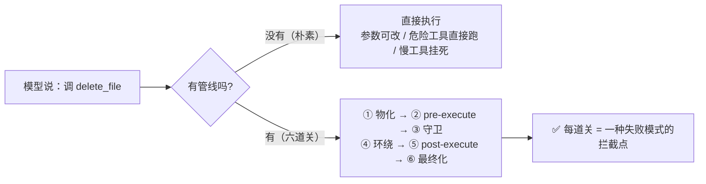
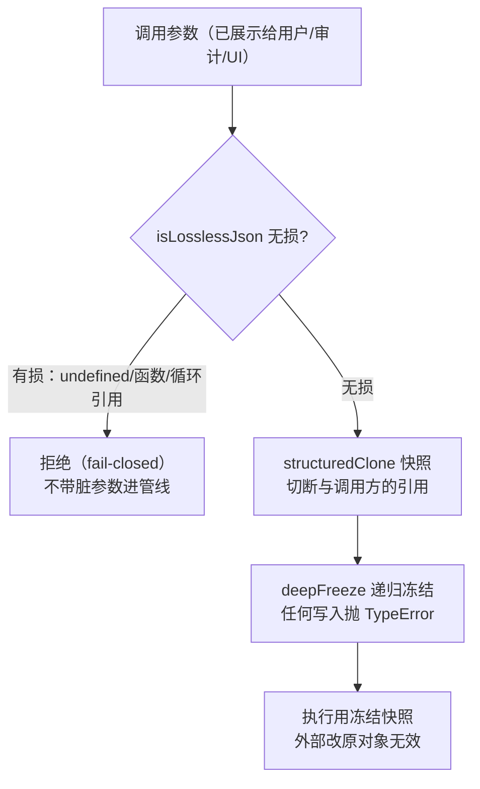
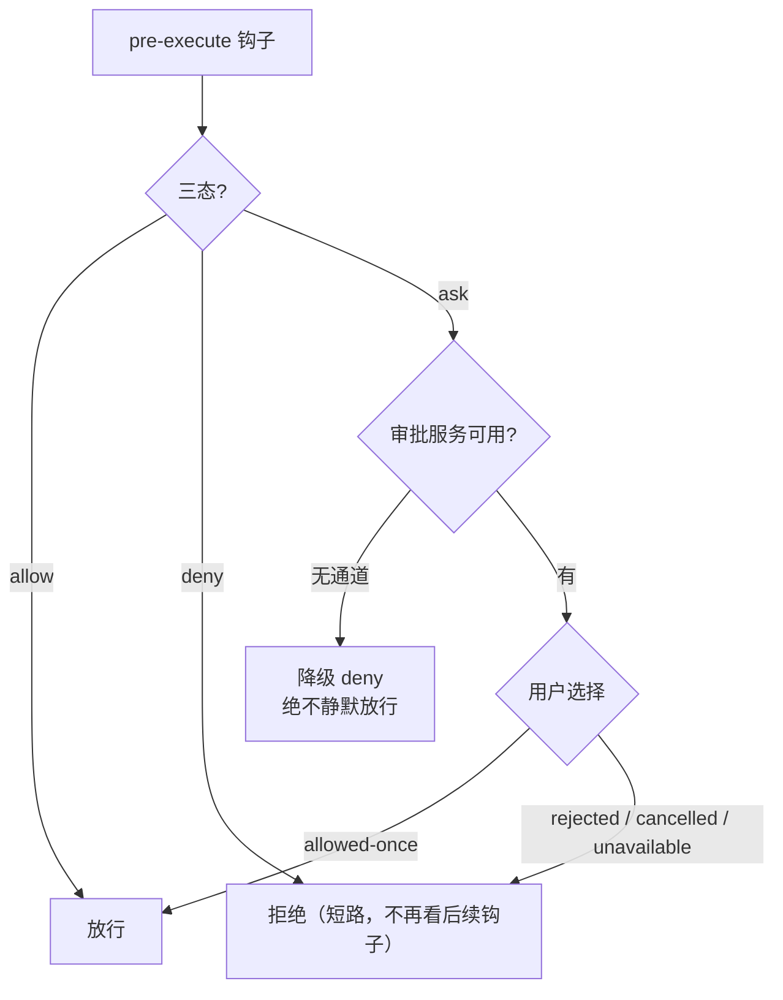
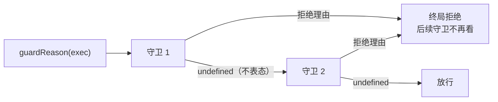
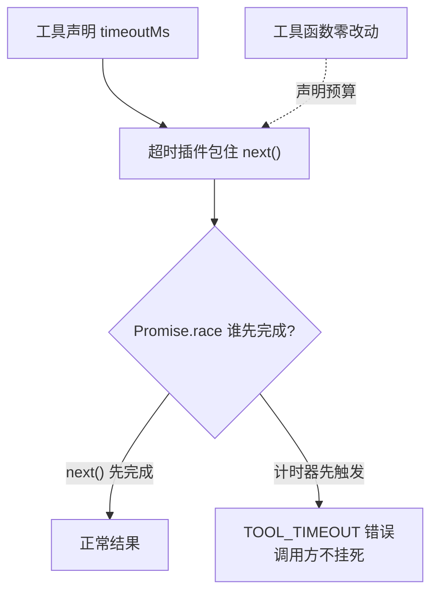
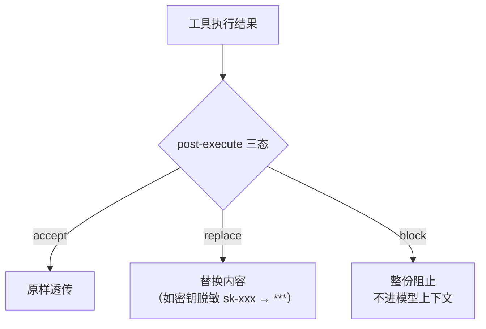
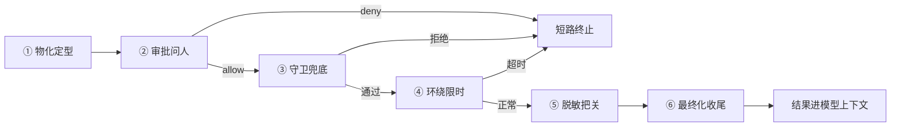

# DeepSeek Harness 源码精读（二）：一个工具调用，要过几道关？

## 开场：模型说"我要调工具"，然后呢？

上一篇我们看了 Agent 主循环：模型流式生成 → 遇到 tool-calls → `executeToolCalls()` 执行工具 → 结果回填 → 模型继续。那"执行工具"这四个字背后到底发生了什么？如果只是 `tool.execute(args)` 一行，你很快会撞上一堆生产级问题：

- 这个工具**该不该让模型调**？（权限：谁允许？要不要问用户？）
- 调用**超时了**怎么办？（bash 卡死、子代理跑飞）
- 模型一次回了 5 个工具调用，**能并行吗**？会不会有竞态？
- 用户中途**点了取消**，正在跑的工具怎么停？没跑的呢？
- 工具返回的数据**怎么变成模型能看的内容**？（结构化 value → 渲染文本）
- 这个工具**在子代理里该不该可见**？（scope 隔离）

DeepSeek Harness 把这套东西做成了一个 1946 行的 `ToolRuntime`（`packages/core/tools/src/index.ts`）+ 一个 289 行的调度器（`packages/core/agent-loop/src/tool-calls.ts`），再加一整套设计决策笔记（40+ 篇）。这篇从源码出发，把"一个工具调用从模型嘴里说出来到结果写进会话日志"的完整旅程拆开。

## 先看全景图：一个工具调用的完整旅程

源码把执行过程分成**六个阶段**，加上**调度器**在外面编排，以及一个**双模式**（native/code）决定模型怎么"够到"工具：

```mermaid
flowchart LR
    subgraph REG["注册（启动时）"]
        R1["register(ToolDefinition)"]
        R2["强制 output 声明 + schema 校验"]
    end

    subgraph SCHED["调度器（agent-loop/tool-calls.ts）"]
        S1["executionMode 分类: parallel / exclusive"]
        S2["滚动池 + 独占屏障"]
        S3["按模型顺序提交结果"]
    end

    subgraph PIPE["六段执行管线（ToolRuntime.execute）"]
        P1["① createExecution 参数物化+冻结"]
        P2["② pre-execute 瀑布: allow/deny/ask"]
        P3["③ guards 单调守卫"]
        P4["④ tools/execute 环绕 + body"]
        P5["⑤ post-execute: accept/replace/block"]
        P6["⑥ finalizeContent + tools/result"]
    end

    REG --> SCHED --> PIPE
```



六个阶段里，②④⑤ 都是 Cordis **waterfall**（可插拔瀑布），意味着超时、溢出、守卫、审计这些能力全是插件挂上去的，核心调度器不用改一行。这是整个设计的灵魂。下面逐个拆。

## 起点：ToolDefinition——一个工具必须声明什么？

先看注册的基本单元。一个工具不是"一个函数"，而是一个**完整的声明对象**（`index.ts:222`）：

```ts
interface ToolDefinition extends ToolSchema {
  // 模型可见：name / description / parameters（来自 ToolSchema）

  // ① 强制输出契约：schema + 纯函数渲染器
  readonly output: {
    schema: JsonSchemaNode // 工具返回值的 JSON Schema
    render(args, value): ContentBlock[] // 规范值 → 模型可见内容（纯函数）
    presentationMeta?(args, value): JsonValue // 可选 UI 元数据投影
  }
  // ② 执行函数：只返回规范 JSON value
  execute(args: unknown, exec: ToolRunContext): Promise<unknown>
  // ③ 最后一道内容变换（快照后恰好调用一次）
  finalizeContent?(exec, result): ContentBlock[] | undefined
  // ④ 超时预算（由 timeout-policy 插件强制执行）
  timeoutMs?: number
  // ⑤ 并发分类器：精确 true 才可并行
  isConcurrencySafe?(args): boolean
  // ⑥ UI 展示：pending 态 / 完成态
  presentCall?(args): ToolCallView | undefined
  presentResult?(args, result): ToolResultView | undefined
}
```

**为什么 output 是强制的？** 这是 2026-07-20 的 `canonical-tool-output-contract` 笔记定下的：以前工具直接返回一段文本给模型，导致"执行结果"和"展示"永远纠缠在一起——审计想要结构化数据拿不到，UI 想要卡片只能解析文本。现在每个工具必须回答两个问题：**我的返回值长什么样（schema）** + **怎么把它渲染给模型看（render）**。注册时少声明 `output` 直接 `TypeError` 拒绝。

**为什么 schemas() 要白名单？** 模型请求里只能出现 `name/description/parameters` 三个字段（`index.ts:1260` 的 `schemaOf`），`execute`、`output.render`、`finalizeContent` 这些**永远不能泄漏到模型请求里**——否则工具的实现细节就暴露在模型上下文里，白白烧 token 还可能被诱导。

第一方工具不手写 `ToolDefinition`，用 `defineTool`（`schema.ts:545`），它做三件事：把作者友好的 `ValueSchemaSpec` 编译成严格 JSON Schema 子集、从 schema **类型推断**出 `execute`/`render` 的参数和返回类型、在每次调用时硬校验参数。

## defineTool：一个 schema，三处用途

作者写的 schema 是一份 `ValueSchemaSpec`，比如：

```ts
const tool = defineTool({
  name: 'read_file',
  description: 'Read a text file.',
  parameters: {
    path: { type: 'string', required: true },
    offset: { type: 'integer' },
    limit: { type: 'integer' },
  },
  output: {
    schema: {
      type: 'object',
      additionalProperties: false,
      properties: {
        path: { type: 'string', required: true },
        totalLines: { type: 'integer', required: true },
        lines: { type: 'array', required: true, items: { type: 'string' } },
      },
    },
    render(args, value) {
      return [{ type: 'text', text: `read ${value.lines.length} lines of ${value.path}` }]
    },
  },
  async execute(args, exec) {
    // args 的类型已经被推断：{ path: string; offset?: number; limit?: number }
    return { path: args.path, totalLines: 100, lines: [] } // 必须匹配 output.schema
  },
})
```

一份 schema 编译成 JSON Schema 后有三个消费者（`defineTool` 内部）：

- **execute 路径硬校验**：参数不合法 → `ToolArgsError`（`INVALID_ARGS`）；返回值不合 output schema → `ToolOutputError`（`INVALID_TOOL_OUTPUT`）
- **presenter 路径软校验**：`presentCall/presentResult` 只在参数合法时才调用作者函数，否则回退通用卡片——因为展示会在**会话回放**时对任意历史参数运行，schema 可能已经改了，展示绝不能 throw
- **类型推断**：`InferArgs<S>` / `InferValue<S>` 精确推断 16 层容器深度，超过就放宽成 `JsonValue`——避免 TypeScript 类型栈爆炸

有个细节值得注意：`isConcurrencySafe` 也是"软校验 + 精确 true"语义（`index.ts:698` 的 `executionMode`），分类器抛异常、返回非 true 一律按**独占**处理——**fail-closed**，猜错了宁可串行不可并行。

## 第一站：参数物化——为什么参数要"冻"起来

调度器把模型请求的 tool-calls 交给 `ToolRuntime.execute()`（`index.ts:1382`），第一件事是 `createExecution`：**参数过一遍 lossless-JSON 快照 + deepFreeze**，再分配一个不透明的 `token`（Symbol）作为执行身份。

为什么要冻结参数？看 `PreToolDecision` 的注释就知道：**参数已经在历史日志里、在审计里、在 UI 里展示过了，执行时改参数 = 三个读者看到三个版本**。这就是 `proposed/feature/2026-06-30-pre-tool-input-rewrite.md`（执行前重写参数）至今没被批准的原因——改参数需要原子化更新模型历史、审计记录、UI 展示三个读者，代价巨大收益存疑。

同样的物化边界还有一道：**finalizeContent 回调在参数物化之前就快照**（`index.ts:1460`）。因为参数 getter 可能触发副作用（比如动态 schema 读取），如果在物化后快照，参数物化过程中工具定义可能已经变了。快照保证"调用开始时是什么样，最后一道变换就用什么样"。

## 第二站：pre-execute 瀑布——允许、拒绝，还是问用户？

`prepareExecution`（`index.ts:1510`）跑第一个瀑布。Cordis 的 waterfall 语义：每个监听者可以 `next()` 放行，也可以直接返回决策短路：

```ts
type PreToolDecision =
  | { kind: 'allow' }
  | { kind: 'deny'; reason: string } // 直接拒绝，产出 isError 结果
  | { kind: 'ask'; reason?: string } // 转人工审批
```

`ask` 走 approval 服务（`serviceAsk`，`index.ts:1747`）：审批返回 `allowed-once` 才放行，其余三种结局——`rejected`（用户拒绝）、`cancelled`（审批被取消）、`unavailable`（没有审批通道）——全部变成**带不同理由的 deny**。注意：**没有配置 approval 服务时 ask 直接降级为 deny**，fail-closed 而不是静默放行。agent-less 的调用也拒绝（没有会话可审计、没有 UI 可路由）。

这里还有一层精妙设计（`index.ts:1440`）：**code 模式下被折叠的工具（见后文）在进入政策管线之前就被确定性拒绝**——`pre-execute` 监听者、审批、守卫永远看不到一个注定失败的调用。否则可能出现"插件审批通过了、守卫放行了、结果还是 UNKNOWN_TOOL"的荒诞局面。

## 第三站：guards——为什么守卫只能"拒绝"不能"放行"？

瀑布之后是一道**单调守卫**（`index.ts:708`）：

```ts
type ToolGuard = (execution: Readonly<ToolExecution>) => string | undefined
// 返回 reason = 拒绝；返回 undefined = 不改变决策
```

`ToolGuard` 的返回类型**故意没有 allow 分支**。为什么？看注释：_"Because guards have no allow result, listener ordering cannot turn a denial back into permission."_ ——如果守卫能放行，那么注册顺序就能决定"谁说了算"：A 拒绝、B 放行，结果变成放行，守卫之间开始互相踩。**只允许拒绝**意味着任何一道守卫的拒绝都是终局，监听者顺序永远不会把拒绝变回许可。

守卫是分层的：全局注册的守卫对所有 agent 生效；通过 `agent.ctx` 注册的只对该 agent 生效。`guardReason` 先查全局层，再沿 scope 链从远到近查（`index.ts:1132`），任一返回 reason 即拒绝。

## 第四站：tools/execute 环绕 + 工具体——超时就是这么挂上去的

`dispatchScheduledExecution`（`index.ts:1605`）跑第二个瀑布 `tools/execute`，然后调用工具体。**这是唯一能替换 `exec.signal` 的阶段**（`ToolDispatchExecution` 是唯一可变视图）。

超时策略就是挂在这里的标准范例（`packages/guard/timeout-policy/src/index.ts`，81 行）：

```ts
ctx.on('tools/execute', async (exec, next) => {
  const timeoutMs = ctx.tools.get(exec.name, exec.agent)?.timeoutMs
  if (timeoutMs === undefined) return next() // 没声明预算就不管

  using d = deadline(exec.signal, timeoutMs, TOOL_TIMEOUT) // 派生带截止的信号
  exec.signal = d.signal // 替换信号（仅此阶段允许）
  try {
    const result = await next() // 跑工具体
    if (timeoutOf(d.signal, TOOL_TIMEOUT) !== undefined) {
      return toolTimeoutResult(timeoutMs) // 我们的计时器赢了 → 结构化 TOOL_TIMEOUT 错误
    }
    return result
  } finally {
    exec.signal = upstream // 用完恢复，post-execute 看不到我们的信号
  }
})
```

要点：**超时是协作式的**——插件只是替换信号，工具必须自己尊重 `exec.signal` 才能真的停。`timeoutMs` 声明在工具定义上而不是配置映射表里，因为"这个工具有没有超时预算"是工具自己的能力声明。错误码 `TOOL_TIMEOUT` 是插件私有的，嵌套的外层超时不会被误读成这个插件的。

工具体真正执行时（`dispatchToolBody`，`index.ts:1577`），注册表把**调用者信号和环绕包装器的信号融合**（`fuseToolSignals`）再交给工具——包装器换掉的信号不能把调用者的取消给"摘掉"。body 成功返回后进入 `createSuccessResult`：先校验 output.schema，再调 render 渲染成 `ContentBlock[]`，可选地投影 `presentationMeta`（只有顶层调用才投影，嵌套调用不投影）。**render 失败也会变成结构化错误**，而不是让整个管线崩溃。

## 第五站：post-execute——接受、替换、还是阻止？

`finalizeScheduledExecution`（`index.ts:1640`）跑第三个瀑布 `tools/post-execute`，决策有三种（`index.ts:599`）：

```ts
type PostToolDecision =
  | { kind: 'accept'; content?: ContentBlock[] } // 接受（可替换内容）
  | { kind: 'accept'; value: JsonValue } // 接受（可替换规范值）
  | { kind: 'block'; feedback: ContentBlock[] } // 阻止：变成纠正性错误
```

- **替换 content**：只改模型看到的内容，规范 value 和 meta 保留——这是**展示策略**（比如溢出策略把 10 万字的 bash 输出换成"预览 + 文件定位器"）
- **替换 value**：会重新校验 schema 并重新渲染——这是**数据策略**
- **block**：把成功结果变成 `isError`，内容换成纠正性反馈（比如"你连续 3 次调同一个工具了"）——模型会看到错误并自我纠正

两个坑：content 和 value **不能同时替换**（二选一，同时给直接 TypeError）；`additionalContexts` 可以附带，会被调度器塞进下一轮的输入。body 里 `deferContext` 挂的上下文在 accept 时保留、block 时丢弃（block 只暴露决策者显式给的上下文）。

## 第六站：finalizeContent + tools/result——最后一道门

`finishScheduledExecution`（`index.ts:1653`）做三件事：

1. **materialize**：把结果快照成 lossless JSON + deepFreeze——保证后续持久化不会因可变对象悄悄串改
2. **applyFinalContent**：调用定义里快照的 `finalizeContent`（恰好一次），返回 `undefined` 则保留原内容
3. **notifyResult**：`tools/result` emit 事件，observer 拿到**冻结的**执行对象和结果，**observer 抛异常被隔离**（只打日志，不影响结果）

这里有个细节：materialize 失败、finalizeContent 抛异常，都会降级成 `isError` 结果而不是让管线抛出去——**工具调用失败不能搞死整个 turn**。未知工具（`ToolNotFoundError` → `UNKNOWN_TOOL`）也是同样的结构化错误路径，模型看到错误可以自我纠正，而不是 turn 崩溃。

至此六段管线走完。但管线之外还有两个大机制：**取消**和**调度**。

## 取消体系：ABORTED vs ABORTED_BEFORE_DISPATCH

用户点取消，`AbortSignal` 从 agent loop 一路传进每个 `ToolExecutionInput`（必填字段）。注册表的取消语义（`index.ts:1571` + `2026-07-19-cooperative-tool-cancellation.md`）有几个关键点：

**① 不竞速、不放弃 Promise。** body 一旦开始，注册表就等它自然结束（quiescence），只是把最终结果替换成 `ABORTED`。竞速（Promise.race 赢者通吃）的问题在于：被放弃的 Promise 里的工作还在跑，可能产生你不知道的副作用。协作式取消 = "告诉它停，等它停"。

**② 两个错误码区分"停在哪了"：**

- `ABORTED_BEFORE_DISPATCH`：body 还没启动就取消了（参数物化后、政策管线前后都会重查取消）
- `ABORTED`：body 已启动，成功结果被取消覆盖

为什么要区分？**回放**需要知道真相——`tool/call` 事件已经写了，如果没区分，回放时无法判断"这个调用到底跑没跑"。

**③ 取消检查点**遍布全程：prepare 入口、pre-execute 之后、guards 之后、dispatch 之前，每次 await 回来都重查（用 `isAborted()` 函数而不是直接读 `.aborted`，避免 TS 控制流收窄误判）。

## 并行/独占调度：厨房可以并行炒菜，上菜必须按点单顺序

模型一次返回 5 个工具调用，调度器（`tool-calls.ts`）按 `executionMode()` 分类：`parallel` 的进滚动池，`exclusive` 的单独跑并形成**屏障**。设计契约（`2026-07-10-parallel-tool-call-execution.md`）：

- **只有 dispatch/body 阶段能重叠**；pre-execute、post-execute、结果提交全部按模型顺序串行——政策绝不能乱序
- **启动前重新分类**：滚动池每次补位时重读 `executionMode`，注册表中途变更可能把调用从 parallel 翻成 exclusive
- **提交保序**：`commitReady` 只推进**连续已结算**的槽位（head-of-line cursor），前面的没结算完，后面的先完成也得等——保证模型看到的工具结果顺序和它请求的顺序一致
- **容量**：`maxParallelToolCalls` 默认 10，设 1 就是纯串行；独占调用要等池子排空，且屏障持续到它的 post-execute 完成
- **取消时的合成结果**：已启动的 drain 完，未启动的**合成 `ABORTED_BEFORE_DISPATCH` 结果写进日志**（`appendSkippedToolCall`）——不然回放会看到"调用了却没结果"的洞

## Code Mode：native 之外的第二种形态——让模型写代码调工具

六段管线讲完了，但还有一个更激进的设计：**code 模式**（`2026-06-15-code-mode.md` + `code-mode.ts`）。默认 `native` 模式把全部工具的 schema 发给模型，模型直接发 tool-calls。`code` 模式下模型看到的**只有一个工具 `run_code`**：模型写一段 TypeScript/Python 程序，程序里 `await tools.read_file(...)` 这样调工具，worker 线程沙箱里跑，只把 print/return 的精选结果返回给模型。

为什么要这个模式？**省 token + 减少往返**：模型一次写程序可以循环、判断、批量调 10 个工具，而不是一轮轮发 tool-calls 等结果。代价是模型要"会编程"。

几个关键机制：

- **SDK section 动态生成**：system prompt 里按调用方的可见工具集生成 `tools` 对象的类型声明（TS 用 `jsonSchemaToTs`），程序里能绑定的工具 = prompt 里声明的工具
- **子派发走完整管线**：程序里的每次 `tools.x()` 都是注册表的一次 `execute`（带 `parent` token 标记为传输子派发），pre-execute/guards/post-execute 全都不跳过；`deferContext` 挂的上下文推迟到外层 `run_code` 结果之后
- **单驱动器通道**：子派发的有序阶段（start 事件、prepare、commit、settle 事件）全在**一个 drive 循环**里串行，只有 body 并发（上限 `maxParallelSubCalls` 默认 10）——和 native 调度器同一套语义
- **折叠规则**：code 模式下模型直接调用非 run_code 工具 → 确定性拒绝 `UNKNOWN_TOOL`（提示"请从程序里调"），且**在政策管线之前**拒绝；但 `run_code` 的子派发不受此限
- **日志分流**：每个子派发写 `tool/code-dispatch-start` / `tool/code-dispatch` 事件，`tools/code-dispatch-log` 瀑布允许替换**日志副本**（比如 spill 策略把大结果换成预览+定位器）——程序收到的 value、模型看到的结果都不受影响

## Scope 可见性：一个工具，谁能看见？

最后是可见性。注册表用 Cordis 的 scope 机制分层（`index.ts:1148` 的 `view()`）：

- **全局注册 vs agent 级注册**：`agent.ctx.tools.register()` 注册到该 agent 自己的层，**shadow** 掉全局同名工具；子代理注册自己的上报工具时，父级的 restrict 掩码**不会**剥掉它——"子代理回答问题的机制不能被父级的权限过滤误伤"
- **restrict 掩码**：`allow`（白名单）/ `deny`（黑名单）编译成集合，多个限制**求交**；只作用于继承面（全局+祖先层），不作用于自己的注册
- **run_code 保留在过滤外**：它作为"展示传输"永远可见，不能被 restrict 掉（restrict 里指名 `run_code` 直接报错）

## 🧪 自己动手：7 步渐进式理解设计哲学（代码 + 真实输出）

> 2026-08-22 重构：从"机制叠加的 7 步复现"改为**每步只解决一个哲学点**——这一步回答一个问题：为什么这么设计、好处是什么、解决了什么。代码在 `articles/dsh-tools/src/steps/`（ai-agent-code-lab 仓库，纯 Node 实现，不需要 API key）。
>
> 跑法二选一：
>
> - 根目录：`pnpm run tools:step:01` ~ `tools:step:07`；完整版 `pnpm run run:dsh-tools`
> - 或在 `articles/dsh-tools/` 目录内：`pnpm run step:01` ~ `step:07`

每步文件顶部都是四段式 JSDoc：**痛苦场景 → 为什么这么设计 → 收益 → 对应源码**。下面按步拆解，配核心代码和实测输出。

### Step 01：管线骨架——工具调用 ≠ 调个函数

**这一步解决什么问题**：模型说"调工具"，如果实现只是 `registry.get(name)(args)` 直接调函数，一切看起来都正常——直到某天出现：参数被篡改、危险工具被诱导执行、慢工具挂死、结果泄露密钥。问题不是"哪个工具坏了"，而是**调用本身没有任何关卡**。

**为什么这么设计**：一次工具调用要过六道关（参数物化 → pre-execute → 守卫 → execute 环绕 → post-execute → 最终化），每道关在源码里都是一段独立流程。本步只搭骨架，每站留注释说明"未来这一站要干什么"。

**收益**：先建立"一次调用过六道关"的地图，后面每步填实一道关。

**流程图**（朴素 vs 管线，同一调用两条路）：



**核心代码**（`step-01-pipeline-skeleton.ts`，六段骨架 + 朴素对照）：

```ts
/** 朴素实现（对照）：没有管线，直接调函数——崩点从这一行开始 */
async function naiveCall(name: string, args: { path: string }): Promise<string> {
  return `已删除 ${args.path}` // 假设工具立即执行，没有任何关卡
}

// ── 六段管线骨架（数组模拟 Cordis 瀑布）──
const preHooks: PreHook[] = [] // 第②站：审批瀑布（allow/deny/ask，index.ts:588）
const guards: Guard[] = [] // 第③站：单调拒绝（string = 拒绝理由，index.ts:711）
const wrappers: Wrapper[] = [] // 第④站：execute 环绕（超时/重试/日志）
const postHooks: PostHook[] = [] // 第⑤站：脱敏/校验/重渲染（index.ts:597）

async function execute(exec: ToolExec): Promise<ToolResult> {
  // ① 参数物化：验证 → 快照 → 冻结 → token（本步先透传，step-02 填实）
  // ② pre-execute 瀑布：任一 deny 短路即终止（未来：审批，index.ts:1459）
  for (const hook of preHooks) {
    const decision = await hook(exec)
    if (decision.kind === 'deny') return { isError: true, content: `Error: ${decision.reason}` }
  }
  // ③ 单调守卫：只能拒绝，任一拒绝都是终局（未来：guardReason，index.ts:1119）
  for (const guard of guards) {
    const reason = guard(exec)
    if (reason !== undefined) return { isError: true, content: `Error: guarded: ${reason}` }
  }
  // ④ execute 环绕：wrapper 从外到内包住工具体（未来：超时插件，index.ts:1569）
  const body = async (): Promise<ToolResult> => ({
    isError: false,
    content: `已删除 ${(exec.args as { path: string }).path}`,
  })
  const result = await wrappers.reduceRight(
    (next: () => Promise<ToolResult>, wrap) => () => wrap(exec, next),
    body,
  )()
  // ⑤⑥ post-execute + 最终化（未来：脱敏 + 事件通知，index.ts:1609/1631）
  return postHooks.reduce((r, hook) => hook(exec, r), result)
}
```

**实测输出**：

```text
🧩 Step 01 – 管线骨架：工具调用 ≠ 调个函数
-----------------------------------------------
模型说：删除 A.txt
  朴素实现：已删除 A.txt ← 删了就删了，没有任何关卡
  管线实现：已删除 A.txt ← 六道关全部通过

六道关（本步只有骨架，注释标注了未来职责）：
  ① 参数物化 —— 参数已进审计，执行时不许变（step-02 填实）
  ② pre-execute —— 危险工具要问人（step-03 填实）
  ③ 单调守卫 —— 策略红线，只能拒绝（step-04 填实）
  ④ execute 环绕 —— 超时/重试包在外面（step-05 填实）
  ⑤ post-execute —— 结果也要过门（step-06 填实）
  ⑥ 最终化 —— 事件通知、日志收尾

🎯 一句话：直接调函数 = 裸奔；管线 = 每道关一个失败模式的答案
```

**看什么**：同一行"删除 A.txt"，朴素版删了就删了，管线版先过六道关——**管线的存在意义是给每种失败模式一个拦截点**。后面每步填实一道关，你会看到每道关都对应一种真实事故。

### Step 02：参数物化——为什么参数要"冻"起来？

**这一步解决什么问题**：参数已经出现在模型历史 / 审计日志 / UI 里（三个读者），但工具执行时才真正读参数。如果执行期间参数还能被改——"展示的是 A，执行的是 B"，**审计无法自证"当时到底执行了什么"**。

**为什么这么设计**：物化 = 验证 → 快照 → 冻结 → 发 token。验证保证参数是无损 JSON（undefined / 函数 / 循环引用在序列化时丢信息，fail-closed 直接拒绝）；快照克隆切断与调用方的引用；冻结让任何路径的写入都抛 TypeError；token 是执行身份的凭据。

**收益**：参数一进管线就"定型"，审计、重放、并行调度看到的永远是同一份。

**流程图**（参数一进管线就定型）：



**核心代码**（`step-02-arg-freezing.ts`）：

```ts
/** 无损 JSON 校验：JSON 会丢信息的值（undefined/函数/symbol/bigint/循环引用）一律拒绝 */
function isLosslessJson(value: unknown, seen = new Set<object>()): boolean {
  if (value === null || ['string', 'number', 'boolean'].includes(typeof value)) return true
  if (typeof value !== 'object' || seen.has(value)) return false
  seen.add(value)
  return Array.isArray(value)
    ? value.every(v => isLosslessJson(v, seen))
    : Object.values(value).every(v => isLosslessJson(v, seen))
}

/** 递归冻结：strict 模式下对冻结对象任何路径的写入都会抛 TypeError */
function deepFreeze<T>(value: T): T {
  if (value !== null && typeof value === 'object') {
    Object.freeze(value)
    for (const key of Object.keys(value as object))
      deepFreeze((value as Record<string, unknown>)[key])
  }
  return value
}

/** 物化：验证 → 快照（structuredClone 切断引用）→ 冻结 → 分配 token */
function createExecution(input: {
  callId: string
  name: string
  args: unknown
  signal: AbortSignal
}) {
  if (!isLosslessJson(input.args)) {
    return {
      kind: 'rejected',
      reason: `tool "${input.name}" arguments must be losslessly JSON-serializable`,
    }
  }
  return {
    kind: 'ready',
    exec: {
      callId: input.callId,
      name: input.name,
      args: deepFreeze(structuredClone(input.args)),
      signal: input.signal,
    },
  }
}
```

**实测输出**：

```text
🧊 Step 02 – 参数物化：参数要"冻"起来
------------------------------------------
场景 1：模型说删 A.txt，await 期间外部把参数改成 B.txt
  展示/审计/UI 看到：A.txt
  实际执行：已删除 A.txt ← 删的是 A！三个读者永远看到同一份

场景 2：有人想写冻结参数
  💥 抛错：Cannot assign to read only property 'path' of object '#<Object>'

场景 3：传有损参数（path: undefined，JSON 序列化会丢这个字段）
  物化结果：💥 拒绝（tool "delete_file" arguments must be losslessly JSON-serializable）

🎯 一句话：参数一进管线就定型——审计自证靠"冻结"，不是靠自觉
```

**看什么**：场景 1 是核心——**审计自证不靠"约定"，靠运行时强制**。调用方改原对象、执行方改冻结参数，两条路径都被切断。有损参数在源头拒绝（fail-closed），绝不带着"和被展示过的不一样"的参数进入政策管线。

### Step 03：审批瀑布——为什么危险工具要问人？

**这一步解决什么问题**：模型被 prompt injection 诱导时，"执行 delete_file(path=C.txt)" 只是模型输出里的一行。如果 pre-execute 没有关卡，这一行就直接变成删库命令。

**为什么这么设计**：pre-execute 瀑布里每个钩子返回 allow / deny / ask 三态，任一钩子短路即终止；ask 把"要不要执行"从模型手里拿出来，交给审批服务（真实场景是人工弹窗）。源码中 ask 走 serviceAsk()（index.ts:1689）：**无审批通道或用户不是 "allowed-once" 确认，全部 fail-closed 降级 deny**。

**收益**：危险工具必须过人类监督点；策略按工具声明（requiresApproval），模型无法绕过。

**流程图**（三态瀑布 + fail-closed 审批）：



**核心代码**（`step-03-approval-waterfall.ts`）：

```ts
/** pre-execute 三态：allow 放行 / deny 拒绝 / ask 问人（源码 PreToolDecision，index.ts:588） */
type PreToolDecision =
  { kind: 'allow' } | { kind: 'deny'; reason: string } | { kind: 'ask'; reason?: string }

/** 复刻源码 serviceAsk 的 fail-closed 语义：只有 allowed-once 放行 */
async function resolveAsk(exec: ToolExec, reason?: string) {
  if (approvalService === undefined) {
    return {
      decision: 'deny',
      reason: reason ?? `tool "${exec.name}" requires approval (no channel)`,
    }
  }
  const outcome = await approvalService.request({ toolName: exec.name })
  return outcome === 'allowed-once'
    ? { decision: 'allow' }
    : { decision: 'deny', reason: `the user rejected tool "${exec.name}"` }
}
```

**实测输出**：

```text
🚦 Step 03 – 审批瀑布：危险工具要问人
-------------------------------------------
场景 1：模型读 notes.txt（read_file，无风险）
  → 文件 notes.txt 的内容：... ← 瀑布直接 allow，不问人

场景 2：模型被诱导删 C.txt（delete_file）→ 弹窗，用户拒绝
  👤 审批弹窗：允许 "delete_file" 删除 C.txt？→ 用户点了「拒绝」
  → Error: the user rejected tool "delete_file" ← 模型无法绕过

场景 3：模型再次删 D.txt → 弹窗，用户确认
  👤 审批弹窗：允许 "delete_file" 删除 D.txt？→ 用户点了「允许」
  → 已删除 D.txt ← 只有 allowed-once 放行

场景 4：审批服务不可用（真实场景：进程没接上审批通道）
  → Error: delete_file needs human approval ← 无通道也拒绝，绝不静默放行

🎯 一句话：要不要执行，从模型手里拿出来，交给政策（allow / deny / ask）
```

**看什么**：场景 4 是精髓——**审批通道没接上 = 拒绝，不是放行**。fail-closed 的默认姿势贯穿整个管线：猜错方向永远偏向"保守"。

### Step 04：单调守卫——为什么守卫只能"拒绝"？

**这一步解决什么问题**：审批放行之后，还有策略红线（禁删 AGENTS.md、禁读 .env）。如果守卫既能拒绝又能放行，注册顺序就决定"谁说了算"：A 拒绝、B 放行 → 结果变放行，守卫互相踩——加一个守卫反而可能解除另一个守卫的拒绝。

**为什么这么设计**：ToolGuard 的返回类型只有 `string | undefined`——拒绝理由或"不表态"，**没有 allow 分支**。源码注释："Because guards have no allow result, listener ordering cannot turn a denial back into permission"（守卫没有放行结果，监听顺序永远无法把拒绝翻回许可）。**拒绝是幂等安全的，放行不是**。

**收益**：守卫注册顺序无关，任何一道拒绝都是终局；策略可叠加、不会互相抵消。

**流程图**（守卫只有拒绝，没有放行）：



**核心代码**（`step-04-monotonic-guard.ts`）：

```ts
/** 守卫：string = 拒绝理由；undefined = 不表态。故意没有 allow 分支 */
type ToolGuard = (exec: Readonly<ToolExec>) => string | undefined

/** 任一守卫的拒绝都是终局（简化版 guardReason，源码还查全局 + scope 链） */
function guardReason(exec: ToolExec): string | undefined {
  for (const guard of guards) {
    const reason = guard(exec)
    if (reason !== undefined) return reason
  }
  return undefined
}
```

**实测输出**：

```text
🛡️ Step 04 – 单调守卫：守卫只能拒绝
----------------------------------------
场景 1：删除 notes.txt（无红线）
  guardReason → undefined（放行）

场景 2：删除 AGENTS.md（红线）
  guardReason → AGENTS.md is protected ← 终局，后续守卫不用再看

场景 3：删除 .env（红线，注册在最前）
  guardReason → .env is protected

反例：假设守卫能返回 allow——
  守卫 A（拒绝 .env）→ 守卫 B（放行 delete_file）：顺序 先A后B = 放行
  同一组守卫顺序颠倒：先B后A = 拒绝 → 结果由注册顺序决定，守卫互相踩
  所以类型上就没有 allow：拒绝是幂等的，放行不是。

🎯 一句话：审批管"能不能"，守卫管"绝对不行"——拒绝永远是终局
```

**看什么**：反例演示是整个 step 的高潮——**守卫如果有 allow 分支，结果就由注册顺序决定**，审计无法回答"为什么放行/拒绝"。类型层面删掉 allow，让"顺序无关"在编译期就成立。

### Step 05：超时环绕——为什么超时是"包一层"？

**这一步解决什么问题**：慢工具（读 100MB 日志）无限等待会拖垮整个 agent。如果让每个工具自己写超时，20 个工具 20 份重复代码，而且容易漏——漏一个就是挂死。

**为什么这么设计**：超时是"横切关注点"——超时 / 日志 / 重试是包在工具外面的能力，不该是工具自己的责任。execute 环绕（wrapper）把超时做成插件，工具声明 timeoutMs 预算即可，任何工具注册后自动获得超时能力，工具函数一行都不用改。

**收益**：关注点分离——工具只管"做什么"，超时管"多久"，改策略不用改工具。

**流程图**（超时是包在工具外面的插件）：



**核心代码**（`step-05-timeout-wrap.ts`）：

```ts
/** 超时插件：Promise.race 包一层，超时就返回 TOOL_TIMEOUT 错误（简化版） */
function installTimeoutPolicy(): void {
  wrappers.push(async (exec, next) => {
    const timeoutMs = registry.get(exec.name)?.timeoutMs
    if (timeoutMs === undefined) return next() // 没声明预算就不管
    const timer = new Promise<ToolResult>(resolve => {
      setTimeout(
        () =>
          resolve({
            isError: true,
            content: `Error: tool "${exec.name}" timed out after ${timeoutMs}ms`,
            error: { code: 'TOOL_TIMEOUT' },
          }),
        timeoutMs,
      )
    })
    return await Promise.race([next(), timer])
  })
}
```

**实测输出**：

```text
⏱️ Step 05 – 超时环绕：超时是"包一层"
---------------------------------------------
场景 1：读 huge.log（工具要 2s，预算 500ms）
  503ms 后返回：Error: tool "read_file" timed out after 500ms
  调用方不挂死——超时是插件给的，不是工具自己写的

场景 2：同一工具函数，预算改成 3000ms（工具代码一行没改）
  2006ms 后成功：文件 huge.log 的内容：...

场景 3：echo（没声明预算，照常执行）
  → echo: hi

🎯 一句话：超时是工具外面的插件——注册即获得，工具专注"做什么"
```

**看什么**：场景 2 是核心证据——**同一工具函数，只改声明的预算，工具代码零改动**。超时能力是"注册即获得"的，这就是横切关注点 vs 工具自实现的分水岭。

### Step 06：post-execute——为什么执行结果也要过一道门？

**这一步解决什么问题**：工具返回的值不一定适合直接给模型看——read_file 可能返回 api_key=sk-xxx，日志导出可能混着 password 字段。如果结果直接进模型上下文，密钥就"过了一次模型"（可能在历史里留存、被模型引用、被泄露）。

**为什么这么设计**：**输出同输入一样不可信**。post-execute 是接受 / 替换 / 阻止三道门（源码 PostToolDecision，index.ts:597）：脱敏、校验、重渲染都挂这里，和工具逻辑解耦——工具不知道也不关心谁在看结果。

**收益**：结果处理（脱敏 / 校验 / 重渲染）集中一处，策略可叠加，工具保持纯粹。

**流程图**（结果也要过三道门）：



**核心代码**（`step-06-post-execute.ts`）：

```ts
/** post-execute 三态：接受 / 替换 / 阻止（源码 PostToolDecision，index.ts:597） */
type PostToolDecision =
  { kind: 'accept' } | { kind: 'replace'; content: string } | { kind: 'block'; reason: string }

/** post-execute 三态裁决：accept 原样透传 / replace 替换内容 / block 整份阻止 */
for (const hook of postHooks) {
  const decision = hook(exec, result)
  if (decision.kind === 'accept') continue // 原样透传
  if (decision.kind === 'replace') result.content = decision.content // 脱敏：sk-xxx → ***
  if (decision.kind === 'block') {
    return { isError: true, content: `Error: blocked by post-execute: ${decision.reason}` }
  }
}
return result
```

**实测输出**：

```text
🚪 Step 06 – post-execute：结果也要过一道门
--------------------------------------------------
场景 1：读 config.json（含 api_key）
  工具原始返回：文件 config.json 的内容：api_key=sk-abc123456
  模型看到：文件 config.json 的内容：api_key=*** ← 密钥在进入模型上下文前被替换

场景 2：读 user.db 导出（含 password 字段）
  工具原始返回：username=alice,password=hunter2
  模型看到：Error: blocked by post-execute: result contains sensitive keyword "password" ← 整份结果被阻止，不进模型上下文

场景 3：读 notes.txt（干净内容）
  模型看到：会议记录：明天 10 点评审 ← accept，原样透传

🎯 一句话：输出同输入一样不可信——进出都要过门，脱敏/校验和工具逻辑解耦
```

**看什么**：场景 2 比场景 1 更狠——不只是脱敏，而是**整份阻止**。密钥"过了一次模型"就可能在历史里留存，所以宁可结果进不来，也不能让敏感数据进上下文。

### Step 07：完整管线——一次调用六道关的协作

**这一步解决什么问题**：前六步每道关单独看都能懂，但真实调用里它们是协作的：审批放行后守卫还能拒绝；守卫放行后超时还能截断；执行结果还会被脱敏。关与关如何衔接、短路如何传播，只有看完整旅程才知道。

**为什么这么设计**：六道关的顺序不是随意的——物化在前（参数定型），pre-execute 和守卫在 execute 之前（决策先于动作），环绕包住 execute（横切关注点），post-execute 在结果进模型上下文之前（输出把关），最终化收尾（通知/日志）。

**收益**：一次调用 = 一个完整旅程；任何一道关都能独立短路，互不干扰。

**流程图**（六道关协作 + 短路传播）：



**核心代码**（`step-07-full-pipeline.ts`，主流程串联六站）：

```ts
async function execute(exec: ToolExec): Promise<ToolResult> {
  // ① 物化在入口之前已完成（createExecution，index.ts:1364）：验证 → 快照 → 冻结 → token

  // ② pre-execute 瀑布：allow / deny / ask，ask 走审批服务（fail-closed）
  for (const hook of preHooks) {
    const decision = await hook(exec)
    if (decision.kind === 'allow') continue
    if (decision.kind === 'deny') return { isError: true, content: `Error: ${decision.reason}` }
    const resolved = await resolveAsk(exec, decision.reason) // 审批：无通道/非 allowed-once → deny
    if (resolved.decision === 'deny') return { isError: true, content: `Error: ${resolved.reason}` }
  }

  // ③ 单调守卫：审批放行 ≠ 守卫放行，任一拒绝都是终局
  const reason = guardReason(exec)
  if (reason !== undefined) return { isError: true, content: `Error: guarded: ${reason}` }

  // ④ execute 环绕：wrapper 从外到内包住工具体（超时/重试/日志都是这里的插件）
  const body = async (): Promise<ToolResult> => {
    const tool = registry.get(exec.name)
    if (!tool) return { isError: true, content: `Error: unknown tool "${exec.name}"` }
    return { isError: false, content: String(await tool.execute(exec.args)) }
  }
  const result = await wrappers.reduceRight(
    (next: () => Promise<ToolResult>, wrap) => () => wrap(exec, next),
    body,
  )()

  // ⑤ post-execute：接受 / 替换（脱敏）/ 阻止——结果进模型上下文前的最后一道门
  // ⑥ 最终化：事件通知、日志收尾（简化省略）
  return postHooks.reduce((r, hook) => hook(exec, r), result)
}
```

**实测输出**（四个场景覆盖"放行 / 审批 / 红线 / 超时"四种结局）：

```text
🧩 Step 07 – 完整管线：一次调用六道关的协作
--------------------------------------------------
场景 1：模型读 notes.txt（read_file，无风险）
  ① 物化 → ready（快照 + 冻结 + token）
  ② pre-execute → allow（无风险工具）
  ③ guard → 全部放行（无守卫拒绝）
  ④ wrapper → 无超时 / 正常返回
  ⑤ post-execute → replace（脱敏）
  ⑥ 最终化 → 事件通知 + 日志（简化省略）
  结果：文件 notes.txt 的内容：api_key=*** ✅

场景 2：模型删 A.txt（delete_file，危险）→ 审批确认
  ① 物化 → ready（快照 + 冻结 + token）
  ② pre-execute → ask（delete_file needs human approval）
  👤 审批弹窗：允许 "delete_file"？→ 用户点了「允许」
  👤 审批 → allowed-once，放行
  ③ guard → 全部放行（无守卫拒绝）
  ④ wrapper → 无超时 / 正常返回
  ⑤ post-execute → accept
  ⑥ 最终化 → 事件通知 + 日志（简化省略）
  结果：已删除 A.txt ✅

场景 3：模型删 AGENTS.md（红线）→ 审批也过了，但守卫拒绝
  ① 物化 → ready（快照 + 冻结 + token）
  ② pre-execute → ask（delete_file needs human approval）
  👤 审批弹窗：允许 "delete_file"？→ 用户点了「允许」
  👤 审批 → allowed-once，放行
  ③ guard → deny（AGENTS.md is protected）← 审批放行 ≠ 守卫放行
  结果：Error: guarded: AGENTS.md is protected 🚫

场景 4：模型读 huge.log（慢工具）→ 500ms 预算截断
  ① 物化 → ready（快照 + 冻结 + token）
  ② pre-execute → allow（无风险工具）
  ③ guard → 全部放行（无守卫拒绝）
  ④ wrapper → 超时截断
  ⑤ post-execute → accept
  ⑥ 最终化 → 事件通知 + 日志（简化省略）
  502ms 后：Error: tool "read_file" timed out after 500ms 🚫

🎯 六道关协作：物化定型 → 审批问人 → 守卫兜底 → 环绕限时 → 脱敏把关 → 收尾
```

**看什么**（三条最容易忽略的证据）：

- **场景 3 是协作的精髓**：审批放行 ≠ 守卫放行——人类点「允许」只代表"人同意"，不代表"策略允许"，红线永远由守卫兜底
- **短路传播**：任何一道关都能独立终止（deny / 拒绝 / 超时），终止后后面的关不再执行
- **结果统一过门**：即使一切正常，结果也要经 post-execute 脱敏（场景 1 的 api_key 被替换）——六道关全程无死角

**7 步跑通的收获**：纸上读源码和亲手跑一遍是两种理解。Step 02 的冻结 TypeError、Step 03 的 fail-closed 拒绝、Step 04 的反例、Step 07 的审批放行后被守卫拦截——这些真实输出把"审计自证""单调性""fail-closed""横切关注点"从抽象原则变成了可触摸的事实。跑代码时遇到任何一个"意外"输出，都值得回去翻对应源码：那不是 bug，是某个设计决策的边界。

> 💡 **与原 7 步版的差异**：旧版每步叠加多个机制（step-02 同时含物化 + token + 骨架），新版每步只解决一个哲学点，取消体系（ABORTED / ABORTED_BEFORE_DISPATCH）和并行/独占调度（滚动池 + 屏障 + 保序提交）未在复现中展开——它们对应源码 `cooperative-tool-cancellation`（07-19）和 `parallel-tool-call-execution`（07-10）两篇设计笔记，文章上半部分已讲解，可回到源码深挖。

## 回头看：这套管线在设计上反复出现的六个原则

1. **一切皆插件**：超时、溢出、守卫、审计全是瀑布上的插件，核心 1946 行从不因新策略改动——Cordis 的"效果可逆卸载"让插件装上卸下都是干净的
2. **fail-closed 是默认姿势**：分类器抛异常 → 独占；审批缺失 → 拒绝；渲染失败 → isError。猜错方向永远偏向"保守"
3. **协作式取消**：不竞速、不放弃 Promise，靠 AbortSignal 全链路传递——"告诉它停，等它停"
4. **规范值 vs 展示分离**：工具返回结构化 JSON，render 成模型内容，presentationMeta 给 UI——三个读者各取所需，互不污染
5. **模型顺序不可破坏**：并行只发生在 body 阶段，政策、结果、上下文全部保序提交
6. **执行身份不可变**：token、callId、参数全程冻结，wrapper 只能换信号不能改身份——审计和回放永远看到同一个执行

## 总结

一个工具调用在 DeepSeek Harness 里要过六道关：**参数物化**（lossless + 冻结）→ **pre-execute 瀑布**（允许/拒绝/询问）→ **单调守卫**（只能拒绝不能放行）→ **execute 环绕 + body**（超时等策略挂这里）→ **post-execute**（接受/替换/阻止）→ **finalizeContent + tools/result**（最后一道变换 + 不可变通知）。外面是**调度器**（parallel 滚动池 + exclusive 屏障，提交保序），上面是**双模式**（native 直接调 vs code 写程序调），下面是 **scope 可见性**（shadowing + restrict 求交）。取消体系用两个错误码（ABORTED / ABORTED_BEFORE_DISPATCH）精确表达"停在哪了"，协作式地贯穿全程。

对我们自己的 agent 项目（比如 agent-coze-workflow 的工具调用）最值得抄的三件事：**强制输出契约**（schema + render 分离）、**可插拔执行瀑布**（权限/超时/后处理不写死在核心）、**fail-closed 的并发分类**（不确定就串行）。

## 面试考点

- **工具执行管线的六阶段分别是什么？各自负责什么？**（物化/pre-execute/guard/execute/post-execute/finalize+result）
- **为什么 guard 只能拒绝不能放行？**（保证监听者顺序无法把拒绝翻回许可——单调性）
- **为什么工具参数要冻结？**（历史日志、审计、UI、执行必须看到同一份参数；改写参数需要原子化更新三个读者）
- **ABORTED 和 ABORTED_BEFORE_DISPATCH 的区别？**（body 是否已启动；回放需要知道调用到底跑没跑）
- **协作式取消和竞速式取消的区别？为什么选协作式？**（Promise.race 放弃的 Promise 副作用不可控；协作式 = 告诉它停、等它停）
- **并行调度的保序机制？**（只有 body 重叠；pre/post 和结果提交按模型顺序；head-of-line cursor）
- **Code Mode 的折叠规则？**（code 模式下模型只能直接调 run_code；子派发不受限；折叠拒绝发生在政策管线之前）
- **restrict 掩码为什么不影响 scope 自己的注册？**（子代理回答问题的机制不能被父级过滤误伤）
- **什么是 fail-closed？举三个例子**（并发分类器异常→独占；审批缺失→拒绝；渲染失败→isError）

## 参考来源

- 源码：`packages/core/tools/src/index.ts`（1946 行）+ `schema.ts`（617 行）+ `code-mode.ts`（673 行）+ `presentation.ts`（389 行）
- 调度器：`packages/core/agent-loop/src/tool-calls.ts`（289 行）
- 超时插件：`packages/guard/timeout-policy/src/index.ts`（81 行）
- 官方规范：`docs/subsystems/tools.md`
- 设计决策笔记（`.agents/notes/implemented/`）：parallel-tool-call-execution（07-10）、tool-call-timeout-policy（07-07）、cooperative-tool-cancellation（07-19）、canonical-tool-output-contract（07-20）、code-mode（06-15）、code-mode-typed-tool-returns（07-20）、code-mode-live-parallel-dispatch（07-26）、tool-render-intent-union（07-02）、agent-scope-contexts（07-08）、subagent-persona-tool-filter-and-depth（07-12）、tool-output-spill-files（07-08）
